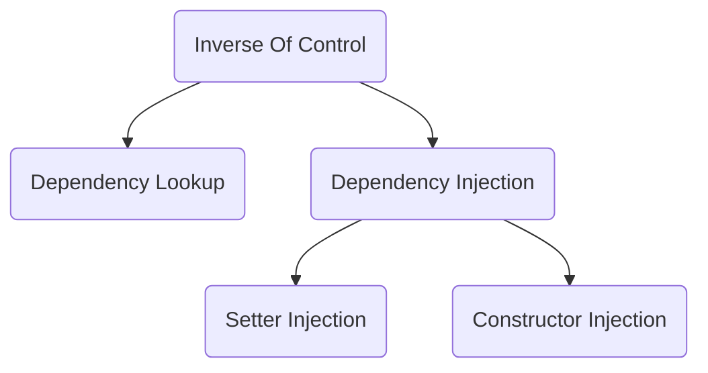

## SSH & SSM

MVC|数据操作|事务管理AOP、对象管理IOC
---|-------|-----------------
Struts2|Hibernate|Spring
SpringMVC|Mybatis|Spring

- Mybatis：轻量级数据管理框架，适合数据量大，访问量高
- Hibernate：ORM数据框架，适合数据量小，追求面向对象，开发效率

## Spring 概述

- [Spring官网](https://spring.io/)
- Spring是一个容器，包含并管理系统对象的生命周期和配置
- Spring在项目中*管理事务*以及*对象注入*
- Rod Johnson 《Expert one-on-one J2EE Design and Development》 → Spring
- 轻量级、灵活性
    - EJB：重量级，开发难度高，适合分布式架构
- 非侵入式
    - 基于Spring开发的系统中的对象，一般不依赖于Spring的类
    - 降低耦合
    - 轻量级框架
    - 发展历史：Struts→Hibernate→Spring→Struts2→SpringMVC
        - Struts2借鉴了Spring的思想，也是非侵入式的
        - Spring整合了Struts2，建立了SpringMVC
- 一站式框架
    - Web层：SpringMVC
    - Service层：IOC
    - DAO层：jdbcTemplate

## Spring 整体结构

- Test
- Core Container
    - Beans
    - Core
    - Context
    - Expression Language
- AOP
- Aspects
- Instrumentation
- Web(MVC/Remoting)
    - Web
    - Servlet
    - Portlet
- Data Access/Integration
    - JDBC
    - ORM
    - OXM
    - JMS
    - Transactions

- Spring框架的每个模块、组件都可以单独存在

## Spring 实例

- 导入jar包
- 生成applicationContext.xml文件
    - 生成相应约束
    - docs\spring-framework-reference\html\xsd-configuration.html
- 生成相应的bean
- 生成调用类

## Spring 核心概念介绍

- Spring优点
    - 不需要实现框架指定的接口，可以轻松将组件从Spring中脱离
    - 组件间的依赖关系少，改善代码的可重用性
    - 依赖注入机制，可以在运行期为组件配置所需资源，无需再编写组件代码时加以指定，从而降低组件间的耦合
    - 高内聚、低耦合
- Spring基本概念
    - IOC: Inverse of Control 控制反转
    - DI: Dependence Injection 依赖注入
    - AOP: 面向接口、面向抽象、面向切面编程

## 控制反转（IOC） & 依赖注入（DI）

控制反转
- 将设计好的类交给系统控制，而不是在类内部控制
    - 类的生成由Spring容器管理
    - 作用
        - 解析XML文件
        - 反射机制生成XML解析出来的对象
        - 工厂模式调用反射机制生成对象

- IOC: Framework manages object lifecycle
- DL: Container calls object when a lookup context is available. Objects Implement container-specific API.
- DI: Objects populated via language-level dependencies. No container-specific API.
- SI: Objects populated via JavaBean properties.
- CI: Objects populated via constructor arguments.

- 控制反转就是依赖注入，依赖注入帮助实现了控制反转

依赖注入
- 在运行期由容器将依赖关系注入到组件之中
- 在运行期，由Spring根据配置文件，将其他对象的应用通过组件的提供的setter方法进行设定
- 类型
    - 设值注入（常用）
        - Setter
        - bean class=...
            - property...
                - value...
        - bean scope=...
                - Singleton：单实例（默认值）
                - Prototype：多实例
                - Request
                - Session
                - GlobalSession：类似单点登录
    - 构造子注入
        - bean class= ...
            - constructor-arg value=...
    - 接口注入（Spring框架不支持）

属性参考
- property ref=...

集合对象注入
- propperty
    - list
        - value
        - value
- property
    - map
        - entry
            - value

#### ApplicationContext

- BeanFactory提供了针对Java Bean的管理功能
- ApplicationContext提供了一个更为框架化的实现
- ApplicationContext覆盖了BeanFactory的所有功能，并提供了更多的特性
- 相对BeanFactory而言，ApplicationContext提供了一下扩展功能：
    - 国际化支持
    - 资源访问
    - 事件传播

- org.springframework.beans.factory.config.PropertyPlaceholderConfigurer