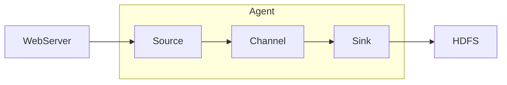

# 目录 #

- [第一节 Flume核心概念](#1)
- [第二节 Flume的分布式安装与配置](#2)
- [第三节 Flume Agent应用开发](#3)
- [第四节 Flume拦截器使用](#4)
- [第五节 Flume自定义开发组件](#5)

***

<h4 id='1'>第一节 Flume核心概念</h4>

1. 了解Flume原理
2. 掌握Flume架构
3. 了解Flume应用历史与场景

---

Flume
- Cloudera公司发布的开源的日志收集工具
- 分布式、可靠、高可用的海量日志采集、聚合和传输的日志收集系统
- 系统灵活性高：数据源可定制、可扩展；数据存储系统可定制、可扩展
- 中间件：屏蔽了数据源和数据存储系统的异构性

Flume基本架构

***

<h4 id='2'>第二节 Flume的分布式安装与配置</h4>

***

<h4 id='3'>第三节 Flume Agent应用开发</h4>

***

<h4 id='4'>第四节 Flume拦截器使用</h4>

***

<h4 id='5'>第五节 Flume自定义开发组件</h4>
