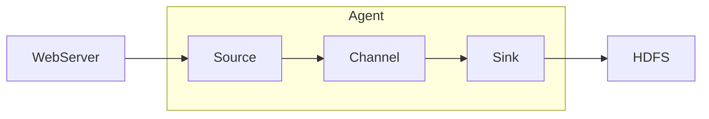
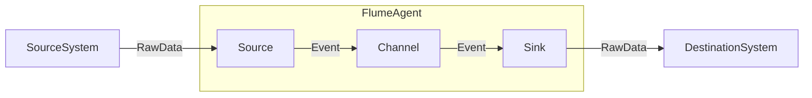

# 目录 #

- [第一节 Flume核心概念](#1)
- [第二节 Flume的分布式安装与配置](#2)
- [第三节 Flume Agent应用开发](#3)
- [第四节 Flume拦截器使用](#4)
- [第五节 Flume自定义开发组件](#5)

***

<h4 id='1'>第一节 Flume核心概念</h4>

1. 了解Flume原理
2. 掌握Flume架构
3. 了解Flume应用历史与场景

---

Flume
- Cloudera公司发布的开源的日志收集工具
- 分布式、可靠、高可用的海量日志采集、聚合和传输的日志收集系统
- 系统灵活性高：数据源可定制、可扩展；数据存储系统可定制、可扩展
- 中间件：屏蔽了数据源和数据存储系统的异构性

Flume特点
- 可靠性：数据高可用
- 可扩展性：组件可扩展
- 性能高：高性能高吞吐量、满足海量数据收集需求
- 文档丰富、社区活跃，Hadoop生态系统应用广泛

Flume基本架构
- 基本组件：Event、Client、Agent、Source、Channel、Sink
- 其他组件：Interceptor、Channel Selector、Sink Processor，在数据传输中对数据进行处理，可以定制化、二次开发
- Source、Channel、Sink都是逻辑组件（Java类），非物理组件，组合形成的Agent是Flume的物理组件


- Agent：Flume基本采集组件（配置文件）
    - 部署在采集的机器上
    - 包括Source、Channel、Sink
    - 是Flume流的基础部分
    - 为组件提供了配置、生命周期管理、监控支持
- Event：Flume数据传输的基本单元
    - 存储在内存或Flume本地文件中
    - 由可选的header和载有数据的byte array构成载有数据的构成
- Source
    - 负责接收event或通过特殊机制产生event，并将events批量的放到一个或多个Channel
    - 包含event驱动和轮询两种类型
    - Source必须至少和一个Channel关联
- Channel
    - 位于Source和Sink之间，用于缓存从Source传进来的event
    - 成功缓存event后，会将event发送到Sink
    - 不同的Chanel，所提供的的持久化水平，是不同的
    - Channel可以和任意数量的Source、Sink工作
- Sink
    - 负责将event传输到下一个Source或最终目的地，成功完成后，将event从Channel移除
    - 必须作用于一个确切的Channel
- 其他组件
    - Interceptor
        - 作用于Source，在必要地方处理events
    - Channel Selector
        - 允许Source基于预设的标准，从所有Channel中，选择一个或多个Channel
    - Sink Processor
        - 多个Sink可以构成一个Sink Group
        - 可以通过组中所有Sink实现负载均衡
        - 可以在一个Sink失败时转移到另一个Sink

Flume与Scribe比较
对比项|Flume|Scribe
-----|-----|------
使用语言|Java|C/C++
容错性|Agent和Collector间，Collector和Store间都有容错性，且提供三种级别的可靠性保证|Agent和Collector间，Collector和Store间有容错性
负载均衡|Agent和Collector间，Collector和Store间有LoadBalance和Failover两种模式|无
可扩展性|好|好
Agent丰富程度|提供丰富的Agent，包括avro/thrift socket, text, tail等|主要是thrift端口
Store丰富程度|可以直接写hdfs,text,console,tcp，写hdfs时支持对text和sequence的压缩|提供buffer,network,file(hdfs,text)等
代码结构|系统框架好，模块分明，易于开发|代码简单

***

<h4 id='2'>第二节 Flume的分布式安装与配置</h4>

flume-env.sh配置JAVA_HOME,JAVA_OPTS
配置环境变量

***

<h4 id='3'>第三节 Flume Agent应用开发</h4>

1. 掌握Flume Agent开发
2. 掌握Flume脚本开发方式

---

Flume NG部署
- 配置Flume Agent配置文件
    - 定义Source、Channel、Sink名称
        - agent1.sources = src1
        - agent1.channels = ch1
        - agent1.sinks = sink1
    - 定义并配置Source
        - agent1.sources.src1.type=netcat
        - agent1.sources.src1.channels=ch1
        - agent1.sources.src1.bind=127.0.0.1
        - agent1.sources.src1.port=10112
    - 定义并配置Channel
        - agent1.channels.ch1.type=memory
    - 定义并配置Sink
        - agent1.sinks.sink1.type=logger
        - agent1.sinks.sink1.channel=ch1
```
a1.sources=r1
a1.channels=c1
a1.sinks=s1
a1.sources.r1.type=spooldir
a1.sources.r1.spoolDir=/root/flumeAgent
a1.sources.r1.channels=c1
a1.channels.c1.type=memory
a1.sinks.s1.type=logger
a1.sinks.s1.channel=c1
```
```
flume-ng agent --conf $FLUME_HOME/conf/ --conf-file $FLUME_HOME/agentconf/test.conf --name a1 -Dflume.root.logger=INFO,console
```
- 采集完的文件会打上COMPLETED标签

Flume Agent协同工作
- avro：一个hadoop的序列化框架，将对象序列化到流中，提供RPC
- agent1：负责源数据(/root/flumeAgent)的监听，将数据送给agent2的source
```
a1.sources=r1
a1.channels=c1
a1.sinks=s1
a1.sources.r1.type=spooldir
a1.sources.r1.spoolDir=/root/flumeAgent
a1.sources.r1.channels=c1
a1.channels.c1.type=memory
a1.channels.c1.capacity=1000
a1.channels.c1.transactionCapacity=100
a1.sinks.s1.type=avro
a1.sinks.s1.channel=c1
a1.sinks.s1.hostname=hadoop001
a1.sinks.s1.port=4141
```
- agent2
```
a1.sources=r1
a1.channels=c1
a1.sinks=s1
a1.sources.r1.type=avro
a1.sources.r1.bind=0.0.0.0
a1.sources.r1.port=4141
a1.sources.r1.channels=c1
a1.channels.c1.type=memory
a1.channels.c1.capacity=1000
a1.channels.c1.transactionCapacity=100
a1.sinks.s1.type=logger
a1.sinks.s1.channel=c1
```
- 启动
```
flume-ng agent --conf $FLUME_HOME/conf/ --conf-file $FLUME_HOME/agentconf/avro2.conf --name a1 -Dflume.root.logger=INFO,console

flume-ng agent --conf $FLUME_HOME/conf/ --conf-file $FLUME_HOME/agentconf/avro1.conf --name a1 -Dflume.root.logger=INFO,console
```

***

<h4 id='4'>第四节 Flume拦截器使用</h4>

1. 掌握Flume拦截器原理
2. 掌握Flume拦截器开发

---

Flume拦截器（Interceptor）
- 简单的插件式组件，设置在source和channel之间，专门处理event
- 每个拦截器只处理同一个source接收到的事件
- 可以自定义拦截器
- 拦截器类型
    - Timestamp Interceptor
        - 将时间戳插入到flume的事件报头中
        - a1.source.r1.inteceptors=timestamp
        - a1.source.r1.inteceptors.timestamp.type=timestamp
        - a1.source.r1.inteceptors.timestamp.preserveExisting=false
            - 默认false，若设置为true，如果事件中报头已经存在，不会替换时间戳报头的值
    - Host Interceptor
        - 将服务器的ip地址或者主机名插入到事件报头中
        - a1.source.r1.inteceptors=host
        - a1.source.r1.inteceptors.host.type=host
        - a1.source.r1.inteceptors.host.useIP=false
            - false:主机名/true:IP
        - a1.source.r1.inteceptors.timestamp=preserveExisting=true
    - Static Interceptor
    - UUID Interceptor
    - Morphline Interceptor
    - Search and Replace Interceptor
    - Regex Filtering Interceptor
        - 可以过滤掉不需要的日志，根据需要收集满足正则条件的日志
        - a1.sources.r1.interceptors=regex
        - a1.sources.r1.interceptors.regex.type=REGEX_FILTER
        - a1.sources.r1.interceptors.regex.regex=(rm)|(kill)
            - .*：匹配除“\n”之外的任意字符
        - a1.sources.r1.interceptors.regex.excludeEvents=false
            - 默认收集匹配到的事件，如果为true，则会删除匹配到的event，收集未匹配到的
    - Regex Extractor Interceptor
```
a1.sources=r1
a1.channels=c1
a1.sinks=s1
a1.sources.r1.type=spooldir
a1.sources.r1.spoolDir=/root/flumeAgent
a1.sources.r1.interceptors=timestamp
a1.sources.r1.interceptors.timestamp.type=timestamp
a1.sources.r1.interceptors.timestamp.preserveExisting=false
a1.sources.r1.channels=c1
a1.channels.c1.type=memory
a1.channels.c1.capacity=1000
a1.channels.c1.transactionCapacity=100
a1.sinks.s1.type=logger
a1.sinks.s1.channel=c1
```
```
a1.sources=r1
a1.channels=c1
a1.sinks=s1
a1.sources.r1.type=spooldir
a1.sources.r1.spoolDir=/root/flumeAgent
a1.sources.r1.interceptors=i1 i2
a1.sources.r1.interceptors.i1.type=timestamp
a1.sources.r1.interceptors.i1.preserveExisting=false
a1.sources.r1.interceptors.i2.type=host
a1.sources.r1.interceptors.i2.hostHeader=host
a1.sources.r1.interceptors.i2.useIP=false
a1.sources.r1.interceptors.i2.preserveExisting=false
a1.sources.r1.channels=c1
a1.channels.c1.type=memory
a1.channels.c1.capacity=1000
a1.channels.c1.transactionCapacity=100
a1.sinks.s1.type=logger
a1.sinks.s1.channel=c1
```
```
a1.sources=r1
a1.channels=c1
a1.sinks=s1
a1.sources.r1.type=spooldir
a1.sources.r1.spoolDir=/root/flumeAgent
a1.sources.r1.interceptors=i1
a1.sources.r1.interceptors.i1.type=regex_filter
a1.sources.r1.interceptors.i1.regex=^[0-9]*$
a1.sources.r1.interceptors.i1.excludeEvents=true
a1.sources.r1.channels=c1
a1.channels.c1.type=memory
a1.channels.c1.capacity=1000
a1.channels.c1.transactionCapacity=100
a1.sinks.s1.type=hdfs
a1.sinks.s1.hdfs.path=hdfs://hadoop001:9000/flume/regex
a1.sinks.s1.hdfs.fileType=DataStream
a1.sinks.s1.channel=c1
```
```
flume-ng agent -c $FLUME_HOME/conf/ -f $FLUME_HOME/agentconf/***.conf -n a1 -Dflume.root.logger=INFO,console
```

***

<h4 id='5'>第五节 Flume自定义开发组件</h4>

1. 掌握Flume自定义Source
2. 掌握Flume自定义Sink
3. 掌握Flume自定义Interceptor

---

Configure方法
- 初始化配置，只执行一次
```
public void configure(Context context) {
    fileName = context.getString("fileName");
}
```

Flume自定义Source
- extends AbstractSource implements Configurable, PollableSource
- 继承PollableSource（轮询拉取）或者EventDrivenSource（事件驱动）
    - PollableSource：通过线程不断去调用process方法，主动拉取消息
    - EventDrivenSource：需要触发一个调用机制，被动等待
- 开发步骤
    1. 自定义Source类
        ```
        String text = "mySource" + ...;
        HashMap header = new HashMap<String, String>();
        header.put("id", ...);
        this.getChannelProcessor().processEvent(EventBuilder.withBody(text, Charset.forName("UTF-8"), header));
        ```
    2. 打包Jar包，放置到flume的lib目录下，或加入环境变量
    3. 配置flume agent使用
        ```
        a1.sources=r1
        a1.channels=c1
        a1.sinks=s1
        a1.sources.r1.type=com.***.MySource
        a1.sources.r1.channels=c1
        a1.channels.c1.type=memory
        a1.channels.c1.capacity=1000
        a1.channels.c1.transactionCapacity=100
        a1.sinks.s1.type=logger
        a1.sinks.s1.channel=c1
        ```

Flume自定义Sink
- extends AbstractSink implements Configurable
- 开发步骤
    1. 自定义Sink类
        - 继承AbstractSink
        - 重写process方法
        ```
        Channel ch = getChannel();
        // get the transaction
        Transaction txn = ch.getTransaction();
        Event event = null;
        // begin the transaction
        txn.begin();

        ...
        event = ch.take();
        event.getBody();
        ...

        txn.commit();
        txn.close();

        return Status.READY;
        ```
    2. 打包
    3. 配置使用
    ```
    a1.sources=r1
    a1.channels=c1
    a1.sinks=s1
    a1.sources.r1.type=spooldir
    a1.sources.r1.spoolDir=/root/flumeAgent
    a1.sources.r1.channels=c1
    a1.channels.c1.type=memory
    a1.sinks.s1.type=com.***.MySink
    a1.sinks.s1.channel=c1
    ```

Flume自定义Interceptor
- 拦截器是简单的插件式组件，设置在Source和Channel之间
- Source接收到的时间，在写入Channel之前，拦截器都可以进行转换或删除这些事件
- 每个拦截器只能处理同一个Source接收到的事件
- 实现Inteceptor的继承类
- 开发步骤
    1. 实现Inteceptor接口
        - 在Event intercept(Event event)方法里实现逻辑
        ```
        String body = new String(event.getBody(), Charsets.UTF_8);
        event.setBody(new StringBuffer().append("...").getBytes());
        return event;
        ```
        - 实现List<Event> intercept(List<Event> events)方法
        ```
        // 重组events
        List<Event> in = Lists.newArrayListWithCapacity(events.size());
        for (Event event : events) {
            // 调用上面实现的方法，对所有event进行处理
            Event inEvent = intercept(event);
            if (inEvent != null) 
                in.add(inEvent);
        }
        return in;
        ```
        - 实现Interceptor.Builder
        ```
        public static class Builder implements Interceptor.Builder {
            return new MyInterceptor();
        }
        ```
    2. 打包
    3. 配置文件：interceptor=com.***.Interceptor.$Builder
    ```
    a1.sources=r1
    a1.channels=c1
    a1.sinks=s1
    a1.sources.r1.type=spooldir
    a1.sources.r1.spoolDir=/root/flumeAgent
    a1.sources.r1.channels=c1
    a1.sources.r1.interceptors=i1
    a1.sources.r1.interceptors.i1.type=com.***.MyInterceptor$Builder
    a1.channels.c1.type=memory
    a1.channels.c1.capacity=1000
    a1.channels.c1.transactionCapacity=100
    a1.sinks.s1.type=logger
    a1.sinks.s1.channel=c1
    ```