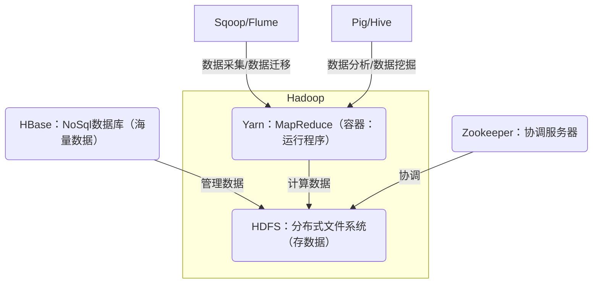
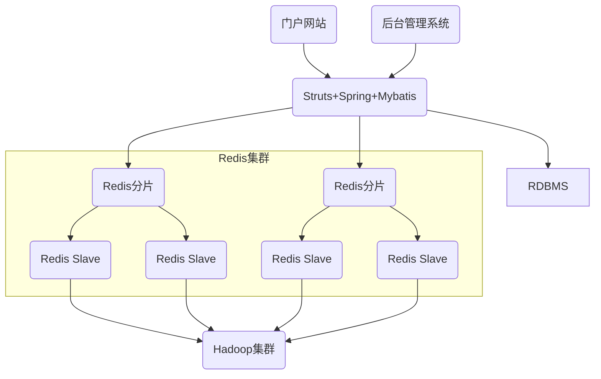
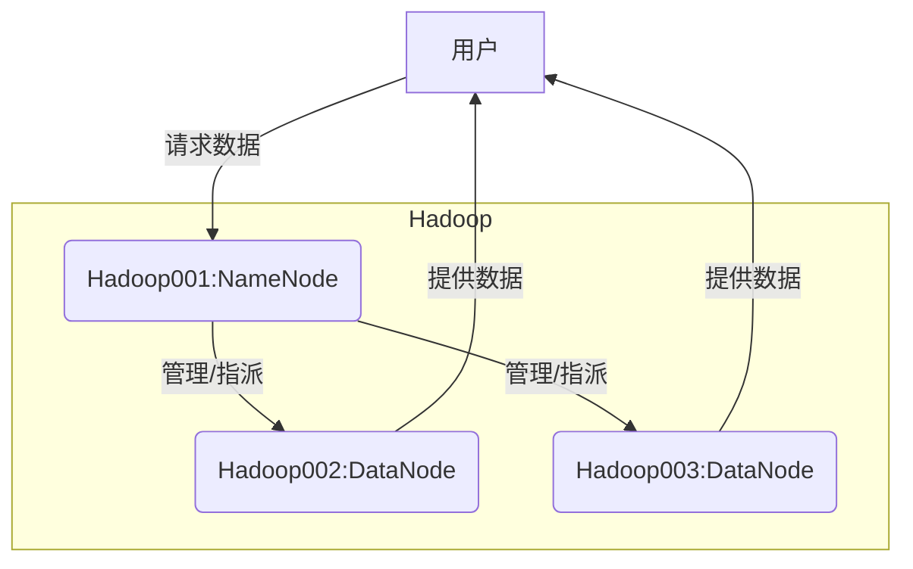

1. 了解大数据行业现状与最新动态
2. 了解Hadoop起源、历史与不同的发行版本
3. 了解Hadoop的生态体系
4. 熟悉Hadoop3.0新特性
5. 了解Hadoop在互联网公司的应用案例
6. 熟练掌握Hadoop的安装、配置方法

***

# 目录 #
- [第一节 大数据行业现状分析与最新动态](#1)
- [第二节 Hadoop的起源与简史](#2)
- [第三节 Hadoop的生态体系](#3)
- [第四节 Hadoop3.0新特性介绍](#4)
- [第五节 Hadoop在互联网公司的应用案例解析](#5)
- [第六节 Hadoop2.X安装部署的三种模式](#6)

***

<h4 id='1'>第一节 大数据行业现状分析与最新动态</h4>

1. 了解大数据核心思想
2. 了解大数据行业现状与趋势

---

大数据能做什么
- 核心功能是：预测
    - Google预测：2009年，谷歌公司成功预测到了美国冬季流感的传播
- 核心思想是：通过现象、总结规律、预测未来，而非因果关系

---

大数据现状
- 大数据市场
    - 2013-2020，全球大数据市场份额将以58.2%的复合年增长率增长
- 我国大数据产业处于规模化发展时期
- 2015年我国大数据市场规模1692亿元，占全球市场大数据规模的20.30%
- 预计2020年全球大数据市场规模将超过10270亿美元，我国将接近13625亿元

大数据主要应用领域
- 政府服务类
    - 对内：提供工作效率，监督、透明化
    - 对外：改善民生，智慧城市、交通等
- 商业类大数据应用
    - 电子商务
    - 金融
    - 电信
    - 医疗
    - 交通
    - 物流
    - 教育

大数据产业发展需求
 - 数据源范围不断扩大、所属行业不断丰富
 - 大数据存储、处理与分析

 大数据产业存在的挑战
 - 数据开放程度较低
 - 安全风险日益突出
 - 技术应用创新滞后
 - 技术人才紧缺

 ***

<h4 id='2'>第二节 Hadoop的起源与简史</h4>

1. Hadoop的起源与简史
2. Hadoop的核心设计思想

---

大数据
- 是指无法在一定时间范围内用常规软件工具进行捕捉、管理和处理的数据集合，是需要新处理模式才能具有更强的决策力、洞察发现力和流程优化能力的海量、高增长率和多样化的信息资产
- 5个特征（IBM提出）
    - Volume（大量）：T级别
    - Velocity（高速）：增长速度快
    - Variety（多样）
    - Value（价值）：反复挖掘的可能性
    - Veracity（真实性）
- 深入理解：样本就是全部数据

Hadoop的起源和发展
- 1980年，托夫勒《第三次浪潮》,第一次提出大数据
- 2008年，《自然》推出了“大数据”的封面专栏
- 2011年6月，麦肯锡发布《大数据：下一个创新、竞争和生产力的前沿》研究报告
- Hadoop简史
    - 2002年，Nutch（爬虫）项目启动
    - 2003年，Google发表了第一篇云计算核心技术GFS的论文
    - 2004年，Nutch项目组根据GFS原理开发出NDFS
    - 2004年，Google发表了另一篇核心技术MapReduce的论文
    - 2005年，Nutch的主要算法移植到基于NDFS和MapReduce的框架下，Hadoop初步成形
    - 2006年，Doug Cutting加盟雅虎，正式启动Hadoop项目，Hadoop从Nutch项目中分离了出来，正式成为Apache的顶级项目
        - Hadoop名字来源于Doug儿子的玩具大象
    - 2007年，推出Hadoop测试版
    - 2008年，Hadoop获得排序的世界冠军
    - 2013年，Hadoop技术峰会召开，标志Hadoop进入主流
- Hadoop版本
    - Apache
        - 对硬件要求较低，兼容性较差，无商业支持
    - CDH
        - 对硬件要求较高，兼容性好，提供商业支持
    - 版本选择方法
        - 是否开源
        - 是否稳定
        - 是否有实战验证
        - 是否有社区支持
        - 是否有商业支持

---

Hadoop的思想来源
- Google
    - GFS → HDFS：冗余度、多节点
    - Page Rank → MapReduce：分而治之
- 分布式文件系统（DFS）
    - 管理员
    - 数据仓库/数据仓库/数据仓库...
    - 解决问题
        1. 大数据存储
            - 加仓库（硬盘），理论上无限扩展
        2. 数据安全
            - 冗余度：默认备份3份
- Page Rank
    - 每个页面之间互相打分，进行矩阵计算，得出排名
    - 计算过于复杂，拆分给多个机器分别完成（Map）
    - 将计算结果汇总（Reduce）

Google的低成本之道
- 不使用超级计算机，不使用存储（淘宝的去i、去e、去o之路）
- 大量使用普通的pc服务器（去掉机箱、外设、硬盘），提供有冗余的集群服务
- 全世界多个数据中心，有些附带发电厂
- Google的三篇论文（Hadoop的思想来源）
    - GFS → HDFS
    - Page Rank → MapReduce
    - Big Table → HBase
- GFS(Google File System)

***

<h4 id='3'>第三节 Hadoop的生态体系</h4>

1. 了解Hadoop自身体系
2. 了解Hadoop的生态体系

---

Hadoop在大数据中的作用
- Hadoop的核心价值，是在廉价硬件组成的集群上进行海量的数据存储、运算，以获取有价值的信息
- Hadoop的分布式架构，大大提高了数据存储和数据处理的能力
- Hadoop的MapReduce功能实现了将单个任务打碎，并将碎片任务（Map）发送到多个节点上，之后再以单个数据集的形式加载（Reduce）到数据仓库里

Hadoop核心组成
- HDFS——分布式文件系统（存储）
    - 数据被分割成小块存于上千节点上
- MapReduce——分布式数据处理架构（计算）
    - 在数据节点上处理，降低IO成本
    - 只是一个软件架构，充分灵活，使开发者易于实现多种多样的应用程序

优点
- 高可靠性
- 高扩展性：扩集群，扩节点
- 高效性：节点之间动态地移动数据，避免数据倾斜
- 高容错性
- 低成本

---

Hadoop生态系统相关项目
- Pig：用于大数据分析工具，包含一个能产生MapReduce程序的编译器及查询语言Pig Latin
- Hive：基于HDFS的数据仓库工具，可以将结构化的文件映射为一张数据库表，提供类SQL语言(HiveQL)
- HBase（NoSql数据库）：分布式、面向列的开源数据库，适用于非结构大数据存储
- Sqoop：用于Hadoop系统与传统数据库间进行数据交换的工具
- Flume：是一个高可用、高可靠、分布式的海量日志采集、聚合和传输的系统
- ZooKeeper：是一个分布式应用程序协调服务器

***

<h4 id='4'>第四节 Hadoop3.0新特性介绍</h4>

Hadoop3.0简介
- 2017年，Apache Hadoop 3.0.0-beta1正式发布
- API是稳定的，但是不保证它的质量，不推荐线上使用
- 基于jdk1.8，必须升级至Java8

HDFS支持纠删码
- 数据持久化存储方法，与副本相比，纠删码更节省空间
- HDFS支持纠删码Erasure Coding，简称EC技术
- 可以防止数据丢失，可以解决HDFS存储空间翻倍的问题
    - 纠缠码标准编码会有1.4倍的空间开销
    - HDFS副本会有3倍的空间开销
- 劣势
    - 数据恢复会带来网络消耗，因为不仅要读取原数据块，还要读取校验块
    - 存储文件或者恢复文件，需要编码解码，会有CPU消耗
- 建议用于存储冷数据（不常使用的数据）
    - 冷数据数量大，减少副本的存储空间
    - 冷数据稳定，恢复数据时对业务的影响不大

Hadoop namenode的变化
- 支持一个active，多个standby的部署方式
    - “一正多副”
- 旧版本只支持“一正一副”模式

服务端口变化
- 弃用临时端口（linux临时端口：32768-61000），避免软件冲突
    - port：50xxx → 98xx

Intra-datanode均衡器
- 一个DataNode可以管理多个磁盘，正常写入操作，各磁盘会被均匀填满
- 当添加或替换磁盘时，可能导致此DataNode内部的磁盘存储的数据严重内斜
- 现有的HDFS balancer无法处理
- 由intra-datanode均衡器解决，通过hdfs diskbalancer CLI来调用

MapReduce的变化
- task-level native优化
- 增加了map output collector的native实现
- 对于shuffle密集型任务，可以提高30%的执行效率

内存参数自动推断
- Hadoop守护进程和MapReduce任务的堆内存管理发生了一系列变化
- 主机内存大小可以自动调整，所需的堆大小不再需要通过任务配置和Java选项实现，Hadoop_Heapsize已弃用
    - 避免内存浪费，节省资源

***

<h4 id='5'>第五节 Hadoop在互联网公司的应用案例解析</h4>

1. 了解互联网应用的架构
2. 了解Hadoop在互联网公司的应用

---

软件架构
- Client/Server(C/S)
    - 优点：重复利用客户电脑，降低服务器压力，体验更流畅
- Browser/Server(B/S)
    - 优点：使用方便，升级方便

- 传统架构
    系统前台：用户前段应用/后台管理系统
    系统后台：应用系统 → RDBMS（关系型数据库） → 硬盘
- 改良架构
    - 应用系统 → RDBMS → 硬盘
    - 应用系统 → NoSQL(Redis) → 内存 → 持久化存储
    - NoSQL ↔ 读写 ↔ RDBMS
- 内存存储容灾性差 → Redis集群
- Redis集群 存入 Hadoop集群
- 完整架构图

***

<h4 id='6'>第六节 Hadoop2.X安装部署的三种模式</h4>

1. 熟练掌握Hadoop安装准备条件
2. 熟练掌握Hadoop三种模式的安装配置

---

预备条件
- 设置主机名和IP地址
    - 修改主机名（hostname文件）
    - 完成IP和主机名映射（hosts文件）
- 关闭防火墙
    - systemctl status firewalld.service
    - systemctl stop firewalld.service
    - systemctl disable firewalld.service
- 安装JDK
    - tar -zxvf jdk-* -C dir
    - 配置环境变量
- 配置SSH免密登录
    - 免密登录原理
    1. Hadoop1：产生一个秘钥对
        - 公钥：给别人
        - 私钥：自己保留
    2. Hadoop1：发送公钥给Hadoop2
    3. Hadoop2：得到公钥
    4. Hadoop2：随机产生一个字符串
    5. Hadoop2：用公钥加密
    6. Hadoop2：将密文发送给Hadoop1
    7. Hadoop1：得到密文
    8. Hadoop1：使用私钥解密
    9. Hadoop1：将明文发送给Hadoop2
    10. Hadoop2：得到明文
    11. Hadoop2：对比得到的明文和自己发送的明文，如果一致，允许登录
    - 配置
    1. 产生秘钥对
        - ssh-keygen -t rsa
    2. 秘钥对默认生成在家目录的.ssh目录下
    3. 把自己的公钥给需要免密登录对象
        - ssh-copy-id-i .ssh/id_rsa.pub root@localhost
    4. 会发现Hadoop的/root/.ssh目录下多了文件authorized_keys
    5. 验证是否能够实现免密登录
        - ssh hadoop001

---

1. 本地模式
    - 特点
        - 不具备HDFS功能，所有数据存在Linux上
        - 只能运行MapReduce程序
    - 解压安装文件
        - tar -zxvf hadoop-*.tar.gz
    - 目录结构
        - bin：操作命令
        - etc/hadoop：配置文件
        - sbin：管理命令：启动、停止
        - share/doc：文档
        - share/hadoop：按照模块对各个组件进行划分
            - common：公用的jar包
            - mapreduce：hadoop-mapreduce-examples.jar-学习用的jar包
    - 修改相关配置文件
        - hadoop-env.sh：配置JAVA_HOME
    - 配置环境变量
    - 验证本地配置模式
        - 启动
            - start-all.sh
        - 准备测试数据
            - mkdir -p data/input
            - vi data.txt
        - 测试(MapReduce功能)
            - cd $HADOOP_HOME/share/hadoop/mapreduce
            - hadoop jar hadoop-mapreduce-*.jar wordcount .../data/input/data.txt .../data/output/wordcount
2. 伪分布模式
    - 特点
        - 具有Hadoop的所有功能：HDFS和Yarn
        - 在单机上模拟分布式
        - 适合开发和测试使用
    - 配置

    <table>
        <tr>
            <td>参数文件</td>
            <td>配置参数</td>
            <td>参考值</td>
            <td>解释</td>
        </tr>
    <!-- hadoop-env.sh -->
        <tr>
            <td>hadoop-env.sh</td>
            <td>JAVA_HOME</td>
            <td>/root/software/jdk1.8</td>
            <td></td>
        </tr>
    <!-- hdfs-site.xml -->
        <tr>
            <td rowspan="4">hdfs-site.xml</td>
            <td>dfs.replication</td>
            <td>1</td>
            <td>数据块冗余度：默认是3，即备份3份</td>
        </tr>
        <tr>
            <td>dfs.permissions</td>
            <td>FALSE</td>
            <td>不进行权限校验</td>
        </tr>
        <tr>
            <td>dfs.namenode.name.dir</td>
            <td>file:/data/name/data</td>
            <td>HDFS的元信息保存目录</td>
        </tr>
        <tr>
            <td>dfs.datanode.data.dir</td>
            <td>file:/data/dfs/data</td>
            <td>HDFS的数据保存目录</td>
        </tr>
    <!-- core-site.xml -->
        <tr>
            <td rowspan="2">core-site.xml</td>
            <td>fs.defaultFS</td>
            <td>hdfs://hostname:9000</td>
            <td>NameNode地址</td>
        </tr>
        <tr>
            <td>hadoop.tmp.dir</td>
            <td>/root/software/hadoop2.6/tmp</td>
            <td>日志保存目录：默认是/tmp</td>
        </tr>
    <!-- mapred-site.xml -->
        <tr>
            <td>mapred-site.xml</td>
            <td>mapreduce.framework.name</td>
            <td>yarn</td>
            <td>Map-Reduce运行的平台：在Yarn平台上运行</td>
        </tr>
    <!-- yarn-site.xml -->
        <tr>
            <td rowspan="2">yarn-site.xml</td>
            <td>yarn.resourcemanager.hostname</td>
            <td>hostname</td>
            <td>Yarn的主节点</td>
        </tr>
        <tr>
            <td>yarn.nodemanager.aux-services</td>
            <td>mapreduce_shuffle</td>
            <td>mr处理数据的方式，从节点</td>
        </tr>
    </table>

    - 创建需要的文件路径
    - 格式化namenode
        - hdfs namenode -format
    - 验证安装是否成功
        - 启动集群
            - start-all.sh
        - 查看进程
            - jps
            - NameNode、DataNode、NodeManager、ResourceManager、SecondaryNameNode
3. 全分布模式
    - 特点
        - 具备Hadoop的所有功能：HDFS和Yarn
        - 数据更加安全可靠
        - 性能更高
        - 适合生产环境使用

-
    1. 准备多台Linux服务器
    2. 关闭防火墙
    3. 配置主机名和地址映射
        - hosts文件
    4. 安装JDK
    5. 配置免密登录
    6. 同步三台服务器的时间
    7. 安装配置Hadoop
        - core-site/yarn-sit：修改主节点ip
        - 配置slaves：修改从节点名称
        - dfs.replication：备份数量
    8. 清理数据
        - hadoop的tmp路径下内容
        - hadoop配置的元信息保存路径下的内容
        - hadoop配置的数据保存路径下的内容
    9. 复制操作系统
    10. 格式化hdfs
    11. 启动
    12. 测试

    - 与伪分布配置的不同点
        - 需要配置slaves文件（从节点）
    - 真实环境复制Hadoop环境
        - scp -r hadoop2.6/ root@hadoop002:/root/training

***

