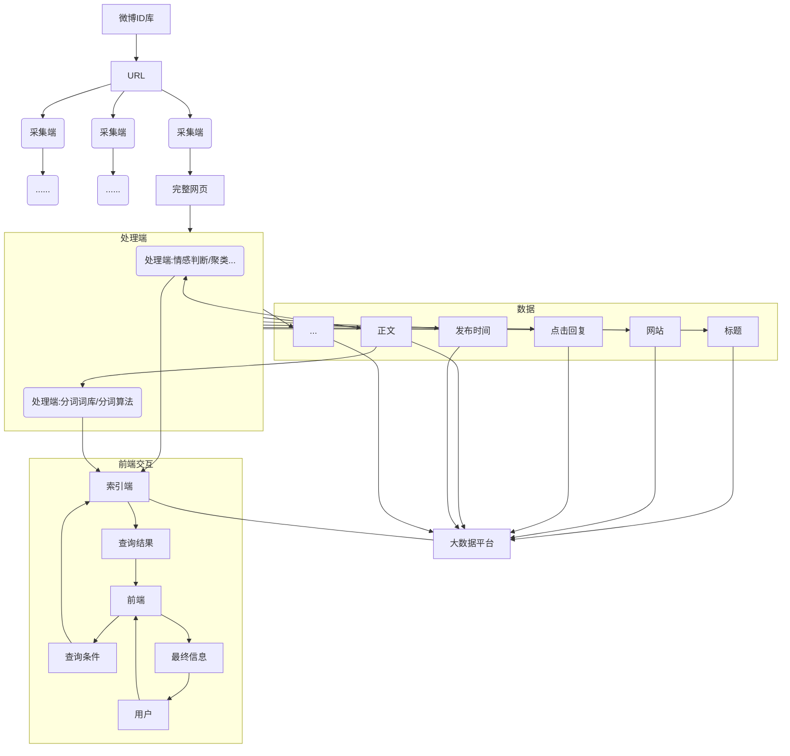

# 目录 #

[HadoopEnv与YarnEnv配置](#1)
[HDFS生产环境配置文件解析](#2)
[MapReduce生产环境配置文件解析](#3)
[Yarn生产环境配置文件解析](#4)
[如何在不同配置的集群中合理管理Hadoop配置](#5)
[某公司微博数据分析平台架构解析](#6)

***

120台机器（NameNode2台，DataNode118台）
机器配置：96G内存，24块1TB磁盘（SAS）

***

<h4 id='1'>HadoopEnv与YarnEnv配置</h4>

1. 了解hadoop-env.sh生产环境配置方法
2. 掌握yarn-env.sh重要的配置参数

hadoop-env.sh
- hadoop的运行环境
- JAVA_HOME
- HADOOP_CLASSPATH
- YARN_HOME
- HBASE_HOME
    - 一般在/usr/lib目录下
    - conf文件一般在/etc目录下
- HADOOP_HEAPSIZE
- HADOOP_NAMENODE_OPTS
    - 一般是一半内存，即：-Xms45g -Xmn4g
- HADOOP_DATANODE_OPTS

yarn-evn.sh
- YARN的日志路径
- YARN_RESOURCEMANAGER_OPTS
    - -Xmx4g -Xmn1g
- YARN_NODEMANAGER_OPTS
    - -Xmx2g -Xmn512m
- HADOOP_JOB_HISTORYSERVER_OPTS
    - 存储应用运行日志

***

<h4 id='2'>HDFS生产环境配置文件解析</h4>

1. 了解HDFS生产环境配置方法
2. 掌握HDFS常见更新的参数

磁盘目录配置
- dfs.namenode.name.dir
- dfs.datanode.data.dir

磁盘配置策略
- dfs.datanode.failed.volumes.tolerated
    - 磁盘损坏容忍数量
    - 一般是总量的1/4，即6
- dfs.datanode.fsdataset.volume.choosing.policy
    - 磁盘选择策略
    - 默认是轮询
    - org.apache.hadoop.hdfs.server.datanode.fsdataset.AvailableSpaceVolumeChoosingPolicy：均衡存储
- dfs.datanode.available-space-volume-choosing-policy.balanced-space-threshole
    - 磁盘使用空间最大值减去最小值，小于该值时就选择轮询策略
    - 10737418240（10G）
- dfs.datanode.available-space-volume-choosing-policy.balanced-space-preference-fraction
    - 磁盘使用容忍度
    - 一般是0.75（最多使用75%磁盘）

磁盘预留空间
- dfs.datanode.du.reserved
    - 每块磁盘保留的空余空间，预留给非hdfs文件使用
    - 和之前磁盘配置策略配合使用（10G）

主机数量包含管理
- dfs.hosts.exclude
    - 配置节点下线
- dfs.hosts
    - 配置节点上线

NameNode处理线程数量
- dfs.namenode.handler.count
    - 默认值很小，集群大时修改
    - namenode压力过大时，减少线程数

Block信息处理
- dfs.client.file-block-storage-locatioins.timeout
    - 定位block超时时间
- dfs.datanode.hdfs-blocks-metadata.enabled
    - 默认true

负载均衡
- dfs.balance.bandwidthPersec

***

<h4 id='3'>MapReduce生产环境配置文件解析</h4>

1. 了解MapReduce生产环境配置方法
2. 掌握MapReduce重要的配置参数

任务执行参数
- mapreduce.map.java.opts
    - -Xmx2048m
- mapreduce.reduce.java.opts
    - -Xmx4096m
- mapreduce.reduce.memory.mb
    - 4096
    - 一次能申请4G内存

目录配置
- mapreduce.jobhistory.intermediate-done-dir
- mapreduce.jobhistory.done-dir
    - jobhistory日志，任务执行情况
    - 一般配置在/user/history目录下

framework与端口配置
- mapreduce.framework.name
    - yarn
- mapreduce.jobhistory,address
    - db-cdh-218:10020
- mapreduce.jobhistory.webapp.address
    - db-cdh-218:19888

***

<h4 id='4'>Yarn生产环境配置文件解析</h4>

1. 了解Yarn生产环境配置方法
2. 掌握Yarn重要的配置参数

应用Classpath配置
- yarn.application.classpath
    - 将yarn用到的配置文件和lib配置进来

log配置
- yarn.nodemanager.local-dirs
    - 中间结果
- yarn.nodemanager.log-dirs
    - 日志，放到每个磁盘上，定期清理
- yarn.ndoemanager.remote-app-log-dir
- yarn.app.mapreduce.am.staging-dir

内存和CPU配置
- yarn.nodemanager.resource.memory-mb
    - 能够使用多少内存
    - 一般是1/2，即40960（40G）
- yarn.nodemanager.resource.cpu-vcores
    - 18

App计算资源配置
- yarn.scheduler.minimum-allocation-mb
    - 最小申请资源
    - 一般2048（2G）
- yarn.nodemanager.pmem-check-enabled
- yarn.nodemanager.vmem-check-enabled
    - 是否检查
    - 一般false

各端口分开配置
- 一般配置到90xx

***

<h4 id='5'>如何在不同配置的集群中合理管理Hadoop配置</h4>

1. 了解如何在不同配置的集群中合理管理Hadoop配置
2. 掌握为什么生产环境中会出现不同的配置

为什么会出现不同的配置
- 作用不同：离线分析（存储要求高，数量多）/在线分析（性能要求高，内存大）
- 采购时间不同，不同时间搭建

如何管理不同配置的集群——运维工具
- Puppet
    - 管理配置文件
    - 是一个开源的软件自动化配置和部署工具
    - 为C/S架构
    - 服务器端保存着所有对客户端服务器的配置代码
    - 与SVN一起使用
    ```mermaid
    graph TD
    user-->|用户提交作业|SVN(SVN DB)
    SVN-->|从SVN读配置|PM(Puppet Master)
    PM-->|推送配置|PC1(Puppet Client)
    PM-->|推送配置|PC2(Puppet Client)
    PM-->|推送配置|PC3(Puppet Client)
    ```
- SaltStack
    - 部署和配置工具
- Ansible
    - 服务的启动和管理

***

<h4 id='6'>某公司微博数据分析平台架构解析</h4>

1. 了解课程案例微博数据分析平台的架构
2. 了解常见的大数据平台架构

微博大数据分析

产品背景需求
- 微博舆情：危机管理、竞争情报、品牌分析
    - 负面信息
        - 影响范围
    - 竞争对手
        - 行业政策、新技术、新商业模式
        - 竞争对手动态，新产品、营销活动
    - 品牌形象
        - 媒体认知、网友认知、用户认知、意见领袖的态度

对于客户的价值
- 提升客户体验
- 创新商业模式
- 技术高效、低成本
- 提升业务效率
- 增强管理水平

服务体系
- 检测系统
    - 网络口碑监测
    - 热点事件监测
    - 行业竞品监测
- 危机预警
    - 邮件预警
    - 微信预警
    - 电话、手机短信预警
    - IM预警
    - ...
- 分析报告
    - 日/周/季/年报专题事件报告
    - 市场效果评估

整体架构
- 云采集
    - 定向抓取的智能爬虫、云搜索等多种机制，实时全网监测，数据采集
- 云存储
    - 分布式存储
    - 结构化、非结构化数据存储
    - 快照存储
    - 安全性
    - 高扩展性
- 云分析
    - 文章权重计算
    - 情感分析
    - 自动分类
    - 自动聚类
    - 传播轨迹
    - 自动发现
- 云应用
    - 前端界面

产品架构
- 应用层
    - J2EE
- 能力层
    - 基础分析
    - 多维分析
    - 数据挖掘
    - 实时分析
    - 自主分析
    - 数据共享
    - 数据统一服务，开放SQL、FTP、WX、MDX、API、...
- 数据层（混合数据中心架构）
    - 主数据仓库（Oracle、TeraData...）
        - 提供数据分析报表，直接面对业务用户
        - 离线分析业务，实时性要求低
    - 分布式数据库（MPP、SQLServer、SybaseIQ、HANA、Greenplum...）
        - Ad-hoc query，在大数据量上完成实时分析
        - Hadoop实时查询较慢，因此需要分布式数据库
    - Hadoop平台
        - 存储所有的数据
        - 完成基本统计分析
        - 目前无法完成真正的维度建模
        - 很少直面业务用户
- 获取层
    - 数据采集
        - ETL（数据的extract + transform + load）
            - 工具：Kettle, Talend, Niffi...
            - 收费：Infomatic, Datastage...
            - 对数据清洗流程进行调度
            - 封装清洗流程（可视化）
        - 流数据处理
        - 爬虫
- 数据源
    - 公司内部数据
    - 互联网

功能结构
- 微博分析应用
    - 微博声量分析
    - 微博情感分析
    - 微博转发评论分析
- 微博粉丝应用
    - 微博发帖用户归属地分析
    - 微博用户活跃度分析
- 微博品牌分析
    - 品牌粉丝画像
    - 微博账号用户画像

平台流程
- 提供需要监控的微博ID
- 通过微博的正则工具采集内容，变成文件（FTP、Linux共享目录），通过采集工具发给大数据平台



平台设计步骤
1. 业务需求制定分析
    - 离线分析业务（小时级，T+1）
        - 定时报表
        - 定时任务
    - 在线分析业务（分钟级）
        - 输入条件查询结果
        - 统计分析
    - 展现方法
        - ECharts
        - J2EE Tomcat
    - 数据存储需求
2. 软件规划
    - 大数据平台组件（离线分析）
    - 数据库软件
    - Web应用
    - BI组件
    - MPP数据库（在线分析）
    - 缓存（在线分析）
    - NoSQL数据库（在线分析）
3. 硬件规划
    - 离线分析集群
    - 在线分析集群
    - Web端应用集群
    - MPP集群
    - 缓存集群
    - NoSQL集群
    - 注：集群之间最好互相独立，便于管理，并且每个集群业务作用不同，对硬件的要求不同

本项目使用软件
- CDH 5.14
    - HDFS
    - Yarn
    - MapReduce
    - Hive
    - HBase
    - Flume
    - Sqoop
- MySQL 5.6
- JDK 1.8
- CentOS 7.0
- Web应用：Tomcat
- 报表：ECharts