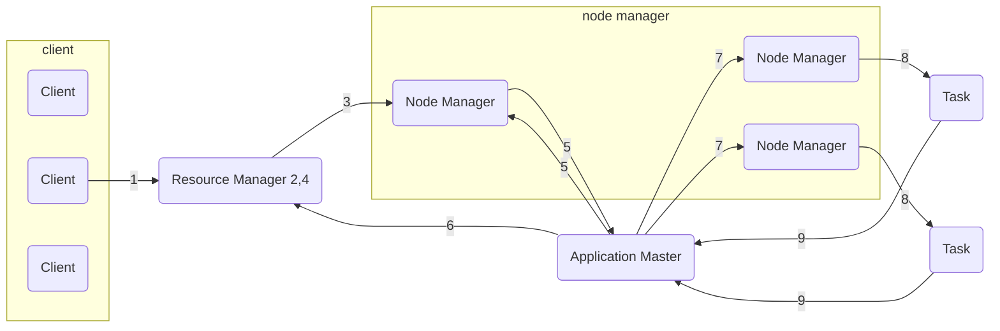

# 目录 #

- [第一节 MapReduce概要介绍](#1)
- [第二节 MapReduce示例运行与解析](#2)
- [第三节 搭建Eclipse Hadoop开发环境](#3)
- [第四节 WordCount实现](#4)
- [第五节 Yarn原理介绍](#5)

***

<h4 id='1'>第一节 MapReduce概要介绍</h4>

1. 了解MapReduce概念
2. 掌握MapReduce原理
3. 掌握MapReduce处理过程

---

MapReduce
- 一种编程模型，用于大规模数据集（大于1TB）的并行运算
- Map（映射）和Reduce（归约），以及它们的主要思想，都是从函数式编程语言（如LISP）借鉴来的
- 极大地方便了编程人员，使得编程人员在不必编写分布式并行程序的情况下，可以将自己的程序运行在分布式系统上

MapReduce处理模型
- 数据集必须具备两个特点
    - 可被分解为许多小数据集
    - 每个小数据集可以并行处理
- 典型的并行计算过程
- 应用程序只需关注数据处理逻辑，MapReduce框架负责处理并行计算中的种种复杂问题，包括：
    - 分布式存储
    - 作业调度
    - 负载均衡
    - 容错处理
    - 网络通信

MapReduce处理过程
1. 确定待处理的数据块数量，以及每个记录在数据块中的位置
2. 对数据块中的所有记录执行相应的算法处理
    - 处理数据块的每一个程序实例就是一个Mapper任务
3. 对每个节点Mapper任务产生的中间结果在其本地进行整合
4. 根据分区要求，将Mapper产生的结果划分为组
5. Reduce阶段：将Mapper产生的结果整合成单一结果
    - 处理Mapper结果的每一个程序实例就是一个Reduce任务

***

<h4 id='2'>第二节 MapReduce示例运行与解析</h4>

略

***

<h4 id='3'>第三节 搭建Eclipse Hadoop开发环境</h4>

- http://marven.apache.org/
- http://mvnresponsity.com/
- http://maven.aliyun.com/nexus/
- [cdh](https://www.cloudera.com/documentation/enterprise/release-notes/topics/cdh_vd_cdh5_maven_repo_514x.html#concept_flv_nwn_yk)

***

<h4 id='4'>第四节 WordCount实现</h4>

略

***

<h4 id='5'>第五节 Yarn原理介绍</h4>

1. 掌握Yarn的架构
2. 理解Yarn框架的原理

---

Yarn
- Yet Another Resource Negotiator：另一种资源协调者
- 是一种通用资源管理系统
- 可为上层应用提供统一的资源管理和调度
- 主要功能是提高集群的资源利用率、统一资源管理和数据共享

Hadoop1.0
- HDFS + MapReduce
Hadoop2.0
- HDFS + YARN + MapReduce + Others
- Yarn：计算资源分配管理

Yarn架构
- Client
- Resource Manager
    - 控制整个集群，管理应用程序向基础计算资源的分配
    - 处理客户端请求
    - 启动和监控ApplicationMaster
    - 监控NameNodeManager
    - 资源的分配与调度
- Node Manager
    - 管理单个节点上的资源
    - 处理来自ResourceManager的命令
    - 处理来自ApplicationMaster的命令
- Application Master
    - 管理在Yarn内运行的每个应用程序实例
    - 为应用程序申请资源并分配给内部的任务
    - 任务的监控与容错
- Container
    - 对任务环境进行抽象，封装CPU、内存等多维度的资源以及环境变量、启动命令等任务运行相关的信息

Yarn框架原理
1. Client提交任务
2. ResourceManager分配作业ID
3. ResourceManager发放作业所需资料（Jar包、文件等）给NodeManager
4. ResourceManager启动应用管理器
5. NodeManager启动并监控应用管理器ApplicationMaster
6. ApplicationMaster向ResourceManager申请作业资源、分配Container
7. ApplicationMaster命令节点NodeManager启动Container
8. NodeManager启动Container，创建作业Task
9. Task向ApplicationMaster汇报进度
10. 作业完成后，ApplicationMaster和Container清理工作状态

Yarn架构故障
- ResourceManager
    - 不存在单点故障
    - 基于ZooKeeper实现HA
- NodeManager
    - 失败后，RM将失败任务告诉对应的AM
    - AM决定如何处理失败的任务
- ApplicationMaster
    - 失败后，由RM负责重启
    - AM需处理内部任务的容错问题
    - RM、AM会保存已经运行完成的Task，重启后无需重新运行

Yarn资源调度器
- 提供多种资源调度器
    - FIFO
        - 先进先出，一般用在测试环境
    - Fair Scheduler
        - 公平调度器
    - Capacity Scheduler
        - 容量调度器
- 多租户资源调度器
    - 支持资源按比例分配
    - 支持层级队列划分方式
    - 支持资源抢占