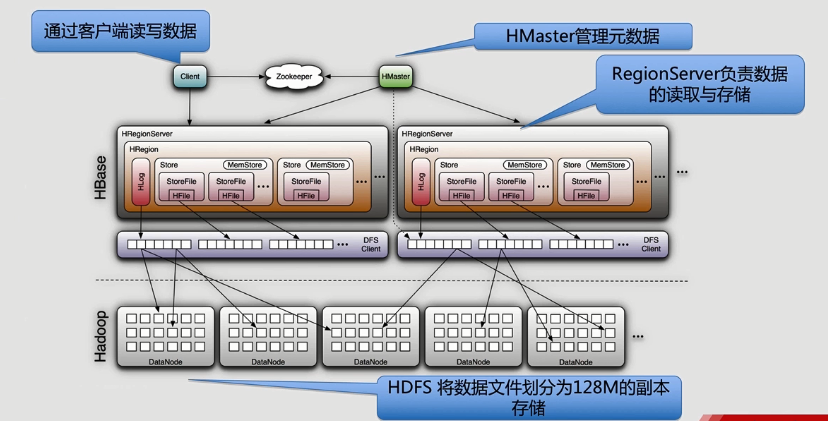

# 目录 #

-[第一节 HBase基础概念与数据模型](#1)
-[第二节 HBase系统结构](#2)
-[第三节 HBase安装](#3)
-[第四节 HBaseShell](#4)
-[第五节 HBaseJava编程接口](#5)
-[第六节 HBase协处理器原理](#6)
-[第七节 HBase二级索引](#7)
-[第八节 HBase Bulkload等高级特性](#8)
-[第九节 HBase与Hive协同工作](#9)
-[第十节 HBasePhoneix](#10)
-[第十一节 HBase表结构设计案例](#11)

***

<h4 id='1'>第一节 HBase基础概念与数据模型</h4>

1. 了解HBase发展简史
2. 掌握HBase主要版本
3. 了解HBase使用场景
4. 熟悉HBase数据模型

---

HBase起源和发展
- Hbase是一个分布式的、面向列的开源数据库，该技术来源于Fay Chang所撰写的Google论文“Bigtable”
- HBase基于Hadoop HDFS
- HBase版本：Apache/CDH

HBase适用场景
- 海量数据写入与查询同时存在的场景
- 高并发写入
- 高并发查询（非关键词检索类、统计类）

HBase与关系型数据库对比
对比项|HBase|关系型数据库
-----|-----|------------
数据类型|只有bytes类型|丰富的数据类型
数据操作|只有很简单的操作，如插入、删除等，表之间没有复杂的关系|各种各样的连接操作，函数等
数据维护|保留原数据，插入新数据|直接修改原数据
存储方式|基于列存储，每个列族都有自己的文件，不同的列族是分开的|基于表结构和行存储
可扩展性|支持随意扩展，不需要改变表内原有的数据（Free Schema）|修改表结构，需要复杂的操作
事务|没有复杂的事务支持，只有简单的行级事务|强事务保证
索引|第三方二级索引|拥有丰富的索引支持

传统行式数据库
- 数据是按行存储的
- 没有索引的查询使用大量IO
- 建立索引和物化视图需要花费大量时间和资源
- 面对查询的需求，数据库必须被大量膨胀才能满足性能要求

列式数据库
- 数据按列存储：每一列单独存放
- 数据即是索引
- 只访问查询涉及的列：大量降低系统IO
- 每一列由一个线索来处理：查询的并发处理
- 数据类型一致，数据特征相似：高效压缩

对比|行式存储|列式存储
---|-------|--------
优点|数据被保存在一起，INSERT/UPDATE容易|查询时只有涉及到的列会被读取，投影（projection）很高效，任何列都能作为索引
缺点|选择（Selection）时即使只涉及某几列，所有数据也都会被读取|选择完成时，被选择的列要重新组装，INSERT/UPDATE比较麻烦

HBase：满足海量数据存储，不适合做复杂事务的业务
数据库：OLTP，如银行交易系统，或更复杂的数据（OLAP）

HBase数据模型
- rowkey：可以按照不同的时间戳，保存不同版本的数据
    - 没有主外键的概念
- 列族：可以有多个，包含很多列（也可以没有列），不同列族的列可以不一样
- 列

基本操作方法
- delete
- get
- scan
- put

***

<h4 id='2'>第二节 HBase系统结构</h4>

1. 掌握HBase系统架构
2. 掌握HBase系统原理

---

HBase系统架构
- HMaster：管理元数据
    - 分配region
    - 管理RegionServer
    - 发现失效的Region server并重新分配其上的region
    - HDFS上的垃圾回收处理
    - schema更新请求
- RegionServer：负责数据的读取与存储
    - 维护master分配给他的region，处理对这些region的IO请求
    - Region Split与合并
- Zookeeper
    - 提供hbase regionserver状态管理
    - 元数据管理

HBase数据定位及元数据架构
- Zookeeper File
    - -ROOT-
    - .META
        - TBLs
- Table
    - Region (StartKey - EndKey) → 跨服务器，可分裂
        - Store → 列族
            - memStore → 内存结构，写入时先写memStore，达到一定量后flush成StoreFile
            - StoreFile → HDFS上的HFile
        - HLog → 用于数据回滚，每个RegionServer各一个



HBase写入数据流程
- 访问Zookeeper，从Meta表获取相应的Region信息
- 根据Namespace、表名和RowKey、Meta表的数据，找到写入数据对应的Region位置
- 定位最终RegionServer
- 把数据分别写到HLog和MemStore上各一份，MemStore达到一个阈值后则把数据刷成一个StoreFile文件
- 多个StoreFile文件达到一定的大小后，会触发Compact合并操作
- StoreFile大小超过一定阈值后，Region会分割成为两个（Split）,并由Hmaster分配到相应的HRegionServer，实现负载均衡
- 注：如果没写成功，该条数据会被删除，保证单条数据的事务性

HBase读取数据流程
- 访问Zookeeper，读取Region的位置，读取Meta表中的数据
- Meta中又存储了用户表的Region信息
- 根据Namespace、表名和RowKey、Meta表的数据，找到写入数据对应的Region位置
- 定位最终RegionServer
- 读请求在MemStore中查数据，查不到查BlockCache，再查不到就会到磁盘上读，并把读的结果放入BlockCache

HBase通过HDFS实现HA（3份备份数据）

***

<h4 id='3'>第三节 HBase安装</h4>

1. 掌握HBase伪分布式安装方法
2. 掌握HBase安装注意事项

---

Zookeeper
- 是一种为分布式应用所涉及的高可用、高性能且一致的开源协调服务，提供：分布式锁服务，可以实现配置维护、组服务、分布式消息队列、分布式通知/协调等

Zookeeper数据结构
- /
    - /master: serverid
    - /workers
        - /workers/worker-1: foo.com:2181
    - /tasks
        - /tasks/task-1-2: run cmd;
    - /assign
        - /assign/worker-1
            - /assign/worker-1/task-1-1 run cmd;

HBase安装
- 单机伪分布式/集群环境安装
- 安装步骤
    1. Hadoop安装
    2. HBase软件下载解压
    3. 环境变量配置
    4. Zookeeper安装
    5. HBase配置
    6. HBase安装
- zkServer.sh start
- start-hbase.sh
- hbase shell
    - list
    - exit

***

<h4 id='4'>第四节 HBaseShell</h4>

1. 掌握HBase Shell使用方法
2. 掌握HBase创建表等基础操作

---

HBase Shell简介
- HBase为用户提供了丰富的访问接口，HBase Shell是常用的便捷方式
- 通过HBase Shell可以方便地创建、修改和删除表，还可以向表中添加、修改和删除数据，列出表信息等
- 在启动HBase之后，输入HBase Shell进入
- 在HBase Shell中通过输入exit退出

命名空间
- create_namespace 'test'
- list_namespace
- describe_namespace 'test'
- drop_namespace 'test'

表
- create '命名空间：表名','列族'
    - 命名空间为空，则默认放入default命名空间中
- create 'test:t1','f'
- desc 'test:t1'
- put 'test:t1','row01','f:name','andy'
- put 'test:t1','row01','f:age',12
    - 重复插一条记录，不会报错，默认保留最新的一条记录
- scan 'test:t1'
- scan 'test:t1',{COLUMNS=>['f:name'],LIMIT=>10}
- scan 'hbase:meta'
- get 'test:t1','row01'
- get 'test:t1','row01',{COLUMNS=>['f:name']}
- delete 'test:t1','row01'
    - 给数据打上一个标签，无法查询得到，定期进行删除
- delete 'test:t1','row01','f:name'
- deleteall 'test:t1','row01'
- truncate 'test:t1'
    - Disabling table...
    - Truncating table...
- disable 'test:t1'
    - 表不可用，只可进行表的维护，无法查询（scan）
- drop 'test:t1'

***

<h4 id='5'>第五节 HBaseJava编程接口</h4>

1. 掌握HBase Java项目开发流程
2. 掌握HBase Java API

---

常用类
- HBaseConfiguration
- Admin
- HTableDescriptor
- HColumnDescriptor
- HTable
- ResultScanner
- Put
- Get
- Scan
- Result

```
import java.io.IOException;

import org.apache.hadoop.conf.Configuration;
import org.apache.hadoop.hbase.HBaseConfiguration;
import org.apache.hadoop.hbase.HColumnDescriptor;
import org.apache.hadoop.hbase.HTableDescriptor;
import org.apache.hadoop.hbase.TableName;
import org.apache.hadoop.hbase.client.Admin;
import org.apache.hadoop.hbase.client.Connection;
import org.apache.hadoop.hbase.client.ConnectionFactory;
import org.apache.hadoop.hbase.client.Put;
import org.apache.hadoop.hbase.client.Table;
import org.apache.hadoop.hbase.util.Bytes;

/**
 * HBase Util API
 * 
 * @author shanxiao
 *
 */
public class HBaseUtil {

	// configuration
	public static Configuration conf;
	public static Connection conn;

	// init config
	static {
		// hbase config
		conf = HBaseConfiguration.create();
		// hbase master config
		conf.set("hbase.master", "hadoop001:60000");
		// zookeper host
		conf.set("hbase.zookeeper.quorum", "hadoop001");
		// zookeeper port
		conf.set("hbase.zookeeper.property.clientPort", "2181");

		try {
			conn = ConnectionFactory.createConnection(conf);
		} catch (IOException e) {
			// TODO Auto-generated catch block
			e.printStackTrace();
		}
	}

	// create table
	public static void createTable(String tableName, String... families) throws IOException {
		// create admin
		Admin admin = conn.getAdmin();

		HTableDescriptor table = new HTableDescriptor(TableName.valueOf(tableName));
		for (String family : families) {
			HColumnDescriptor col = new HColumnDescriptor(family);
			table.addFamily(col);
		}

		if (admin.tableExists(TableName.valueOf(tableName))) {
			System.out.println("table already exist");
		} else {
			admin.createTable(table);
			System.out.println("successed! " + tableName);
		}

		// close admin
		admin.close();
	}

	// insert data
	// one family, one column, one value
	public static void insertData(String tableName, String rowKey, String family, String column, String value)
			throws IOException {

		Table table = conn.getTable(TableName.valueOf(tableName));
		Put put = new Put(Bytes.toBytes(rowKey));
		put.addColumn(Bytes.toBytes(family), Bytes.toBytes(column), Bytes.toBytes(value));
		table.put(put);
		table.close();

		System.out.println("insert Successed! " + rowKey + ": " + value);
	}

	// insert data
	// one family, muti columns, muti values
	public static void insertData(String tableName, String rowKey, String family, String[] columns, String[] values)
			throws IOException {

		Table table = conn.getTable(TableName.valueOf(tableName));
		Put put = new Put(Bytes.toBytes(rowKey));

		for (int i = 0; i < columns.length; i++) {
			put.addColumn(Bytes.toBytes(family), Bytes.toBytes(columns[i]), Bytes.toBytes(values[i]));
		}

		table.put(put);
		table.close();

		System.out.println("insert Successed! " + rowKey);
	}

	public static void main(String[] args) throws IOException {
		String tableName = "test";
		String[] families = new String[] { "cf0", "cf1" };
		// HBaseUtil.createTable(tableName, families);
		// HBaseUtil.insertData(tableName, "row01", families[0], "name", "shane");
		HBaseUtil.insertData(tableName, "row02", families[0], new String[] { "name", "age" }, new String[] { "scott", "25" });
	}
}
```

***

<h4 id='6'>第六节 HBase协处理器原理</h4>

1. 掌握HBase协处理器原理
2. 能开发基本的协处理器应用

---

HBase协处理器Coprocessor
- 允许开发者自定义的代码在服务端执行，来完成特定的一些功能
- 加载角度分类——系统协处理器、表协处理器
- 功能角度分类——Observer协处理器（关系型数据中的触发器）、Endpoint协处理器（动态终端，类似一个存储过程）

协处理器作用
- 访问权限控制
- 引用完整性，基于外键检验数据
- 给HBase设计二级索引，从而提高基于列过滤时的查询性能
- 监控服务变化，如HLog
- 实现服务端聚合函数：SUM、AVG等

---

Observer协处理器类型
- RegionObserver：提供客户端的数据操纵事件钩子（Get、Put、Delete、Scan等）
- WALObserver：提供WAL相关操作钩子
- MasterObserver：提供DDL类型的操作钩子（创建、删除、修改数据表等）

RegionObserver运转流程
- Client → HTable → HRegionServer → HRegion → coprocessorHost → RegionObserver

Observer协处理器代码部署方案
- 使用JAR包临时部署
    - hadoop fs -put *.jar /hbase
    - disable table
    - alter 'tblName','coprocessor'=>'hdfs://hadoop001:9000/test.jar|com.hbase.util.SecondCoprocessor||'
    - enable table
- 部署在配置文件中
    - hbase.coprocessor.region.classes
    - org.myname.hbase.coprocessor.endpoint.SumEndPoint
- 加载顺序：先加载配置文件中定义的协处理器，后加载表描述符中的协处理器
- Region级别的Observer，可以选择临时部署，可以在线更新
- 部署在配置文件中，因为加入了Regionserver JVM，需要重启才能更新

```
import java.io.IOException;
import java.util.List;

import org.apache.hadoop.conf.Configuration;
import org.apache.hadoop.hbase.Cell;
import org.apache.hadoop.hbase.HBaseConfiguration;
import org.apache.hadoop.hbase.TableName;
import org.apache.hadoop.hbase.client.Connection;
import org.apache.hadoop.hbase.client.ConnectionFactory;
import org.apache.hadoop.hbase.client.Durability;
import org.apache.hadoop.hbase.client.Get;
import org.apache.hadoop.hbase.client.Put;
import org.apache.hadoop.hbase.client.Table;
import org.apache.hadoop.hbase.coprocessor.BaseRegionObserver;
import org.apache.hadoop.hbase.coprocessor.ObserverContext;
import org.apache.hadoop.hbase.coprocessor.RegionCoprocessorEnvironment;
import org.apache.hadoop.hbase.regionserver.wal.WALEdit;
import org.slf4j.Logger;
import org.slf4j.LoggerFactory;

public class InsertData extends BaseRegionObserver {

	private Logger logger = LoggerFactory.getLogger(InsertData.class);
	
	static Configuration conf = null;
	static Connection conn;
	
	static {
		conf = HBaseConfiguration.create();
		conf.set("hbase.master", "hadoop001:60000");
		conf.set("hbase.zookeeper.quorum", "hadoop001");
		conf.set("hbase.zookeeper.property.clientPort", "2181");
		
		try {
			conn = ConnectionFactory.createConnection(conf);
		} catch (IOException e) {
			// TODO Auto-generated catch block
			e.printStackTrace();
		}
	}
	
	@Override
	public void preGetOp(ObserverContext<RegionCoprocessorEnvironment> e, Get get, List<Cell> results)
			throws IOException {
		// TODO Auto-generated method stub
		super.preGetOp(e, get, results);
		logger.info("========================================");
	}

	@Override
	public void prePut(ObserverContext<RegionCoprocessorEnvironment> e, Put put, WALEdit edit, Durability durability)
			throws IOException {
		
		byte[] row = put.getRow();
		List<Cell> list = put.get("cf0".getBytes(), "name".getBytes());
		Cell cell = list.get(0);
		
		Table table = conn.getTable(TableName.valueOf("test2"));
		Put put_new = new Put(cell.getValueArray());
		put_new.addColumn("cf".getBytes(), "age".getBytes(), row);
		
		table.put(put_new);
		table.close();
		
	}

}
```

```
hdfs dfs -put /home/shanxiao/workspace/eclipse/HBaseDemo/target/HBaseDemo-0.0.1-SNAPSHOT.jar /hbase/test1.jar

hbase shell
==========
create 'test','cf0'
disable 'test'
alter 'test','coprocessor'=>'hdfs://hadoop001:9000/hbase/test1.jar|com.hbase.observer.InsertData||'
enable 'test'

create 'test2','cf'
put 'test','123','cf0:name','shanxiao'
```

---

Endpoint
- 类似关系型数据库的存储过程
- 类似于MR，Map端在服务端（RegionServer），Reduce端在客户端
- 作用于Region

Google Probuff
- Protocol Buffers是一种轻便高效的结构化数据存储格式，可以用于结构化数据串序列化
- 适合做数据存储或RPC数据交换格式
- 可用于通讯协议、数据存储等领域的语言无关、平台无关、可扩展的序列化结构数据格式
- 目前提供了C++、Java、Python三种语言的API

HBase于Probuff关系
- HBase0.95内部引入了Google Protocol Buffers作为中间数据组织方式，并在Probuffer提供的RPC接口之上，实现了基于服务的PC实现
- Endpoint与Probuffer关系：使用Probuffer定义接口

Endpoint部署方式
- 同Observer

```
import java.io.IOException;
import java.util.Map;

import org.apache.hadoop.conf.Configuration;
import org.apache.hadoop.hbase.HBaseConfiguration;
import org.apache.hadoop.hbase.TableName;
import org.apache.hadoop.hbase.client.Connection;
import org.apache.hadoop.hbase.client.ConnectionFactory;
import org.apache.hadoop.hbase.client.Table;
import org.apache.hadoop.hbase.client.coprocessor.Batch;
import org.apache.hadoop.hbase.coprocessor.example.generated.ExampleProtos;
import org.apache.hadoop.hbase.coprocessor.example.generated.ExampleProtos.CountRequest;
import org.apache.hadoop.hbase.coprocessor.example.generated.ExampleProtos.RowCountService;
import org.apache.hadoop.hbase.ipc.BlockingRpcCallback;
import org.apache.hadoop.hbase.ipc.ServerRpcController;

import com.google.protobuf.ServiceException;

public class RowCount {
	
	public static Configuration conf = null;
	public static Connection conn = null;
	public static Table table = null;

	static {
		conf = HBaseConfiguration.create();
		conf.set("hbase.master", "hadoop001:60000");
		conf.set("hbase.zookeeper.quorum", "hadoop001");
		conf.set("hbase.zookeeper.property.clientPort", "2181");
		
		try {
			conn = ConnectionFactory.createConnection(conf);
		} catch (IOException e) {
			// TODO Auto-generated catch block
			e.printStackTrace();
		}
	}
	
	public static void main(String[] args) {

		final CountRequest request = CountRequest.getDefaultInstance();
		
		try {
			table = conn.getTable(TableName.valueOf("test"));
			
			Map<byte[], Long> results = table.coprocessorService(ExampleProtos.RowCountService.class, null, null, new Batch.Call<ExampleProtos.RowCountService, Long>() {

				public Long call(RowCountService counter) throws IOException {
					
					//RPC Controller
					ServerRpcController controller = new ServerRpcController();
					BlockingRpcCallback<ExampleProtos.CountResponse> rpcCallback = new BlockingRpcCallback<ExampleProtos.CountResponse>();
					
					counter.getRowCount(controller, request, rpcCallback);
					
					ExampleProtos.CountResponse response = rpcCallback.get();
					if (controller.failedOnException()) {
						throw controller.getFailedOn();
					}
					
					return response != null && response.hasCount()? response.getCount() : 0;
				}
				
			});
			
			int sum = 0;
			int count = 0;
			
			for(Long l : results.values()) {
				sum += l;
				count++;
			}
			
			System.out.println("row count = " + sum);
			System.out.println("region count = " + count);
			
		} catch (ServiceException e) {
			// TODO Auto-generated catch block
			e.printStackTrace();
		} catch (Throwable e) {
			// TODO Auto-generated catch block
			e.printStackTrace();
		}

	}	
}
```

***

<h4 id='7'>第七节 HBase二级索引</h4>

1. 掌握HBase二级索引方案
2. 掌握HBase实现方法

---

二级索引
- 列族下有多个列，对多个列的检索性能差，需要二级索引

HBase二级索引方案
- Coprocessor方案
    - 利用协处理器，在写数据的时候，同时往index表中写一份数据
    - 查询时，直接通过index表查询，提升查询效率
    - 优点：实现简单，充分利用了HBase
    - 缺点：强入侵HBase（挂载到表上）
- Solr + HBase方案
    - Solr提供索引构建与查询
    - HBase提供数据存储
    - HBase indexer提供自己主动化索引构建（从HBase到Solr）
    ```mermaid
    sequenceDiagram
        Client->>SolrInstance:条件查询
        HBase->>SolrInstance:在Solr中创建索引
        SolrInstance->>Client:返回符合条件的RowKey
        Client->>HBase:根据RowKey查询
        HBase->>Client:返回数据集
    ```
    - 优点：没有入侵HBase，可以进行正则匹配
    - 缺点：需要维护一套Solr服务
- ElasticSearch + HBase方案
    - ES：同Solr类似的搜索引擎
    ```mermaid
    sequenceDiagram
        Client->>ES:条件查询
        HBase->>ES:数据同步
        ES->>Client:返回符合条件的RowKey
        Client->>HBase:根据RowKey获取数据
        HBase->>Client:返回数据集
    ```
- Phoneix
    - Apache Phoneix本质是用Java写的基于JDBC API操作HBase的开源SQL引擎
    - 针对百万级及以下级别的HBase数据，效果较好
    - Covered Indexes（覆盖索引）：只需要通过索引就能返回所要查询的数据，所以索引的列必须包含所需查询的列
    - Functional Indexes（函数索引）：当在查询时用到了这些表达式时就直接返回表达式结果
    - Global Indexes（全局索引）：全局索引适用于多读少写的场景
    - Local Indexes（本地索引）：本地索引适用于多写少读，空间有限的场景

```
package com.hbase.secondIndexer;

import java.io.IOException;

import org.apache.hadoop.conf.Configuration;
import org.apache.hadoop.hbase.Cell;
import org.apache.hadoop.hbase.HBaseConfiguration;
import org.apache.hadoop.hbase.TableName;
import org.apache.hadoop.hbase.client.Connection;
import org.apache.hadoop.hbase.client.ConnectionFactory;
import org.apache.hadoop.hbase.client.Durability;
import org.apache.hadoop.hbase.client.Put;
import org.apache.hadoop.hbase.client.Result;
import org.apache.hadoop.hbase.client.ResultScanner;
import org.apache.hadoop.hbase.client.Scan;
import org.apache.hadoop.hbase.client.Table;
import org.apache.hadoop.hbase.coprocessor.BaseRegionObserver;
import org.apache.hadoop.hbase.coprocessor.ObserverContext;
import org.apache.hadoop.hbase.coprocessor.RegionCoprocessorEnvironment;
import org.apache.hadoop.hbase.regionserver.wal.WALEdit;
import org.apache.hadoop.hbase.util.Bytes;

public class SecondIndexer extends BaseRegionObserver {

	static Configuration conf;
	static Connection conn;
	static Table table;
	
	static {
		conf = HBaseConfiguration.create();
		conf.set("hbase.master", "hadoop001:60000");
		conf.set("hbase.zookeeper.quorum", "hadoop001");
		conf.set("hbase.zookeeper.property.clientPort", "2181");
		
		try {
			conn = ConnectionFactory.createConnection(conf);
		} catch (IOException e) {
			// TODO Auto-generated catch block
			e.printStackTrace();
		}
	}	
	
	@Override
	public void prePut(ObserverContext<RegionCoprocessorEnvironment> e, Put put, WALEdit edit, Durability durability)
			throws IOException {
		// TODO Auto-generated method stub
		super.prePut(e, put, edit, durability);
		
		String tableName = "fans";
		
		try {
			byte[] row = put.getRow();
			String rowKey = Bytes.toString(row);
			String[] values = rowKey.split("!");
			String userId = values[0];
			String timeStamp = values[1];
			Cell cell = put.get("info".getBytes(), "name".getBytes()).get(0);
			String nameValue = Bytes.toString(cell.getValueArray(), cell.getValueOffset(), cell.getValueLength());
			String putKey = nameValue + "!" + timeStamp;
			Put putIndex = new Put(Bytes.toBytes(putKey));
			putIndex.addColumn("info".getBytes(), "fans_id".getBytes(), Bytes.toBytes(userId));
			table = conn.getTable(TableName.valueOf(tableName));
			table.put(putIndex);
		} catch (Exception ex) {
			System.out.println("#### exception! ####");
		}
		
	}

	public static void main(String[] args) {
		String tableName = "fans";
		try {
			table = conn.getTable(TableName.valueOf(tableName));
			Scan scan = new Scan();
			scan.setStartRow(Bytes.toBytes("tom!123123123"));
			scan.setStopRow(Bytes.toBytes("tom!123123123"));
			ResultScanner rs = table.getScanner(scan);
			for (Result result : rs) {
				for (Cell cell : result.listCells()) {
					System.out.println(cell.getTimestamp());
				}
			}
		} catch (IOException e) {
			// TODO Auto-generated catch block
			e.printStackTrace();
		}
	}
	
}
```

***

<h4 id='8'>第八节 HBase Bulkload等高级特性</h4>

1. 掌握HBase Bulkload等常见高级方法
2. 能够使用HBase高级方法优化HBase

---

HBase Bulkload
- 是为了向HBase中一次性导入大量数据来使用的
- 使用MapReduce直接生成HFile
- 需要特殊的方法来导入HBase
	- completeBulkload
	- doBulkload
- 过程
	- 修改Hadoop配置文件
		- JobHistoryServer：YarnAPP运行日志收集
		- mapred-site.xml
			- mapreduce.jobhistory.address = hadoop001:10020
		- mr-jobhistory-daemon.sh start historyserver
	- 启动JobHistoryServer
	- HBase建表hbaseBulkload
	1. 将Map Output设置成以下输出格式
	```
	public static class BulkLoadMap extends Mapper<LongWritable, Text, ImmutableBytesWritable, Put>
	```
	2. 设置输出格式为HFileOutputFormat2
	```
	job.setOutputFormatClass(HFileOutputFormat2.class);
	```
	3. 在MapReduce执行完成后，使用以下方式，将文件导入HBase表
	```
	HFileOutputFormat2.configureIncrementalLoad(job,table,con.getRegionLocator(TableName.valueOf("hbaseBulkload")));
	if (job.waitForCompletion(true)) {
		LoadIncrementalHFiles loader = new LoadIncrementalHFiles(conf);
		loader.doBulkLoad(new Path(outputPath),admin,table,con.getRegionLocator(TableName.valueOf("hbaseBulkload")));
	}
	```

```
import java.io.IOException;

import org.apache.hadoop.conf.Configuration;
import org.apache.hadoop.fs.Path;
import org.apache.hadoop.hbase.HBaseConfiguration;
import org.apache.hadoop.hbase.TableName;
import org.apache.hadoop.hbase.client.Admin;
import org.apache.hadoop.hbase.client.Connection;
import org.apache.hadoop.hbase.client.ConnectionFactory;
import org.apache.hadoop.hbase.client.Put;
import org.apache.hadoop.hbase.client.Table;
import org.apache.hadoop.hbase.io.ImmutableBytesWritable;
import org.apache.hadoop.hbase.mapreduce.HFileOutputFormat2;
import org.apache.hadoop.hbase.mapreduce.LoadIncrementalHFiles;
import org.apache.hadoop.hbase.util.Bytes;
import org.apache.hadoop.io.LongWritable;
import org.apache.hadoop.io.Text;
import org.apache.hadoop.mapreduce.Job;
import org.apache.hadoop.mapreduce.Mapper;
import org.apache.hadoop.mapreduce.lib.input.FileInputFormat;
import org.apache.hadoop.mapreduce.lib.input.TextInputFormat;
import org.apache.hadoop.mapreduce.lib.output.FileOutputFormat;

public class BulkLoad {
	
	public static class MyBulkLoadMapper extends Mapper<LongWritable, Text, ImmutableBytesWritable, Put> {

		@Override
		protected void map(LongWritable key, Text value,
				Mapper<LongWritable, Text, ImmutableBytesWritable, Put>.Context context)
				throws IOException, InterruptedException {
			
			String[] items = value.toString().split("\t");
			String rowKey = items[0];
			String family = items[1].split(":")[0];
			String column = items[1].split(":")[1];
			String cValue = items[2];
			
			ImmutableBytesWritable rk = new ImmutableBytesWritable(rowKey.getBytes());
			Put put = new Put(Bytes.toBytes(rowKey));
			put.addColumn(Bytes.toBytes(family), Bytes.toBytes(column), Bytes.toBytes(cValue));
			
			context.write(rk, put);
		}
		
	}
	
	public static void main(String[] args) throws Exception {
		
		Configuration conf = HBaseConfiguration.create();
		Connection conn = ConnectionFactory.createConnection(conf);
		Admin admin = conn.getAdmin();
		String inputPath = "hdfs://hadoop001:9000/hbaseTest/input";
		String outputPath = "hdfs://hadoop001:9000/hbaseTest/output";
		Table table = null;
		String tableName = "bulkLoad";
		
		Job job = Job.getInstance(conf, "bulkload");
		job.setJarByClass(BulkLoad.class);
		job.setMapperClass(BulkLoad.MyBulkLoadMapper.class);
		job.setNumReduceTasks(0);
		
		job.setOutputKeyClass(ImmutableBytesWritable.class);
		job.setOutputValueClass(Put.class);
		
		job.setInputFormatClass(TextInputFormat.class);
		job.setOutputFormatClass(HFileOutputFormat2.class);
		
		FileInputFormat.setInputPaths(job, inputPath);
		FileOutputFormat.setOutputPath(job, new Path(outputPath));
		
		table = conn.getTable(TableName.valueOf(tableName));
		HFileOutputFormat2.configureIncrementalLoad(job, table, conn.getRegionLocator(TableName.valueOf(tableName)));
		if (job.waitForCompletion(true)) {
			LoadIncrementalHFiles loader = new LoadIncrementalHFiles(conf);
			loader.doBulkLoad(new Path(outputPath), admin, table, conn.getRegionLocator(TableName.valueOf(tableName)));
		}
		
	}

}
```

---

HBase预创建分区
- HBase表默认只有一个Region，通过预分区，可以提前创建多个空Region，提高导入效率
```
create 'tbl_name',{NAME=>'cf', COMPRESSION=>'SNAPPY'},{SPLITS_FILE=>'region_split_info.txt'}
```
```
create 'regionTable','info',{SPLITS=>['05','10','20']}
put 'regionTable','-1','info:name','test
put 'regionTable','05','info:name','test
put 'regionTable','20','info:name','test

Region1:(..., 05)	===== 1
Region2:[05, 10)	===== 1
Region3:[10, 20)	===== 0
Region4:[20, ...)	===== 1
```

HBase预创建分区——如何设计Key
- 原则：使key足够散列
- 举例：用户手机号为rowkey：136XX,138XX,139XX
- 做法：对数据取md5，然后截取前四位
	- DigestUtils.md5Hex(x(1)).substring(0,4) + x(1)
- 范围：(0,0,0)至(f,f,f)
- 目的：使数据更散列化

HBase预创建分区——分多少个
- 原则：集群规模
- 举例：10RegionServer，各有100个Region，即总共1000个Region，那么将Region按照(0,0,0)~(f,f,f)分成1000个

---

HBase BloomFilter
- 主要功能提高随机读的性能
- 控制粒度
	- ROW依据KeyValue中的row来过滤storefile(Get)
	- ROWCOL依据KeyValue中的row+qualifier来过滤storefile(Scan)
- 使用场景
	- 依据key随机读时，在StoreFile级别进行过滤
	- 读数据时，会查询到大量不存在的key，高效推断key是否存在
```
create 'tbl_name',{NAME=>'info',BLOOMFILTER=>'ROWCOL'}
```

HBase BloomFilter原理
- m位的位数组，每一位都置为0
- k个相互独立的哈希函数，映射X
- y应用k次哈希函数，hi(y)的位置为1(i in 1~k)
- 高效判断Y是否在集合内
- 需要$n\frac{log_2(1/\epsilon)}{\ln2}=n·log_2e·log_2(1/\epsilon) \approx \text{1.44倍}$
- 误判率：$P=[1-(1-\frac{1}{M})^{NK}]^K=(1-e^{-KN/M})^K$
	- 可能会把不属于集合的数据判断成数据在这个集合中
	- K为K次hash，M为位数，N为集合N的元素
	- 1/M表示任意一个哈希函数选中这一位的概率
	- 1-1/M表示没有被选中的概率
	- N个元素被hash，1的概率为1-(1-1/M)^NK
	- (1+1/x)*x = e

***

<h4 id='9'>第九节 HBase与Hive协同工作</h4>

***

<h4 id='10'>第十节 HBasePhoneix</h4>

***

<h4 id='11'>第十一节 HBase表结构设计案例</h4>