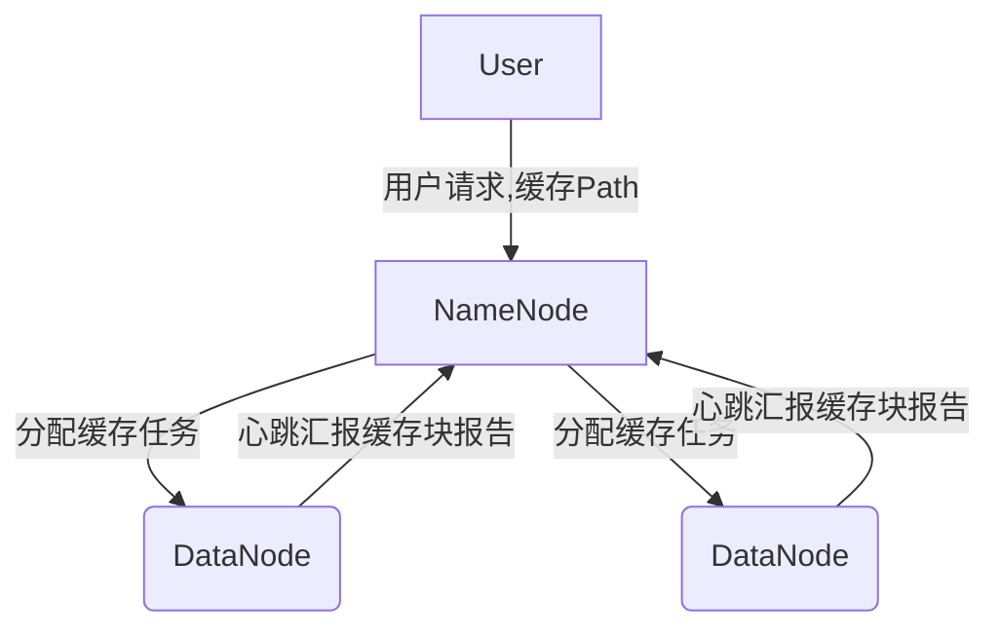

# 目录 #

- [第一节 HDFS原理与架构说明](#1)
- [第二节 HDFS的namenode和datanode](#2)
- [第三节 HDFS缓存机制](#3)
- [第四节 HDFS快照](#4)
- [第五节 HDFS命令行操作](#5)
- [第六节 HDFS的JavaAPI编程](#6)
- [第七节 HDFS Web HDFS API编程实践](#7)

***

<h4 id='1'>第一节 HDFS原理与架构说明</h4>

1. 掌握HDFS架构
2. 掌握HDFS底层原理

---

HDFS分布式文件系统
- HDFS是一个文件系统，用于存储和管理文件，是分布式的，但是有统一的命名空间
- HDFS中的文件在物理上是分块存储（block）
    - 通过配置参数（dfs.blocksize）规定，默认128M
- 目录结构及文件分块位置信息（无数据）的管理，由namenode节点承担
    - namenode是HDFS集群的主节点
    - 维护整个HDFS文件系统的目录树
    - 维护每一个文件所对应的数据块信息
- 文件的各个block的存储管理，由datanode节点承担
    - datanode是HDFS集群的从节点

HDFS设计特点
- 一个文件将被分布在集群中的多台机器上存储
- 与其他分布式文件系统的主要区别
    - 高度容错
    - 高吞吐量
    - 适合大规模数据集

HDFS设计目标
- 硬件故障不影响数据使用
- 数据访问效率高
- 存储大数据集
- 简单一致性模型：一次写入，多次读取，尽量少更改
- 移动计算比移动数据更经济
- 异构软硬件平台间的可移植性

不适合的存储场景
- 低延迟数据访问
    - HDFS高吞吐量，必定高延迟
- 大量小型数据文件
    - 元数据存储在NameNode的内存中，NameNode为单点进程，文件数量达到一定程度时，内存不够

机架与系统
- 多台机器安装在机架中
- 一个机架可安装2-8台机器
- 同一机架上的机器网络交互效率高
- 若干个机架组成一个大型系统
- 一个Hadoop系统可能由上百个机架构成

HDFS基本架构
- 主/从结构
- 一个NameNode，管理文件命名空间和调度客户端访问文件
    - Secondary NameNode，内存不够用时使用、记录操作日志
- 多个DataNode，通常一个节点一个机器，管理其所在节点的存储

HDFS高可用性设计
- 多个数据拷贝同时运行（默认3份）
- 一个服务器失败，其它服务器能够接管它的服务，从而将不可用时间降到最低程度

HDFS文件存储
- 每个文件被分割成大小相等的数据块（默认128M，因此不适合小文件存储），并存储到不同的从节点上
- 每个数据块都有一个对应的元数据，记录数据块的位置和大小等信息，存储在主节点上
- 当客户端访问一个文件时，先从主节点获取文件的元数据，从而获取文件所有数据块的存放信息
- 一个Hadoop集群可能包含成百上千的节点，因此硬件故障是常态

HDFS底层原理
- 动态代理
    - 客户端访问对象
        - new对象
        - 动态代理
            - 代理：不改变原对象，但提供了业务的修改
            - 可能会对对象的逻辑有所限制
    - 为其他对象提供一种代理，以控制对这个对象的访问
    - 核心是JDK的Proxy类
- 远程过程调用 Remote Procedure Call（RPC）
    - RPC协议：访问对象通过代理，底层是动态代理
    - 调用过程代码并不是在调用者本地运行，而是实现调用者与被调用者二地之间的连接与通信
    - RPC的基本通信模型是基于Client/Server进程间相互通信模型的一种同步通信形式
        - Client：请求服务的调用者Caller
        - Server：执行Client的请求而被调用的程序
        - 对Client提供了远程服务的过程抽象
        - 底层消息传递操作对Client是透明的
    - Client访问NameNode，NameNode返回代理，通过代理访问DataNode

***

<h4 id='2'>第二节 HDFS的namenode和datanode</h4>

1. 掌握HDFS中NameNode的功能
2. 掌握HDFS中DataNode的功能
3. 掌握HDFS数据上传下载过程

---

NameNode
- HDFS管理员
- 功能
    - 响应客户端请求（上传、下载）
    - 管理元数据（目录、文件、Block对应关系，Block和DataNode映射关系等）
- 主要文件
    - fsimage
        - 保存文件系统的映射信息
        - 数据块和文件的对应关系
        - 不能体现当前操作
    - edits
        - 临时性记录数据改变情况
        - 元数据进行的每次操作（创建文件、删除文件、修改文件的副本系数）
        - 元数据发生变化时，不会立即更新到fsimage中，而是临时记录在edits文件中，称为EditLog
        - 体现当前操作
- 工作过程
    - Hadoop启动时，启动NameNode进程
    - NameNode初始化
        1. NameNode进程将fsimage载入内存
        2. NameNode载入edit，并将日志文件中记录的数据改变更新到内存中的元数据
        3. DataNode进程向NameNode发送数据块报告单

SecondaryNameNode
- 功能
    - 合并fsimage文件和edits文件
- 与NameNode一般在同节点下
- CheckPoint机制
    - 在适合的时机将edits文件内容合并到fsimage
    - 这种时机被称为检查点（CheckPoint）
    - SecondaryNameNode进程承担CheckPoint工作
- 工作过程
1. 定期启动CheckPoint（默认60分钟/edits大于64M），NameNode创建一个新文件来（edits.new）接受日志文件系统的变化
2. 文件edits不再接受新的变化，并和fsimage一起拷贝到CheckPointNode所在文件系统中
3. CheckPointNode将两个文件合并产生fsimage.ckpt文件
4. CheckPointNode将fsimage.ckpt拷贝到NameNode上
5. NameNode使用新的fsimage.ckt替代原fsimage文件
6. NameNode用edits.new替代edits

DataNode
- 功能
    - 保存数据
- 伪分布：1个；全分布：大于2个
- 机架感知
    - 一个机架上有2份，l另一个在其他机架上
- 水平复制
    - 写完一份数据后，由DataNode复制到别的DataNode上

***

<h4 id='3'>第三节 HDFS缓存机制</h4>

1. 掌握HDFS缓存机制的含义、优势、使用场景
2. 掌握HDFS缓存架构
3. 掌握HDFS缓存指令

---

HDFS缓存机制
- 允许用户指定HDFS路径，NameNode会和保存着所需块数据的素有DataNode通信，并指导他们把块数据缓存在缓存中
    - NameNode负责管理缓存
    - DataNode负责缓存数据

HDFS缓存的优势
- 可以阻止频繁使用的数据被HDFS从内存中清除
    - 当工作集的大小超过内存大小时，指定缓存的数据能获得优先权
- 把任务和缓存块副本放在一个位置上，可以提高读操作的性能
- 当块已经被DataNode缓存时，客户端可以使用一个新的更高效的零拷贝读操作API
    - 直接读取内存中的数据，不需要再拷贝
- 可以提高整个集群的内存使用率
    - DataNode节点的内存可以使用起来

使用场景
- 频繁重复访问的文件
- 性能提升

缓存架构
- NameNode管理缓存
- 多个DataNode缓存不同的副本
    - 不同数据只需要缓存一份即可


缓存指令
- 一条缓存指令定义了一个要被缓存的路径，这些路径可以是文件夹或文件
    - 文件夹是以非迭代的方式缓存，只有文件夹顶层的文件才会被缓存
- 文件夹可以指定额外的参数，比如缓存副本因子（缓存的块副本数）、有效期等
- 有效期在命令行指定，过期后再决定缓存时，不再被NameNode考虑
- 缓存池是一个管理实体，用于管理缓存指令组
    - 可以限制哪个用户和组可以访问、添加、删除该缓存池
- 添加一个缓存池
    - hdfs cacheadmin -addPool admin
- 查看缓存池列表
    - hdfs cacheadmin -listPools
- 将一个目录加入缓存池
    - hdfs cacheadmin -addDirective -path /data -pool admin
- 查看已缓存的数据
    - hdfs cacheadmin -listDirectives
- 按path清除缓存
    - hdfs cacheadmin -removeDirectives -path /data

***

<h4 id='4'>第四节 HDFS快照</h4>

1. 掌握快照的概念
2. 掌握HDFS快照的使用
3. 掌握快照技术的原理

---

快照
- 在某个特定时间点给数据拍照，其本质是备份
    - 备份目的：容灾、容错
- 功能
    - 防止重要数据丢失

HDFS的快照
- 原理
    - 将要备份的数据拷贝一份到一个隐藏目录
- 默认是禁用的
    - HDFS已有3份数据保存，容灾性好，一般不需要开启
    - 只对非常重要的数据进行快照（容错）
- 步骤
    1. 管理员开启快照功能
        - hdfs dfsadmin -allowSnapshot /data
    2. 执行快照
        - hdfs dfs -createSnapshot /data data_bak
    3. 查看快照
        - /data/.snapshot/data_bak
    4. 对比快照
        - hdfs snapshotDiff /data data_bak_1 data_bak_2
    5. 其他指令
        - deleteSnapshot \<snapshotDir> \<snapshotName>
        - renameSnapshot \<snapshotDir> \<oldName> \<newName>

备份
- 策略
    - 全量
    - 增量（优）
- 模式
    - 全库备份
    - 部分备份大数据集（只备份重要数据）

***

<h4 id='5'>第五节 HDFS命令行操作</h4>

1. 掌握HDFS常用命令
2. 掌握HDFS管理与维护命令

---

HDFS文件操作命令
- 命令格式
    - hadoop|hdfs fs|dfs -\<cmd> [args]
    - 类似Linux命令
- 管理命令
    - 格式
        - hadoop|hdfs dfsadmin -\<cmd> [args]
    - 报告HDFS信息
        - hadoop dfsadmin -report
    - 安全模式
        - hadoop启动时，NameNode首先进入安全模式
        - HDFS安全模式，数据只读
        - 作用：检查数据块的副本率是否满足要求（3份）
            - 满足：退出安全模式
            - 不满足：DataNode进行水平复制，以满足冗余度的要求
            - 如果数据块丢失严重，HDFS会一直处于安全模式
        - 管理安全模式：safemode
            - hadoop dfsadmin -safemode [arg]
                - arg: enter/leave/get/wait
    - 管理配额
        - 数量配额：决定目录下文件（目录）的个数
            - hadoop dfsadmin -setQuota 3 /dir
            - hadoop dfsadmin -clrQuota /dir
        - 空间配额：决定目录下文件的大小
            - hadoop dfsadmin -setSpaceQuota 1M /dir
            - hadoop dfsadmin -clrSpaceQuota /dir
            - 注意：文件是按数据块上传，默认最小块128M，但文件上传后并不会占用到128M的空间
    - 快照
        - 开启和关闭快照功能
        - hdfs dfsadmin -allowSnapshot \<dir>
        - hdfs dfsadmin -disallowSnapshot \<dir>
    - 调节存储平衡
        - DataNode节点上的数据块会逐渐不平衡
        - 调节存储平衡工具start-balancer.sh
            - 根据存储策略重新分配数据
        - 管理员定期监控HDFS健康情况，如发现不均衡，应及时使用该工具加以调整

***

<h4 id='6'>第六节 HDFS的JavaAPI编程</h4>

1. 掌握Linux环境下Java开发环境搭建
2. 掌握Java操作HDFS程序开发流程

---

eclipse
- 启动和使用eclipse
    - cd /opt/software/eclipse
    - ./eclipse
    - 需要图形化界面
- 设置工作目录
- 新建工程
- 加入jar包
    - $HADOOP_NOME/share/hadoop/common
    - $HADOOP_NOME/share/hadoop/common/lib
    - $HADOOP_NOME/share/hadoop/hdfs
    - $HADOOP_NOME/share/hadoop/hdfs/lib

HDFS常用API简介
- org.apache.hadoop.fs
    - Configuration：配置信息
    - FileSystem：增删改查文件
    - FileStatus：文件属性
    - FSDataInputStream：文件流
        - 继承自java.io.DataInputStream
    - FileUtil：文件操作工具，FS类功能补充
    - Path：文件名/路径

编码开发
- 通常步骤
    1. 创建配置信息对象Configuration，配置NameNode地址
    2. 基于配置对象创建FileSystem对象
    3. 调用FileSystem的相应方法操作文件
```
// 1. Configuration
Configuration cfg = new Configuration();
cfg.set("fs.defaultFS", "hdfs://192.168.220.130:9000");

// 2. FileSystem
FileSystem fs = FileSystem.get(cfg);

// 3. file operation
fs.mkdirs(new Path("/demo"));
fs.delete(new Path("/demo"), true);

// upload
InputStream is = new FileInputStream(new File("..."));
OutputStream os = fs.create(new Path("/demo/data.txt"));
IOUtils.copy(is, os);

// download
is = fs.open(new Path("/demo/data.txt"));
os = new FileOutputStream("...");
IOUtils.copy(is, os);

// query file status
FileStatus[] status = fs.listStatus(new Path("/demo/data.txt"));
for (FileStatus fileStatus : status) {
	System.out.println(fileStatus.isDirectory());
}

// query block status
FileStatus s = fs.getFileStatus(new Path("/demo/data.txt"));
BlockLocation[] block = fs.getFileBlockLocations(s, 0, s.getLen());
for (BlockLocation blockLocation : block) {
	blockLocation.getHosts();
}
```

***

<h4 id='7'>第七节 HDFS Web HDFS API编程实践</h4>

1. 掌握WebHDFS环境配置
2. 掌握WebHDFS编程原理
3. 掌握常用的WebHDFS操作

---

WebHDFS
- Java本地API支持文件系统的增删改查
- 但是，外部的应用程序操作HDFS时，没有Java环境
    - Hortonworks开发了WebHDFS
    - Cloudera开发了HttpFS
- WebHDFS是基于HTTP操作的（GET、PUT、POST、DELETE）
    - HTTP GET: OPEN, GETFILESTATUS, LISTSTATUS
    - HTTP PUT: CREATE, MKDIRS, RENAME, SETPERMISSION
    - HTTP POST: APPEND
    - HTTP DELETE: DELETE
- 认证方式：user.name参数
    - 标准的URL格式：http://host:port/webhdfs/v1/?op=operation&user.name=username
- 默认的启动端口是14000
- 可以在httpfs-env.sh中配置端口与环境变量

HttpFS配置
- core-site.xml
    - hadoop.proxyuser.#HTTPFSUSER#.hosts
        - \*
    - hadoop.proxyuser.#HTTPFSUSER#.groups
        - \*
- hdfs-site.xml
    - dfs.webhdfs.enabled
        - true
    - dfs.peremissions
        - false
- #HTTPFSUSER#指用户名，即linux启动httpfs的用户，如root