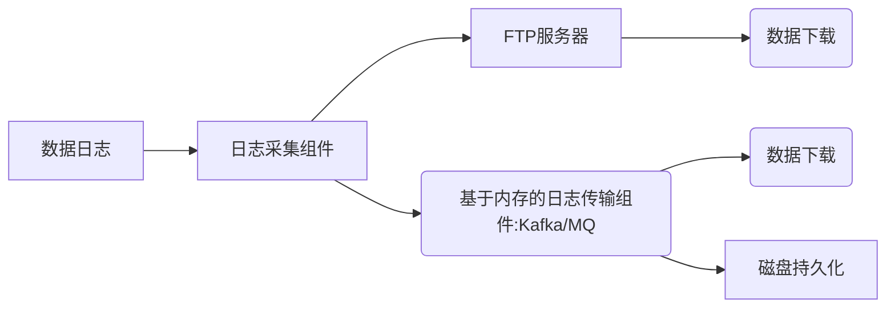

# 目录 #

- [第一节 Kafka概念与功能](#1)
- [第二节 常见消息队列对比分析](#2)
- [第三节 Kafka的Topics和Logs](#3)
- [第四节 Kafka的分布式环境搭建](#4)
- [第五节 消息生产者、消费者以及消息发布的不同模型](#5)
- [第六节 Kafka的命令行工具](#6)

***

<h4 id='1'>第一节 Kafka概念与功能</h4>

1. 了解Kafka发展简史
2. 了解Kafka使用场景

---

设计目标

- 高吞吐量：在廉价的商用机器上单机可支持每秒100万条消息的读写
- 消息持久化：所有消息均被持久化到磁盘，无消息丢失，支持消息重放
- 完全分布式：Producer、Borker、Consumer均支持水平扩展
    - Producer：日志采集组件
    - Broker：日志传输组件
    - Consumer：数据下载组件
- 同时适应在线流处理和离线批处理
- Kafka一般是单独部署集群，用来做日志传输
- Kafka可能会丢失数据，不能用来传输不能丢失的数据
    - 例如：交易数据、消费数据
- Kafka使用Scala开发，支持Java API、Scala API

Kafka对比
对比项|ActiveMQ|RabbitMQ|Kafka
-----|--------|--------|------
所属社区/公司|Apache|Mozilla Public License|Apache/LinkedIn
开发语言|Java|Erlang|Java、Scala
支持的协议|OpenWire、STOMP、REST、XMPP、AMQP|AMQP|仿AMQP
事务|支持|不支持|不支持
集群|支持|支持|支持
负载均衡|支持|支持|支持
动态扩容|不支持|不支持|支持(zk)
- MQ：消息队列/Kafka：日志传输
    - 消息：A进程与B进程通信，传输的内容称为消息

Kafka架构
- Producer
    - 将数据推给Broker
- Broker
    - 有多个分区（副本），实现灾备
    - 通过分区还能实现高负载
- Consumer
    - 从Broker拉取（消费）数据
- Zookeeper
    - 主要保存数据的元数据
        - 数据push到Kafka的时候会有一个offset，ZK会存储offset以及partition信息等
- 生产集群通常是3-5台服务器，内存要求较高（64+G），硬盘SAS以上（读写速度快）

***

<h4 id='2'>第二节 常见消息队列对比分析</h4>

1. 了解常见的消息系统
2. 了解不同消息系统的使用场景

---

消息系统分类
- Peer-to-Peer
    - 基于Pull或者Polling接收消息
    - 发送到队列中的消息被一个而且仅仅一个接收者所接收，即使有多个接收者在同一个队列中侦听同一消息
    - 即，支持异步“即发即弃”的消息传送方式，也支持同步请求/应答传送方式
- 发布/订阅
    - 发布到一个主题的消息，可被多个订阅者所接收发布/订阅
    - 即，可基于Push消费数据，也可基于Pull或者Polling消费数据
    - 数据解耦能力比P2P模型更强

消息系统适用场景
- 解耦：各个系统之间通过消息系统这个统一的接口交换数据，无需了解彼此的存在
- 冗余：部分消息系统具有消息持久化能力，可规避消息处理前丢失的风险
- 扩展：消息系统是统一的数据接口，各系统可独立扩展
- 峰值处理能力：消息系统可顶住峰值流量，业务系统可根据处理能力从消息系统中获取并处理对应量的请求
- 可恢复性：系统中部分组件失效并不会影响整个系统，恢复后仍然可从消息系统中获取并处理数据
- 异步通信：在不需要立即处理请求的场景下，可以将请求放入消息系统，合适的时候再处理

常用消息系统对比
对比项|Kafka|RabbitMQ|ActiveMQ|Redis
-----|-----|--------|--------|-----
消息回溯|支持，无论是否被消费都会保留，可设置策略进行过滤删除（1. 基于消息超时；2. 基于消息大小）|不支持，一旦被确认消费就会标记删除||可设置消息过期时间，自动过期
API完备性|高|高|中|高
单机吞吐量|十万级|万级|万级|十万级
首次部署难度|中|低|低|低
消息堆积|支持|支持（内存堆积达到特定阈值可能会影响性能）|支持（有上限，当消息过期或者存储设备溢出时，会终结他）|支持（有上线，服务器容量不够时会容易造成数据丢失）
消息持久化|支持|支持||支持
多语言支持|支持，Java优先|语言无关|支持，Java优先|支持
优先级设置|不支持|支持|支持|支持
消息延迟|不支持|支持|支持|支持
消费模式|拉模式|推模式+拉模式|推模式+拉模式|拉模式
消息追溯|不支持|支持（有插件，可进行界面管理）|支持（可进行界面管理）|支持
常用场景|日志处理、大数据等|金融支付机构|降低服务之间的耦合|共享Cache、共享Sessioin等
运维管理|有多种插件可进行监控，如Kafka Management|有多种插件可进行监控，如rabbitmq_management（不利于做二次开发和维护）|-|有多种插件可进行监控，如zabbix等
- Kafka支持消息回溯，一般存储7-15天历史数据
- Redis是一个NoSQL的KV数据库
- 消息堆积：后台消费速度没有前台推送速度快
- 消息持久化：数据持久化到硬盘（有时间间隔）
- Kafka不支持消息优先级设置：某些消息被优先处理
- Kafka不支持消息延迟：消息被发送以后并不想让消费者立刻拿到消息，而是等待特定时间后才能拿到这个消息进行消费
- RabbitMQ、ActiveMQ：支持消息推送；Kafka、Redis：更多的是做数据存储

***

<h4 id='3'>第三节 Kafka的Topics和Logs</h4>

1. 了解Kafka的Topics和Logs原理
2. 了解Kafka Partition概念

---

Topic
- Topic是Kafka数据写入操作的基本单元，可以指定副本
- 一个Topic包含一个或者多个Partition
    - 在建立Topic时可以指定Partition，一般Partition个数与服务器个数相当
- 每条消息属于且仅属于一个Topic
- Producer发布数据时，必须指定将该消息发布到哪个Topic
- Consumer订阅消息是，也必须指定订阅哪个Topic的消息

Partition
- Partition只分布与一个Broker上
- Partition物理上对应一个文件夹
- Partition包含多个Segment
- Segment对应一个文件
    - Kafka用内存映射文件，磁盘顺序读写的技术，提升性能
    - 在内存写数据（Segment），在硬盘上写Index文件（存储元数据：文件的偏移量）和日志（Log）文件（Message）
        - Message
            - 8 byte offset：偏移量
            - 4 byte message size
            - 4 byte CRC32
            - 1 byte'magic'：Kafka程序的版本号
            - 1 byte 'attributes'：独立版本
            - 4 byte key length
            - K byte key
            - 4 byte payload length
- Segment由一个个不可变的记录组成，记录只会被append到Segment中，不会被单独删除或者修改
- Segment可以设置大小，达到阈值后将不再写数据
- 清除过期日志时，直接删除一个或多个Segment
- 每个Partition会产生一个log日志文件，将信息持久化到磁盘上

***

<h4 id='4'>第四节 Kafka的分布式环境搭建</h4>

- Kafka安装依赖于Java、Scala、Zookeeper
- 配置环境变量
- 配置server.properties
    - broker.id：配置多行对应多个broker以及它们的id
    - num.network/io.threads：根据集群数量确定
    - log.dirs：logsegment（index、log）本地存储路径
    - num.partitions：默认分区数
    - zookeeper配置：存储consumer状态（上次读到哪里、topic元信息等）
    - 单机配置
        ```
        broker.id = 0
        port = 9092
        host.name = hadoop001
        log.dirs = /tmp/kafka-logs
        zookeeper.connect=hadoop001:2181
        num.partitions = 1
        log.retention.hours = 168 # 日志保留时间
        ```
    - 单机启动
        ```
        1. 先启动Zookeeper
        zkServer.sh start
        2. 再启动Kafka Broker
        $KAFKA_HOME/bin/kafka-server-start.sh $KAFKA_HOME/config/server.properties &
        3. 确认启动成功
        $KAFKA_HOME/bin/kafka-topics.sh --create --zookeeper hadoop001:2181 --replication-factor 1 --partitions 1 --topic singleServer
        $KAFKA_HOME/bin/kafka-topics.sh --list --zookeeper hadoop001:2181
        // topic = n partition = n * m replication-factor（副本个数，一个Broker对应一个）
        ```
    - 集群配置
        - 配置多个server.properties
            - 修改broker.id、port、log.dirs等参数
    - 集群启动
        ```
        1. 删除历史数据
        rm -rf /tmp/kafka-logs
        2. 启动集群中多个节点
        $KAFKA_HOME/bin/kafka-server-start.sh $KAFKA_HOME/config/server.properties &
        $KAFKA_HOME/bin/kafka-server-start.sh $KAFKA_HOME/config/server1.properties &
        $KAFKA_HOME/bin/kafka-server-start.sh $KAFKA_HOME/config/server2.properties &
        ```

***

<h4 id='5'>第五节 消息生产者、消费者以及消息发布的不同模型</h4>

1. 理解Kafka消息消费者、生产者模型
2. 理解Kafka消息消费发布流程

---

Kafka Producer
- Producer产生数据发送给Kafka Server，具体的分发逻辑及负载均衡逻辑，全部由Producer维护
- Producer不用连接Zookeeper
- 指定broker和主题生产消息
    ```
    kafka-console-producer.sh --broker-list hadoop001:9092 --topic singleServer
    ```
- 从指定broker和主题消费消息
    ```
    kafka-console-consumer.sh --bootstrap-server hadoop001:9092 --from-beginning --topic singleServer
    ```

Kafka Consumer
- Consumer以订阅形式获取Kafka数据
- 两种Consumer API
    - High Level Consumer API
        - 将底层具体获取数据、更新offset、设置偏移量等操作屏蔽
        - 直接将操作数据流的处理工作提供给编写程序的人员
        - 操作简单
        - 可操作性差，无法按照自己的业务场景选择处理方式
        - ConsumerConnector
    - Lower Level Consumer API(Simple Consumer API)
        - 通过直接操作底层API获取数据的方式获取Kafka中的数据
        - 需要自行给定分区、偏移量等属性
        - 可操作性强
        - 代码比较复杂
        - SimpleConsumer

Kafka Consumer Group
- 消息被消费后，并不会被删除，只是相应的offset加一对于
- 每条消息，在同一个Consumer Group里只会被一个Consumer消费
- 不同Consumer Group可消费同一条消息

Kafka High Level Consumer Rebalance
- Rebalance提供了Consumer的HA特性
    - Rebalance触发条件（Consumer数量发生变化）
        - 有新的Consumer加入
        - 旧的Consumer挂了
        - topic的partition增加
        - coodinator（协调器）挂了
- 启动流程
    - High Level Consumer启动时将其ID注册到其Consumer Group下的Zookeeper上的路径为/consumers/[consumer group]/ids/[consumer id]
    - 在/consumers/[consumer group]/ids上注册Watch
    - 在/brokers/ids上注册Watch
    - 如果Consumer通过Topic Filter创建消息流，则会同时在/brokers/topics上也创建Watch
    - 强制自己在其Consumer Group内启动Rebalance流程
- Consumer Rebalance算法
    - 将目标Topic下的所有Partition排序，存于PT
    - 将某Consumer Group下所有Consumer排序，存于CG，第i个Consumer记为Ci
    - N=size(PT)/size(CG)，向上取整
    - 解除Ci对原来分配的Partition的消费权(i从0开始)
    - 将第i\*N到(i+1)\*N-1个Partition分配给Ci
- Consumer Rebalance算法缺陷改进
    - Herd Effect任何Broker或者Consumer的增减都会触发所有的Consumer的Rebalance
    - Split Brain每个Consumer分别单独通过Zookeeper判断哪些Broker和Consumer宕机，同时Consumer在同一时刻从Zookeeper“看”到的View可能不完全一样，由Zookeeper的特性决定
    - 调整结果不可控，所有Consumer分别进行Rebalance，彼此不知道对应的Rebalance是否成功

***

<h4 id='6'>第六节 Kafka的命令行工具</h4>

1. 掌握Kafka命令行工具使用
2. 掌握Kafka基本操作方法

---

```
# 列出所有topic
kafka-topics.sh --list --zookeeper hadoop001:2181
# __consumer_offsets

# 查看topic
kafka-topics.sh --describe --zookeeper hadoop001:2181 --topic __consumer_offsets
# Leader ID与Group ID对应

# 修改topic分区
kafka-topics.sh --alter --zookeeper hadoop001:2181 --partitions 2 --topic singleServer

# 删除topic
kafka-topics.sh --delete --zookeeper hadoop001:2181 --topic singleServer
# Topic singleServer is marked for deletion.
# 真删除：server.properties: delete.topic.enable=true
```