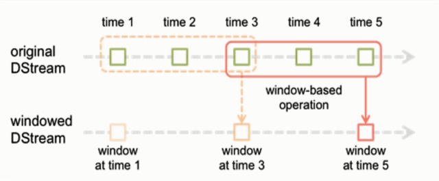

# 目录 #

- [第一节 大数据实时计算介绍](#1)
- [第二节 DStream工作原理](#2)
- [第三节 基于Socket的实时计算WordCount](#3)
- [第四节 StreamingContext详解](#4)
- [第五节 输入DStream和Receiver详解](#5)
- [第六节 基于HDFS的实时计算WordCount](#6)
- [第七节 DStream的transformation操作概览](#7)
- [第八节 transform算子实战开发](#8)
- [第九节 updateStateByKey算子实战开发](#9)
- [第十节 window滑动窗口算子实战开发](#10)
- [第十一节 DStream的output操作概览](#11)
- [第十二节 foreachRDD算子实战开发](#12)
- [第十三节 Spark Streaming与Spark SQL协同工作](#13)

***

<h4 id='1'>第一节 大数据实时计算介绍</h4>

1. 了解大数据实时计算
2. 理解Spark Streaming

---

大数据实时计算
- 流式数据实时处理方案
    - Storm、JStorm
        - 一条一条处理，实时性高（亚秒级别），延迟性非常低
    - Spark Streaming
        - 一批次一批次处理，按时间间隔划分批次，时间间隔较短，运行延迟在毫秒到秒的级别
- Spark：批处理、交互式处理、流式处理，一栈式解决大数据解决方案
    - Spark Core
        - RDD：弹性分布式数据集
        - SparkContext
        - 批处理（离线处理Batch Processing）
            - 每次处理的数据都是一个固定的数据集，而不是变化的
    - Spark SQL
        - DataFrame = RDD + Schema
        - DataSet[Row] = DataFrame
            - Spark 2.x
        - SQLContext
        - 交互式处理（Interactive Processing）
            - 每次处理的数据都是一个固定的数据集，而不是变化的
    - Spark Streaming
        - 流式数据处理（Stream Processing）框架
        - 数据像流一样不断的产生，需要实时的处理
        - 对Spark Core进行了API封装和扩展
            - 将流式数据切分为小批次（微批）处理
            - 按时间间隔切分
        - DStream：离散流，集合
        - StreamingContext（SparkContext）
- 常见应用：网站实时指标统计、物流信息调度、金融、广告收入
- 常用技术
    - Flume：实时获取数据
    - Kafka：实时数据存储
    - Spark、Storm：实时数据计算
    - Redis、MySQL：实时数据缓存
    ```mermaid
    graph LR
        线上系统-->Flume数据采集
        Flume数据采集-->Kafka消息中间件
        Kafka消息中间件-->SparkStreaming/Storm
        SparkStreaming/Storm-->存储到Redis/MySQL/HBase
        存储到Redis/MySQL/HBase-->数据可视化展示
    ```
- 特点
    - 数据实时产生
    - 数据实时传输
    - 数据实时计算
    - 数据实时展示
    - 将源源不断产生的流数据实时收集并实时计算，尽可能快的得到计算结果并展示

Spark Streaming处理数据的流程
- 数据源：从哪里获取数据
    - Kafka（最多）
    - Flume（较少）
    - TCP Socket（开发、测试）
- 数据处理
    - DStream：离散流
        - 针对不同业务需求使用不同的方法（算子）
            - transformation
            - output
    - 两种最常见的的统计类型
        - 实时累加统计：updateStateByKey
        - 实时统计某段时间内的数据、趋势统计分析：reduceByKeyAndWindow
- 存储结果
    - 调用RDD的API将数据进行存储
        - Console打印（开发、测试）
        - Redis：基于内存的分布式KeyValue数据库
        - HBase：分布式列式数据库
        - MySQL：RDBMS（JDBC）

Spark Streaming工作原理
- 接收实时输入数据流
- 将数据拆分成多个batch（批）
    - 比如每收集1秒的数据封装为一个batch
- 将每个batch交给Spark计算引擎进行处理
- 产出一个结果数据流（由batch组成）

***

<h4 id='2'>第二节 DStream工作原理</h4>

1. 掌握DStream工作原理
2. 理解批处理时间间隔

---

DStream工作原理
- Spark Streaming提供了一种高级抽象，英文全称为Discretized Stream——离散流，代表了一个持续不断的数据流
- 可以通过输入数据源来创建，也可以通过对其他DStream应用高阶函数(flatMap、Join、Reduce)来创建
- 内部实现：一组时间序列上连续的RDD来表示
    - 每个RDD包含了一个时间段内的数据
- 对DStream应用的算子，在底层会被转换为对DStream中每个RDD的操作
    - 对每个时间段的RDD都应用一遍算子操作，生成新的RDD

Spark Streaming编程步骤
1. 创建输入的数据流，DStream（Kafka）
2. 对DStream进行一系列的算子操作（transformation、output）
3. 将处理完的结果存储到存储介质中（Redis、MySQL）

批处理时间间隔
- Spark Streaming数据采集是逐条进行的，而数据处理是按进行的
- Spark Streaming先设置好批处理的时间间隔，达到间隔的时候就会把采集到的数据汇总起来成为一批数据，交给系统去处理

***

<h4 id='3'>第三节 基于Socket的实时计算WordCount</h4>

1. 掌握nc工具的安装
2. 掌握基于Socket的实时计算WordCount

---

NetCat
- TCP Socket，监控某台机器某个端口（Socket），从Socket上读取数据
- netcat是一个用于TCP/UDP连接和监听的Linux工具，主要用于网络传输及调试领域，简称nc
- 安装nc工具
    - yum install nc
    - nc -l 6666

基于Socket的实时计算WordCount
```
package streaming

import org.apache.log4j.{Level, Logger}
import org.apache.spark.SparkConf
import org.apache.spark.streaming.{Seconds, StreamingContext}

/**
  * 基于Socket的实时WordCount
  */
object SocketWordCount {

  def main(args: Array[String]): Unit = {
    // 设置日志级别
    Logger.getLogger("org").setLevel(Level.WARN)

    // 创建SparkConf对象
    val conf = new SparkConf().setAppName(this.getClass.getSimpleName)
//      .setMaster("local[2]") // 本地模式用两个线程（CPU）来运行，一个实时获取数据，另一个实时处理数据
    // 创建StreamingContext对象
    val ssc = new StreamingContext(conf, Seconds(2)) // 指定批处理时间间隔为2s

    // 创建输入DStream
    val socketInputDStream = ssc.socketTextStream("hadoop001", 6666)
    // 对输入DStream进行算子操作
    val wordCountDStream = socketInputDStream.flatMap(_.split(" ")).map((_, 1)).reduceByKey(_+_)
    wordCountDStream.print()

    // 启动Streaming应用程序
    ssc.start()
    // 等待应用程序的终止
    ssc.awaitTermination()
  }

}
```

***

<h4 id='4'>第四节 StreamingContext详解</h4>

Streaming Context
- 创建
    - 通过SparkConf创建
    ```
    val conf = new SparkConf().setAppName(appName).setMaster(master)
    val ssc = new StreamingContext(conf, Seconds(1))
    ```
    - 通过已有的SparkContext创建
    ```
    val sc = new SparkContext(conf)
    val ssc = new StreamingContext(sc, Seconds(1))
    ```
- 创建Streaming Context后，必须做以下几件事
    1. 通过创建输入DStream来创建输入数据源
    2. 通过对DStream定义transformation和output算子操作，来定义实时计算逻辑
    3. 调用StreamingContext的start()方法，来开始实时处理数据
    4. 调用StreamingContext的awaitTermination()方法，来等待应用程序的终止
    5. 也可以通过调用StreamingContext的stop()方法来停止应用程序
- 需要注意的点
    - 只要一个StreamingContext启动之后，就不能再往其中添加任何计算逻辑了
    - 一个StreamingContext停止之后，是肯定不能够重启的，调用stop()之后不能再调用start()
    - 一个JVM同时只能有一个StreamingContext启动，在Spark应用程序中不能创建两个StreamingContext
    - 调用stop()方法时，会同时停止内部的SparkContext，如果还希望后面继续使用SparkContext创建其他类型的Context，那么就用stop(false)
    - 一个SparkContext可以创建多个StreamingContext，只要上一个先用stop(false)停止，再创建下一个即可

***

<h4 id='5'>第五节 输入DStream和Receiver详解</h4>

输入DStream
- 代表了来自数据源的输入数据流
- 所有的输入DStream都会绑定一个Receiver对象
- Spark Streaming提供的数据源支持
    - 基础数据源：StreamingContext API中直接提供了对这些数据源的支持
        - 文件、Socket、Akka Actor等
    - 高级数据源：通过第三方工具类提供支持，需要引用其依赖
        - Kafka、Flume、Kinesis、Twitter等
- 如果要在实时计算应用中并行接受多条数据流，可以创建多个DStream，这样会创建多个Receiver，从而并行地接收多个数据流
- 使用本地模式运行程序，必须使用local[n](n≥2)
    - 至少要有两条线程，一条分配给Receiver负责接收数据，另一条负责处理数据
- 如果将Spark Streaming引用提交到集群上运行，需要保证有足够资源

***

<h4 id='6'>第六节 基于HDFS的实时计算WordCount</h4>

```
import org.apache.log4j.{Level, Logger}
import org.apache.spark.SparkConf
import org.apache.spark.streaming.{Seconds, StreamingContext}

/**
  * 基于HDFS的实时WordCount
  */
object HDFSWordCount {

  def main(args: Array[String]): Unit = {
    Logger.getLogger("org").setLevel(Level.WARN)

    val conf = new SparkConf().setAppName(this.getClass.getSimpleName).setMaster("local[2]")
    val ssc = new StreamingContext(conf, Seconds(2))

    // 从HDFS相应目录中获取数据，创建输入DStream
    val inputDStream = ssc.textFileStream("hdfs://hadoop001:9000/SparkStreamingTest/input/")
    val wordCountDStream = inputDStream.flatMap(_.split(" ")).map((_, 1)).reduceByKey(_+_)
    wordCountDStream.print()

    ssc.start()
    ssc.awaitTermination()
  }

}
```
- 所有放入HDFS目录中的文件，都必须有相同的格式
- 文件一旦处理后，即使文件内容改变，也不会再处理
- 基于HDFS文件的数据源没有Receiver，因此不会占用一个CPU core

***

<h4 id='7'>第七节 DStream的transformation操作概览</h4>
***

1. 了解Spark Streaming开发步骤
2. 了解DStream分类
3. 掌握transformation常用算子

---

开发步骤
1. 创建输入DStream
2. 对DStream进行转换操作
3. 对转换后的DStream进行输出操作

DStream分类
- Input DStream
    - 依据数据源创建
- Transformed DStream
    - 由其他DStream通过transformation算子转换而来
- Output DStream
    - 通过Output算子生成，只存在于Output算子内部，不会像Transformation DStream一样由算子返回，是触发Job执行的关键

transformation操作
- map
- flatMap
- filter
- repartition
- union
- count
- reduce
- countByValue
- reduceByKey
- join
- cogroup
- transform
    - 对源DStream的每个RDD应用RDD2RDD函数，返回一个新的DStream，可以用来对DStream做任意RDD操作
- updateStateByKey
    - 返回一个新状态的DStream，其中每个键的状态是根据键的前一个状态和键的新值应用给定函数func后的更新
    - 可以用来维持每个键的任何状态数据
- window
    - 对滑动窗口的数据执行操作

<h4 id='8'>第八节 transform算子实战开发</h4>

```
import org.apache.log4j.{Level, Logger}
import org.apache.spark.SparkConf
import org.apache.spark.streaming.{Seconds, StreamingContext}

/**
  * 实时黑名单过滤
  */
object TransformDemo {

  def main(args: Array[String]): Unit = {
    Logger.getLogger("org").setLevel(Level.WARN)

    val conf = new SparkConf().setAppName(this.getClass.getSimpleName).setMaster("local[2]")
    val ssc = new StreamingContext(conf, Seconds(2))

    // 黑名单
    val blackRDD = ssc.sparkContext.parallelize(Array(("zhangsan", true), ("lisi", true)))

    val inputDStream = ssc.socketTextStream("hadoop001", 6666)
    inputDStream.map(x => {
      val info = x.split(" ")
      (info(0), info.toList.tail.mkString(" "))
    }).transform(rdd => { // transform是一个rdd2rdd操作，需要返回一个rdd
      // 使用黑名单过滤输入rdd信息
      rdd.leftOuterJoin(blackRDD).filter(_._2._2.isEmpty)
    }).map(x => (x._1, x._2._1)).print()

    ssc.start()
    ssc.awaitTermination()
  }

}
```

***

<h4 id='9'>第九节 updateStateByKey算子实战开发</h4>

updateStateByKey操作
- 可以保持任意状态，同时不断有新的信息进行更新
- 必须进行两个步骤
    - 定义状态state
        - 状态可以是任意的数据类型
    - 定义状态state的更新函数
        - 用一个函数指定如何使用之前的状态和从输入流中获取的新值更新状态
- 必须开启CheckPoint机制

```
import org.apache.log4j.{Level, Logger}
import org.apache.spark.{SparkConf, SparkContext}
import org.apache.spark.streaming.{Seconds, StreamingContext}

/**
  * 基于缓存的实时WordCount
  * 在全局范围内统计单词出现次数
  */
object UpdateStateByKeyDemo {

  def main(args: Array[String]): Unit = {
    Logger.getLogger("org").setLevel(Level.WARN)
    
    val conf = new SparkConf().setAppName(this.getClass.getSimpleName).setMaster("local[2]")
    val sc = new SparkContext(conf)
    val ssc = new StreamingContext(sc, Seconds(2))

    // 设置CheckPoint
    ssc.checkpoint("hdfs://hadoop001:9000/checkpoint")

    val inputDStream = ssc.socketTextStream("hadoop001", 6666)
    val resultDStream = inputDStream.flatMap(_.split(" ")).map((_, 1))
      .updateStateByKey(
      /**
        * values:当前批次中Key对应的Values值
        * state:之前的状态值
        */
      (values:Seq[Int], state:Option[Int]) => {
        var value = state.getOrElse(0)
        for (data <- values) {
          value += data
        }
        Some(value)
      }
    )
    resultDStream.print()

    ssc.start()
    ssc.awaitTermination()
  }

}
```

***

<h4 id='10'>第十节 window滑动窗口算子实战开发</h4>

window滑动算子操作
- 对一个滑动窗口内的数据执行计算操作
- 批处理间隔、窗口间隔、滑动间隔
    - 窗口内部会有N个批处理数据
    - 批处理数据大小由窗口间隔决定，而窗口间隔指的就是窗口的持续时间
    - 滑动间隔指的是经过多长时间窗口滑动一次形成新的窗口，滑动间隔默认情况下和批次间隔相同
- 滑动间隔和窗口间隔的大小一定得设置为批处理间隔的整数倍


- 批处理间隔：1s
- 窗口间隔：3 x 1s
    - 将3秒内的RDD聚合起来进行处理
- 滑动间隔：2 x 1s
    - 每次间隔时间窗口滑动2s

常用window算子
- window
- countByWindow
- reduceByWindow
- reduceByKeyAndWindow
- countByValueAndWindow

```
import org.apache.log4j.{Level, Logger}
import org.apache.spark.{SparkConf, SparkContext}
import org.apache.spark.streaming.{Seconds, StreamingContext}

/**
  * 在线热点搜索词实时滑动统计
  * 每隔2秒统计最近5秒中的搜索词，排名最靠前的三个搜索词
  */
object WindowDemo {

  def main(args: Array[String]): Unit = {
    Logger.getLogger("org").setLevel(Level.WARN)

    val conf = new SparkConf().setAppName(this.getClass.getSimpleName).setMaster("local[2]")
    val ssc = new StreamingContext(conf, Seconds(1))

    val inputDStream = ssc.socketTextStream("hadoop001", 6666)
    inputDStream.flatMap(_.split(" ")).map((_, 1))
      .reduceByKeyAndWindow(
        /**
          * 定义窗口如何进行计算
          * x:聚合后的结果
          * y:这个Key对应的下一个需要聚合的值
          */
        (x:Int, y:Int) => x + y,
        Seconds(5), // 窗口间隔，窗口的时间范围大小
        Seconds(2) // 滑动间隔，窗口的滑动时间
      )
      .transform(rdd => {
        ssc.sparkContext.parallelize(rdd.sortBy(_._2, false).take(3))
      })
      .map(x=>s"${x._1}出现的次数是:${x._2}").print()


    ssc.start()
    ssc.awaitTermination()
  }

}
```

***

<h4 id='11'>第十一节 DStream的output操作概览</h4>

ouput输出操作
- 允许DStream的数据输出到外部系统
- 所有计算都是由输出操作触发
- foreachRDD输出操作，也必须在里面对RDD执行action操作，才能触发对每一个batch的计算逻辑

常用output操作
- print
- saveAsTextFiles：以文本方式保存到FS
- saveAsObjectFiles：使用Java序列化机制，序列化结果保存到FS
- foreachRDD：最常用，把结果保存到外部系统

***

<h4 id='12'>第十二节 foreachRDD算子实战开发</h4>

foreachRDD
- 可以遍历DStream中的每个产生的RDD，并进行处理，然后写入外部存储，如文件、数据库、缓存等
- 通常在其中针对RDD执行action操作，比如foreach

foreachRDD操作数据库
- 通常会在foreachRDD中创建一个Connection
    - 不能在foreach外部创建Connection
        - Connection不支持序列化对象，在分布式系统上执行会报错
    - 不能在foreach操作内部创建Connection
        - 会创建多个Connection对象，消耗性能
    - 使用RDD的foreachPartition操作，在该操作内部创建Connection对象，相当于为RDD的每个Partition创建一个Connection对象，节省了很多资源
    - 手动封装一个静态连接池，使用RDD的foreachPartition操作，并且在该静态连接池中，通过静态方法获取到一个连接，使用完后再放回连接池中，可以在多个RDD的partition之间复用数据库连接

```
import java.sql.{Connection, DriverManager, SQLException}
import java.util

object JDBCManager {

  var connectionQue:util.LinkedList[Connection] = null
  Class.forName("com.mysql.jdbc.Driver")

  /**
    * 从数据库连接池获取连接对象
    * @return
    */
  def getConnection(): Connection = {
    synchronized({
      try {
        if (null == connectionQue) {
          connectionQue = new util.LinkedList[Connection]()
          for (i <- 0 until 10) {
            val connection = DriverManager.getConnection("jdbc:mysql://hadoop001:3306/test?characterEncoding=utf-8", "root", "root")
            connectionQue.push(connection)
          }
        }
      } catch {
        case e: SQLException => e.printStackTrace()
      }
      return connectionQue.poll()
    })
  }

  /**
    * 当连接对象使用完毕后，调用这个方法归还数据库连接
    * @param connection
    */
  def returnConnection(connection: Connection): Unit = {
    connectionQue.push(connection)
  }

  def main(args: Array[String]): Unit = {
    getConnection()
    println(connectionQue.size())
  }

}
```
```
import org.apache.log4j.{Level, Logger}
import org.apache.spark.SparkConf
import org.apache.spark.streaming.{Seconds, StreamingContext}

object ForeachRDDDemo {

  def main(args: Array[String]): Unit = {
    Logger.getLogger("org").setLevel(Level.WARN)

    val conf = new SparkConf().setAppName(this.getClass.getSimpleName).setMaster("local[2]")
    val ssc = new StreamingContext(conf, Seconds(1))
    ssc.checkpoint("hdfs://hadoop001:9000/checkpoint")

    val inputDStream = ssc.socketTextStream("hadoop001", 6666)
    inputDStream.flatMap(_.split(" ")).map((_, 1))
      .updateStateByKey((values:Seq[Int], state:Option[Int]) => {
        var value = state.getOrElse(0)
        for (data <- values) {
          value += data
        }
        Some(value)
      })
      .foreachRDD(rdd => {
        if (!rdd.isEmpty()) {
          rdd.foreachPartition(part => {
            val connection = JDBCManager.getConnection() // 从数据库连接池中取出数据库连接
            part.foreach(data => {
              val sql = s"insert into wordcount values " +
                s"('${data._1}', ${data._2}) " +
                s"on duplicate key update count=${data._2}"
              val pstm = connection.prepareStatement(sql)
              pstm.executeUpdate()
            })
            JDBCManager.returnConnection(connection) // 把数据库连接放回连接池
          })
        }
      })

    ssc.start()
    ssc.awaitTermination()
  }

}
```

***

<h4 id='13'>第十三节 Spark Streaming与Spark SQL协同工作</h4>

```
package streaming

import org.apache.log4j.{Level, Logger}
import org.apache.spark.SparkConf
import org.apache.spark.sql.types.{IntegerType, StringType, StructField, StructType}
import org.apache.spark.sql.{Row, SparkSession, types}
import org.apache.spark.streaming.{Seconds, StreamingContext}

/**
  * Spark Streaming与Spark SQL协同工作
  */
object StreamingAndSQLDemo {

  def main(args: Array[String]): Unit = {
    Logger.getLogger("org").setLevel(Level.WARN)

    val conf = new SparkConf().setAppName(this.getClass.getSimpleName).setMaster("local[2]")
    val ssc = new StreamingContext(conf, Seconds(2))
    ssc.checkpoint("hdfs://hadoop001:9000/checkpoint")

    ssc.socketTextStream("hadoop001", 6666)
      .flatMap(_.split(" ")).map((_, 1))
      .updateStateByKey((values:Seq[Int], state:Option[Int]) => {
        var value = state.getOrElse(0)
        for (data <- values)
          value += data
        Some(value)
      })
      .foreachRDD(rdd => {
        // 创建SparkSession对象
        val sc = SparkSession.builder().getOrCreate()
        // 创建Row类型的RDD
        val rowRDD = rdd.map(x => Row(x._1, x._2))
        // 创建元数据信息
        val schema = StructType(List(
          StructField("word", StringType, true),
          StructField("count", IntegerType, true)
        ))
        // 创建视图
        val df = sc.createDataFrame(rowRDD, schema)
        df.createOrReplaceTempView("word_count")

        sc.sql("select * from word_count where count > 3").show()
      })

    ssc.start()
    ssc.awaitTermination()
  }

}
```