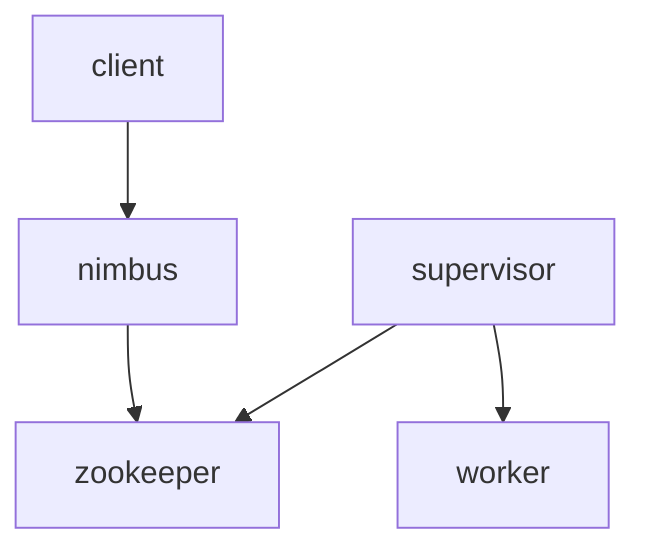
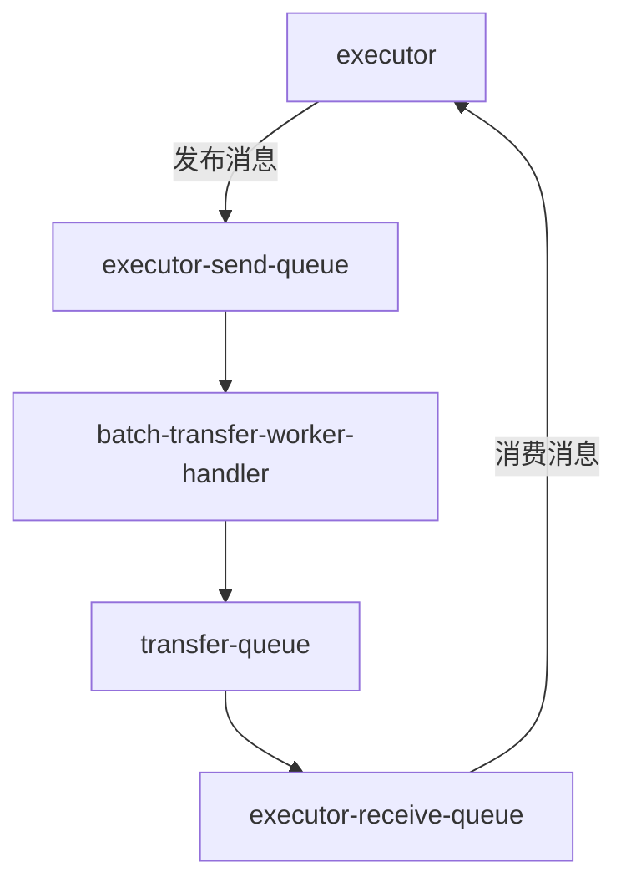
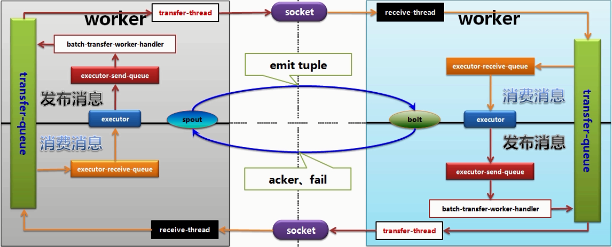

# 目录 #

- [第一节 Storm框架概述](#1)
- [第二节 Storm高可用（HA）集群搭建](#2)
- [第三节 Topology](#3)
- [第四节 第一个storm程序](#4)
- [第五节 storm远程模式](#5)
- [第六节 storm编程详解](#6)
- [第七节 Storm集群架构](#7)
- [第八节 storm任务分配流程](#8)
- [第九节 storm集群的容错机制](#9)
- [第十节 Storm线程模型及消息系统](#10)
- [第十一节 storm web UI](#11)
- [第十二节 Storm1.0 事务](#12)
- [第十三节 Storm1.0 trident基本概念和介绍](#13)
- [第十四节 Storm1.0 trident API](#14)
- [第十五节 Storm1.0 trident state](#15)
- [第十六节 Storm1.0 trident spout](#16)
- [第十七节 Storm1.0 trident RAS API](#17)
- [第十八节 Storm1.0 DRPC](#18)
- [第十九节 Storm1.0与spark 2.X Streaming对比](#19)
- [第二十节 Storm1.0 优化](#20)
- [第二十一节 Storm1.0 客户端命令](#21)

***

<h4 id='1'>第一节 Storm框架概述</h4>

1. 了解什么是Storm
2. 掌握Storm框架的要点
3. 掌握Storm与Hadoop的区别
4. 掌握Storm框架的优势

---

Storm简介
- Storm是Apache旗下免费开源的分布式实时计算框架
- 处理无限数据流
- 对实时分析、在线机器学习、连续计算、分布式RPC、ETL等提供高效、可靠的支持

Storm计算框架的要点
- 开源
- 流式计算
- 实时数据处理
- 分布式系统
- 处理海量数据

与Hadoop比较
- 相同：海量数据、分布式
- 不同：计算介质(Hadoop受限于磁盘IO/Storm计算基于内存)、面向领域(Hadoop基于任务调度离线批处理/Storm基于数据流实时计算)

Storm优势
- 简单的计算编程
- 实时性
- 可伸缩性
- 容错性
- 水平扩展
- 多语言支持

***

<h4 id='2'>第二节 Storm高可用（HA）集群搭建</h4>

准备工作
- linux服务器
- jdk
- python
- zookeeper集群
- 下载[storm](http://archive.apache.org/dist/storm/)

搭建storm集群
- 解压storm
- 配置storm.yaml
- 创建保存storm数据的文件夹
- 配置系统环境变量

***

<h4 id='3'>第三节 Topology</h4>

1. 理解什么是Topology
2. 理解spout、bolt、tuple、stream的含义
3. 理解Stream Grouping

---

Topology（拓扑）
- Hadoop -> MR(map+reduce)
- Storm -> Topology(spout+bolt)
    - Storm分布式计算结构称为Topology（拓扑），由stream（数据流）、spout（数据流的生成者）、bolt（运算）组成
    - spout：数据采集器，把数据转换成一个个tuple，传递给后面的bolt
    - bolt：业务逻辑处理
    - tuple：spout/bolt每次向下游的bolt发送数据的最小单元
    - 一个spout或者bolt可以向下游的多个bolt同时发送tuple；一个bolt可以同时接收多个上游的spout/bolt发送的tuple

Stream Grouping
- 数据流分组（Stream Grouping）定义一个Topology中每个bolt接受什么样的流作为输入
- Storm定义了六种内置数据流分组的定义
    - 随机分组（Shuffle grouping）：所有的tuple都尽量随机的分配到下游的bolt
    - 按字段分组（Fields grouping）：下游的bolt接收tuple是按字段接收，相同的值会发送到同一个bolt中
    - 完全分组（All grouping）：把所有的tuple都复制一份发送给下游的所有bolt
    - 全局分组（Global grouping）：把所有的tuple都发送给同一个bolt的同一个任务（id最小的任务）
    - 不分组（None grouping）：目前与随机分组等效
    - 指向型分组（Direct grouping）：数据源判断tuple由哪个bolt来接收，只能在指向型的数据流上使用

***

<h4 id='4'>第四节 第一个storm程序</h4>

```
package com.storm.wordcount;


import org.apache.storm.Config;
import org.apache.storm.LocalCluster;
import org.apache.storm.topology.TopologyBuilder;
import org.apache.storm.tuple.Fields;
import org.apache.storm.utils.Utils;

public class WordCountTopoMain {

    public static void main(String[] args) {
        // 定义一个Topology
        TopologyBuilder builder = new TopologyBuilder();
        // 将Spout和Bolt放进来
        builder.setSpout("word-reader", new WordReader());
        builder.setBolt("word-normalizer", new WordNormalizer()).shuffleGrouping("word-reader");
        builder.setBolt("word-counter", new WordCounter()).fieldsGrouping("word-normalizer", new Fields("word"));

        // 定义配置信息
        Config config = new Config();
        config.setDebug(false);

        // 本地运行
        LocalCluster localCluster = new LocalCluster();
        localCluster.submitTopology("wordcount", config, builder.createTopology());
        Utils.sleep(10000);
        localCluster.shutdown();
    }

}
```

```
package com.storm.wordcount;

import org.apache.storm.spout.SpoutOutputCollector;
import org.apache.storm.task.TopologyContext;
import org.apache.storm.topology.IRichSpout;
import org.apache.storm.topology.OutputFieldsDeclarer;
import org.apache.storm.tuple.Fields;
import org.apache.storm.tuple.Values;

import java.io.*;
import java.util.Map;
import java.util.UUID;

public class WordReader implements IRichSpout {

    private FileInputStream is;
    private InputStreamReader isr;
    private BufferedReader br;

    private SpoutOutputCollector collector;

    private String line;

    @Override
    public void open(Map map, TopologyContext topologyContext, SpoutOutputCollector spoutOutputCollector) {
        this.collector = spoutOutputCollector;
        try {
            this.is = new FileInputStream("F://test.txt");
            this.isr = new InputStreamReader(is, "utf-8");
            this.br = new BufferedReader(isr);
        } catch (FileNotFoundException e) {
            e.printStackTrace();
        } catch (UnsupportedEncodingException e) {
            e.printStackTrace();
        }
    }

    @Override
    public void close() {
        try {
            this.br.close();
            this.isr.close();
            this.is.close();
        } catch (IOException e) {
            e.printStackTrace();
        }
    }

    @Override
    public void activate() {

    }

    @Override
    public void deactivate() {

    }

    /**
     * 无限循环，发送tuple
     */
    @Override
    public void nextTuple() {
        try {
            while ((this.line = this.br.readLine()) != null) {
                this.collector.emit(new Values(this.line), UUID.randomUUID()); // 输出tuple（输出字段值）
            }
        } catch (IOException e) {
            e.printStackTrace();
        }
    }

    @Override
    public void ack(Object o) {

    }

    @Override
    public void fail(Object o) {

    }

    @Override
    public void declareOutputFields(OutputFieldsDeclarer outputFieldsDeclarer) {
        outputFieldsDeclarer.declare(new Fields("line")); // 输出域（输出字段名）
    }

    @Override
    public Map<String, Object> getComponentConfiguration() {
        return null;
    }
}
```

```
package com.storm.wordcount;

import org.apache.storm.task.OutputCollector;
import org.apache.storm.task.TopologyContext;
import org.apache.storm.topology.IRichBolt;
import org.apache.storm.topology.OutputFieldsDeclarer;
import org.apache.storm.tuple.Fields;
import org.apache.storm.tuple.Tuple;
import org.apache.storm.tuple.Values;

import java.util.Map;

public class WordNormalizer implements IRichBolt {

    private OutputCollector collector;

    private String line;
    private String[] words;

    @Override
    public void prepare(Map map, TopologyContext topologyContext, OutputCollector outputCollector) {
        this.collector = outputCollector;
    }

    /**
     * 无限循环，接收tuple
     * @param tuple
     */
    @Override
    public void execute(Tuple tuple) {
        // 通过域获取值
        this.line = (String) tuple.getValueByField("line");
        // 通过元素下标获取值
//        tuple.getValue(0);
        this.words = this.line.split("\t");
        for (String word : words) {
            this.collector.emit(new Values(word)); // 向下游发送拆分后的word
        }
        // 通知上游已完成处理
        this.collector.ack(tuple);
    }

    @Override
    public void cleanup() {

    }

    @Override
    public void declareOutputFields(OutputFieldsDeclarer outputFieldsDeclarer) {
        outputFieldsDeclarer.declare(new Fields("word"));
    }

    @Override
    public Map<String, Object> getComponentConfiguration() {
        return null;
    }
}
```

```
package com.storm.wordcount;

import org.apache.storm.task.OutputCollector;
import org.apache.storm.task.TopologyContext;
import org.apache.storm.topology.IRichBolt;
import org.apache.storm.topology.OutputFieldsDeclarer;
import org.apache.storm.tuple.Tuple;

import java.util.HashMap;
import java.util.Map;

public class WordCounter implements IRichBolt {

    private OutputCollector collector;

    private String word;
    private Map<String, Integer> wordcount;

    @Override
    public void prepare(Map map, TopologyContext topologyContext, OutputCollector outputCollector) {
        this.collector = outputCollector;
        this.wordcount = new HashMap<>();
    }

    @Override
    public void execute(Tuple tuple) {
        word = (String) tuple.getValueByField("word");
        if (!wordcount.containsKey(word)) {
            wordcount.put(word, 1);
        } else {
            wordcount.put(word, wordcount.get(word) + 1);
        }
        this.collector.ack(tuple);
    }

    @Override
    public void cleanup() {
        // 本地集群停止时执行
        // 展示结果
        for (Map.Entry<String, Integer> entry : wordcount.entrySet()) {
            System.out.println(entry.getKey() + entry.getValue());
        }
    }

    @Override
    public void declareOutputFields(OutputFieldsDeclarer outputFieldsDeclarer) {

    }

    @Override
    public Map<String, Object> getComponentConfiguration() {
        return null;
    }
}
```

***

<h4 id='5'>第五节 storm远程模式</h4>

在Storm集群运行Topology的组件
- Supervisor
```
启动Storm的Supervisor
nohup storm supervisor >> /dev/null &
```
- Worker
```
supervisor.slots.ports:
     - 6700
     - 6701
     - 6702
     - 6703
## 每个supervisor上启动4个进程来执行线程
```
- Executor
```
builder.setSpout("word-reader", new WordReader(), 3); // 并行度：开启3个线程来执行
```
- Task
```
builder.setSpout("word-reader", new WordReader()).setNumTasks(3); // 生成3个实例来执行
```

***

<h4 id='6'>第六节 storm编程详解</h4>

1. 掌握IRichSpout、IRichBolt类的相关方法
2. 掌握SpoutDeclarer、BoltDeclarer类的相关方法

---

IRichSpout
- open：初始化，在实例化时调用
    - Map：创建Topology的配置信息
    - TopologyContext：Topology的数据
    - SpoutOutputCollector：将Spout的Tuple发送给下游数据
- close：关闭资源
- activate：open方法之后，实例处于失效状态，过段时间会变成激活状态，此时调用activate方法
- deactivate：通过客户端执行deactivate命令，调用此方法，并且把Topology的spout实例变成失效状态
- nextTuple：具体读取数据的方法，可以调用collector来发送数据，是一个无限循环调用的方法，直到Topology被停止
- ack：当前的spout发送的tuple具有message ID且成功处理时，调用此方法
    - Object o：message ID
- fail：当前的spout发送的tuple具有message ID且处理失败时，调用此方法
- declareOutputFields：定义当前发送的tuple的域名字，运行topologyBuilder.createTopology方法时调用此方法。定义的域名数量与发送的tuple数据数量要一一对应
- getComponentConfiguration：当前Spout的配置，运行topologyBuilder.createTopology方法时调用此方法
    - 可以在open方法的map参数中使用此处定义的配置
    - 可以定义任意的KV配置

IRichBolt
- prepare：同open的初始化方法，把OutputCollector转化为类的变量，供后面的execute方法使用
- execute：无限循环调用，直到Topology停止
    - Tuple tuple：上游发送过来的tuple
    - collector.emit(new Values(x))：向下游发送数据
    - collector.ack(tuple)：告知上游该tuple已处理完毕
- cleanup：Topology结束时调用，执行一些清理工作，关闭连接，只适合本地模式
- declareOutputFields：定义域
- getComponentConfiguration：当前Bolt的配置

SpoutDeclarer
- new TopologyBuilder().setSpout("spout-name", new SpoutClass())返回的对象类型是SpoutDeclarer
- addConfiguration(s)：设置当前Spout的配置
- setDebug(true)：记录当前spout发射的每一条数据
- setNumTasks(num)：实例Spout对象的个数
- setMaxTaskParallelism(num)：最大实例化个数，优先级高于NumTasks
- setMaxSpoutPending(num)：最大缓存tuple数，达到num后不再发送，直到下游继续消费数据

BoltDeclarer
- setBolt("bolt-name", new BoltClass()).xxxGrouping("last-bolt/spout-name")
- addConfiguration(s)
- setDebug(false)
- setNumTasks(num)
- setMaxTaskParallelism(num)
- setMaxSpoutPending(num)
- customGrouping("last-bolt/spout-name", new ShuffleGrouping())：自定义分组

***

<h4 id='7'>第七节 Storm集群架构</h4>

nimubs
- storm的主节点，类似于Hadoop中的jobtracker，管理、协调和监控在集群上运行的Topology

supervisor
- 每个工作节点运行Supervisor守护进程，负责监听工作节点上已经分配的主机作业
- 启动和停止Nimbus已经分配的工作进程

zookeeper
- storm主要使用zookeeper来协调集群中的状态信息

worker
- supervisor建立的具体处理Spout/Bolt逻辑的进程
- 一个worker只能执行一个Topology的任务子集

1. client提交任务
2. nimbus同步状态、Topology状态、任务分配、注册心跳...->Zookeeper
3. supervisor注册心跳->Zookeeper
4. supervisor下载Topology子集
5. supervisor启动worker、kill worker
6. worker注册心跳->Zookeeper
7. worker创建executor线程
8. executor线程注册心跳->Zookeeper
9. executor运行task

***

<h4 id='8'>第八节 storm任务分配流程</h4>



client
- 提交Topology到storm集群
```
storm jar xxx.jar
```

nimbus
- 把提交的jar放到nimbus所在服务器的nimbus/inbox目录(storm的本地存储路径下)
- 检查storm集群，当前有哪个supervisor可以使用、哪个worker可以使用，检查提交的Topology名称是否重复，检查当前Topology的spout/bolt的id是否有重复
- 根据Topology的定义，分配spout/bolt的task，查询当前有哪些worker可以使用，把task分配给worker
- 将分配好的task放在zookeeper上
- 将整体的Topology放到zookeeper的storms目录下

supervisor
- 定时的上zookeeper上查询，是否有分配给自己的任务并下载（从nimbus上下载）
- 删除本地上已经不需要的Topology（已停止的、重新分配了的）
- 启动相应的worker

worker
- 根据spout/bolt的task id，计算spout/bolt向哪些bolt发送tuple
- 根据上面的计算结果，启动相应的executor，实例化spout/bolt，执行相应的任务

***

<h4 id='9'>第九节 storm集群的容错机制</h4>

Worker死亡
- supervisor将会重启worker
- 如果不断的重启失败，并且不能发送心跳给Nimbus，那么Nimbus将重新调度这个worker

Supervisor工作机宕机
- 分配到这台机器上的Tasks会超时
- Nimbus会将这些任务分配给其他机器执行
- 若没有空闲的worker，这些任务会处于等待状态

Nimbus或Supervisor守护进程死亡
- Nimbus和Supervisor守护进程被设计成快速失败且无状态的，信息存储于Zookeeper上
- 对于已经运行的worker进程没有任何影响
- 若此时worker也死掉了，那将没有Nimbus或Supervisor来重新分配任务，也就是说worker是真的死掉了
- 因此，需要对Nimbus和Supervisor进行监听，保持高可用

Nimbus高可用
- Storm1.0.0版本以后，Nimbus即高可用
- 目前Storm master又叫做Nimbus，是一个运行在单个机器上的受监督的进程
- 采用主备模式运行Nimbus以保证Nimbus的高可用

Supervisor暂时没有高可用方案，需要外部监控

***

<h4 id='10'>第十节 Storm线程模型及消息系统</h4>

本地消息发布与消费
- 同一个worker进程内的executor线程之间
- worker(本地模式)
1. worker启动时，除了启动executor线程，还会启动多个工作线程来负责消息传递
2. worker会订阅到transfer-queue来消费消息
3. executor会发布消息到executor-send-queue（比如tuple.emit），同时会从executor-receive-queue消费消息（ack/fail）
4. batch-transfor-worker-handler线程订阅到executor-send-queue消费消息，并将消息发布到transfer-queue供worker消费

- executor-send-queue类似于发件箱
- batch-transfer-worker-handler类似于邮递员
- transfer-queue类似于邮局
- executor-receive-queue类似于收件箱

远程消息发布与消费
- 不同的worker进程之间

- transfer-thread线程监测是否有消息需要发送给其他worker
- 通过socket通信
- receive-threadx线程接收其他worker发送过来的消息，放入自己的transfer-queue

***

<h4 id='11'>第十一节 storm web UI</h4>

略

***

<h4 id='12'>第十二节 Storm1.0 事务</h4>

1. 掌握Storm的一致性事务设计
2. 掌握CoordinateBolt原理
3. 掌握Storm的Transactional Topology

---

Storm一致性事务
- Storm是一个分布式流处理系统，利用anchor和ack机制保证所有tuple都被成功处理
- 如果tuple出错，可以被重传，可以保证tuple被处理，但无法保证处理且只处理一次

一致性事务设计——强顺序流
- 保证tuple只被处理一次
- 将tuple流变成强顺序的，且每次只处理一个tuple，给每个tuple顺序加上一个id

一致性事务设计——强顺序batch流
- 每次批处理一批tuple，称为一个batch，保证batch处理且只处理一次
- batch id

CoordinateBolt
- 记录上游发送过来的tuple数量，进行校验是否有漏处理

强顺序batch流的问题
- batch需要整体处理完后才能进行处理下一个batch，处理时间长

Storm事务拓扑设计
- processing阶段
    - 此阶段多个batch可以并行计算
- commit阶段
    - 此阶段各个batch之间需要有强顺序性的保证
    - 按顺序id提交

***

<h4 id='13'>第十三节 Storm1.0 trident基本概念和介绍</h4>

Trident
- 提供了更高层次的抽象，将常用的count、sum等封装成了方法，可以直接调用
- 以批次代替单个元祖，每次处理一个批次的数据
- 提供了事务支持，保证数据均处理且只处理了一次

***

<h4 id='14'>第十四节 Storm1.0 trident API</h4>

Trident API
- Trident的核心数据模型时“流”（Stream）
    - 这里的流是一连串batch来处理，不是Tuple
- 5类操作
    - 针对每个小分区（partition）的本地操作
    - 针对一个数据流的重新分区操作
    - 通过网络数据传输进行的聚合操作
    - 针对数据流的分组操作
    - 融合与联结操作

函数（BaseFunction）
- 函数负责接收一个输入域的集合并选择输出或不输出tuple
- 输出tuple的域会被添加到原始数据流的输入域中
- 不输出tuple，原始数据输入tuple会被过滤
```
class MyFunction extends BaseFunction {
    @Override
    public void execute(TridentTuple tuple, TridentCollector collector) {
        ...
        collector.emit(new Value(i));
        ...
    }
}

...
topology.each(new Fields("f"), new MyFunction(), new Fields("new_f")); //针对输入域f执行MyFunction函数，函数结果以new_f域输出
...
```

过滤器（BaseFilter）
- 过滤器负责判断输入的tuple是否保留，返回布尔值
```
class MyFilter extends BaseFilter {
    @Override
    public void isKeep(TridentTuple tuple) {
        return tuple.getInteger(0) == 1 && tuple.getInteger(1) == 2
    }
}
        
...
topology.each(new Fields("f"), new MyFilter()); //针对输入域f执行MyFilter过滤
...
```

聚合器（partitionAggregate）
- 在一批tuple的每个分区上执行一个指定的功能操作
- 与函数不同的是，partitionAggregate发送出的tuple会将输入的tuple域替换，而不是新增
- CombinerAggregator
    - 将带有一个域的一个单独的tuple返回作为输出
    - 会在每个输入tuple上运行初始化函数，然后使用combine函数来组合所有输入的值
    - 如果某个分区上没有tuple，则输出zero方法的结果
    ```
    public interface CombinerAggregator<T> extends Serializable {
        T init(TridentTuple var1);
        T combine(T var1, T var2);
        T zero();
    }
    ```
- ReducerAggregator
    - 使用init产生一个初始化的值
    - 使用该值对每个输入tuple进行遍历，最终生成并输出一个单独的tuple
    - 这个tuple中就包含有我们需要的计算结果值
    ```
    public interface ReducerAggregator<T> extends Serializable {
        T init();
        T reduce(T var1, TridentTuple var2);
    }
    ```
- Aggregator聚合器
    - 可以生成任意数量的tuple，也可以带有任意数量的域
    - 可以在执行过程中的任意一点输出tuple
    - 执行过程
        1. 处理一批数据之前先调用init方法，返回一个代表聚合状态的对象，这个对象接下来会被传入aggregate方法和complete方法中
        2. 对于一个区块中的每个tuple都会调用aggregate方法，这个方法能够更新状态并且有选择的输出tuple
        3. 在区块中的所有tuple都被aggregate方法处理之后就会调用complete方法
    ```
    public interface Aggregator<T> extends Operation {
        T init(Object var1, TridentCollector var2);
        void aggregate(T var1, TridentTuple var2, TridentCollector var3);
        void complete(T var1, TridentCollector var2);
    }
    ```
- 聚合器链
```
topology.chainAgg()
.xxxAggregate()
.xxxAggregate()
.chainEnd()
```

重分区操作
- 执行一个用来改变在不同的任务间分配tuple的方式的函数
1. shuffle：通过随机轮询算法来重新分配目标区块的所有tuple
2. broadcast：每个tuple都会被复制到所有的目标区块中
3. partitionBy：该函数会接受一组域作为参数，并根据这些域来进行分区操作
4. global：所有tuple会发送到同一个目标分区中，数据流中的所有的块都会由这个分区处理
5. batchGlobal：同一个batch块中的所有tuple会发送到同一个区块中
6. partition：使用自定义方法分区

聚类操作
- 使用aggregate方法和persistentAggregate方法
    - aggregate：分别对每个batch进行处理，不涉及state
    - persistentAggregate：除了处理batch外，还要将结果存入state

分组操作
- 对指定的域进行groupBy操作
- 会将数据流重分区，使得相同域的tuple聚集在一起

融合（Merge）
- 联结不同的数据流的操作：topology.merge(流1,流2,流3)
- 融合后的新数据流的域会以第一个数据流的域为准

联结（Join）
- 只能用于有限的输入数据集
- topology.join(s1, s1需要联结的域, s2, s2需要联结的域, 新的域)

***

<h4 id='15'>第十五节 Storm1.0 trident state</h4>

恰好一次语义
- Trident中含有对状态化（stateful）的数据源进行读取和写入操作的一级抽象封装工具。这个所谓的状态（state）可以被保存起来。
- Trident使用一种容错性的方法实现对state的管理。基于这个机制，每条消息都可以看作被恰好处理了一次。
- Trident提供了一种支持恰好一次处理的语义，如下所述：
    - 通过batch的方式来处理tuple
    - 为每个batch提供一个唯一的id（transaction id）
    - state的更新操作按照batch的顺序进行

支持state容错的spout
- 基于trident的基本性质，具体采用什么操作来更新state操作取决于输入的spout
- 有三类支持容错性的spout
    - “非事务型”（non-transactional）
    - “事务型”（transactional）
    - “模糊事务型”（opaque transactional）

State API
- trident的状态具有仅处理一次、持续聚合的语义
- 使用trident state来实现trident恰好一次的语义
- 基本的State接口只有两个方法，state更新操作的开始时和结束时都会获取一个txid
```
public interface State {
    void beginCommit(Long txid);
    void commit(Long txid);
}
```

StateFactory
- 所有处理事务逻辑都在StateFactory中处理了
- trident提供了一个StateFactory用来创建State对象

PersistentAggregate
- trident中用来更新来源的状态的方法
- 如果前面是一个分好组的流，trident希望你提供的状态实现MapState接口
    - key是分组的字段
    - 聚合结果是状态的值
- 实现MapState接口，只需要为这个类提供一个IBackingMap接口
    ```
    public interface IBackingMap<T> {
        List<T> multiGet(List<List<Object>> keys);
        void multiPut(List<List<Object>> keys, List<T> values);
    }
    ```

***

<h4 id='16'>第十六节 Storm1.0 trident spout</h4>

Trident spout
- 在普通的Strom Spout之上提供了一些其他的API接口

管道
- Trident默认每次只处理一个batch
- 可以通过batch管道化来提高吞吐率，降低每个batch的处理延时
- 同时处理的batch的最大数量：topology.max.spout.pending

Trident spout类型
- ITridentSpout：最常用的API，支持事务型和模糊事务型的语义实现
- IBatchSpout：非事务型spout，每次会输出一个batch的tuple
- IPartitionedTridentSpout：可以从分布式数据源（比如一个集群或者Kafka）读取数据的事务型spout
- OpaquePartitionedTridentSpout：可以从分布式数据源读取数据的模糊事务型spout
- IRichSpout

***

<h4 id='17'>第十七节 Storm1.0 trident RAS API</h4>

Trident RAS API
- RAS(Resource AwareScheduler)资源感知调度程序
- 提供了一种机制，允许用户指定Trident Topology的resource consumption(资源消耗)
- setCPULoad(20)：设置CPU负载百分比
- setMemoryLoad(Number onHeap, Number offHeap)：设置内存的负载以及堆栈值

***

<h4 id='18'>第十八节 Storm1.0 DRPC</h4>

DRPC
- Distributed Remote Procedure Call，分布式远程过程调用
- 分布式RPC（DRPC）的真正目的是使用storm实时并行计算极端功能
- Storm拓扑需要一个输入流作为函数参数，以一个输出流的形式发射每个函数的调用结果
- 分布式RPC通过“DRPC Server”协调：DRPC服务器协调接收一个RPC请求，发送请求到Storm拓扑，从Storm拓扑接收结果，发送结果回等待的客户端
- 从客户端角度来看，一个分布式RPC调用和常规的RPC调用一样

LinearDRPCTopologyBuilder
- Storm通过这个拓扑几乎自动的完成DRPC所需的所有相关步骤
1. 设置Spout
2. 返回结果给DRPC服务器
3. 为bolt提供对一组元祖的有限聚合功能

***

<h4 id='19'>第十九节 Storm1.0与spark 2.X Streaming对比</h4>

处理模型以及延迟
- Storm：每次传入一个事件，延迟在亚秒级
- SparkStreaming：处理某个时间段窗口内的事件流，延迟在秒级

容错和数据保证
- SparkStreaming提供了更好的支持容错状态计算
- Storm带state计算时，处理速度不如SparkStreaming

实现和编程API
- Storm：Clojure语言实现，提供了Java和其它语言的API
- SparkStreaming：Scala语言，提供了Scala、Java、Python的API

生产支持
- Storm：Hortonworks Hadoop数据平台中流处理的解决方案
- SparkStreaming：MapR的分布式平台Cloudera的企业数据平台中

集群管理集成
- 都运行在自己的集群上
- Storm：还能运行在Mesos上
- SparkStreaming：还能运行在YARN和Mesos上

***

<h4 id='20'>第二十节 Storm1.0 优化</h4>

优化方向
- 硬件配置优化
- 代码层面的优化
- Topology并行度优化
- Storm集群配置参数和Topology运行参数的优化

Storm特性
- DAG，有向无环图
- 常驻内存，Topology启动后除非kill掉，否则一直运行
- 提供DRPC服务
- 采用了ZeroMQ和Netty作为底层框架
- 采用了ACK/fail方式的tuple追踪机制，并且只能由创建该tuple的task所承载的spout触发

Storm并行概念
- 一个Topology指定多少个worker进程并行运行
- 一个worker进程指定多少个executor线程并行运行
- 一个executor线程指定多少个task并行运行

Storm消息机制
- At least once：至少一次，在运用时要格外小心
- exactly once：仅且一次，通过Trident方式实现

调优方案——硬件配置
- 增加机器的硬件资源，提高硬件配置等

调优方案——代码优化
- 算法优化
- 业务逻辑优化
- 技术优化
    - 连接数据库使用连接池
    - 合理使用多线程
    - JVM优化
    - ...
- Topology优化
    - 设计多少个spout/bolt
    - 每个bolt做什么，关系如何

调优方案——并行度优化
- Worker数量：取决于节点数量、内存容量，数据量大小和代码执行时间
- Spout并行度：在UI里观察Spouts(All time)执行情况
    - Failed值是否为0
    - Emmitted、Transferred、Acked三个值大小大致相等
    - Complete latency(ms) tuple在tuple tree中完全处理的平均时间，如果很长（10+s），则需要调整spout并行度
- bolt并行度：在UI里观察Bolts(All time)执行情况
    - Capacity(last 10m)：越小越好，接近1的时候说明负载很严重，需要增加并行度，正常是在0.0x-0.1 0.2左右
    - Process latency(ms)：每个tuple的平均处理时间，越小越好，正常也是0.0x级别，如果很大，可以考虑增加并行度，但主要以Capacity为准

调优方案——配置参数优化
- spout缓存发射的tuple数量
    - TOPOLOGY_MAX_SPOUT_PENDING
    - 通常情况，下游消费速度>上游发送速度，当下游消费慢了，spout会停下来等待
    - 此参数可以适当调大一些
- worker内存
    - WORKER_HEAP_MEMORY_MB
    - TOPOLOGY_WORKER_MAX_HEAP_SIZE_MB
- worker间通信缓冲参数
    - TOPOLOGY_RECEIVER_BUFFER_SIZE=8
    - TOPOLOGY_TRANSFER_BUFFER_SIZE=32
    - TOPOLOGY_EXECUTOR_RECEIVE_BUFFER_SIZE=16384
    - TOPOLOGY_EXECUTOR_SEND_BUFFER_SIZE=16384
- 配置优先级：defaults.yaml < storm.yaml < 特定拓扑的配置 < 内部特定组件的配置 < 外部特定组件的配置

***

<h4 id='21'>第二十一节 Storm1.0 客户端命令</h4>

常用命令
- jar：提交topology任务命令
- kill：杀死topology任务，可选填等待多少秒后杀死
- nimbus：启动nimbus守护进程
- supervisor：启动supervisor守护进程
- ui：启动UI守护进程
- drpc：启动drpc守护进程
- rebalance：平衡，即动态设置拓扑的进程数量和线程数量等
    - -w：等待多少秒后执行平衡
    - -n：调整后worker的数量
    - -e：调整后的spout/bolt的并行度
- list：列出正在运行的拓扑及其状态
- logviewer：启动logviewer守护进程，提供一个web接口查看storm日志文件，使用daemontools或者monit工具监控运行