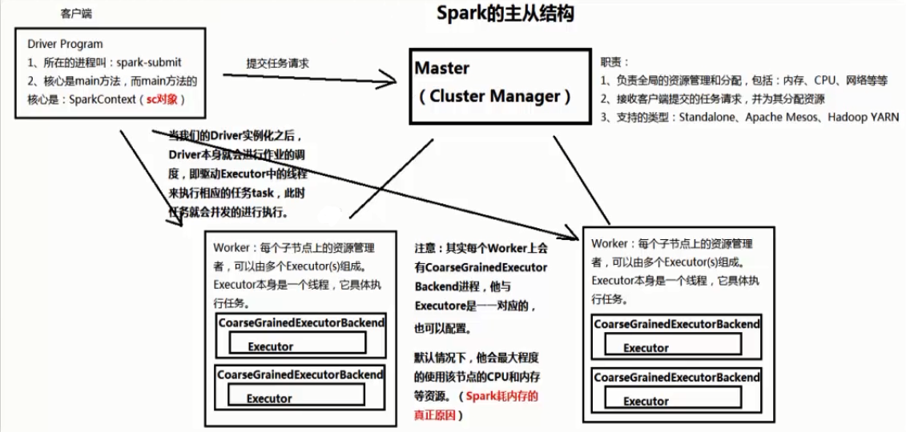
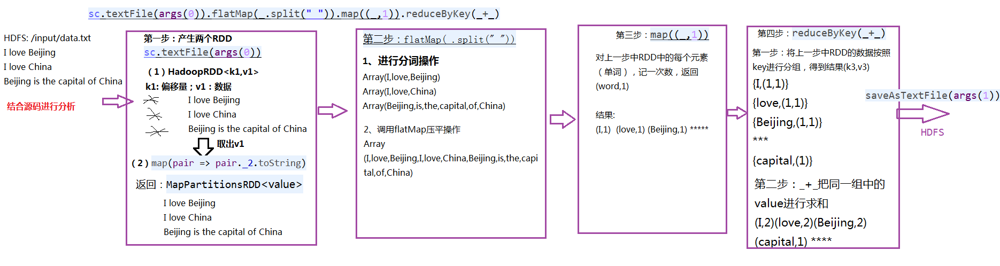
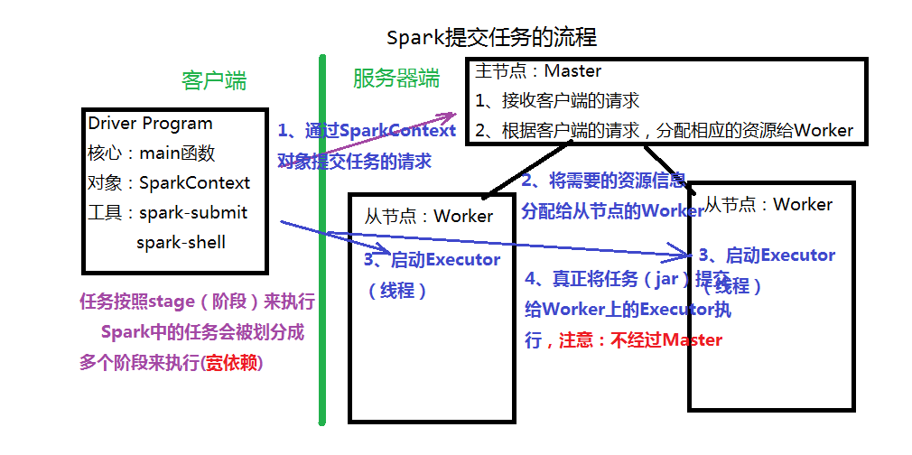

# 目录 #

- [第一节 Spark基础入门](#1)
- [第二节 Spark的体系结构与安装部署](#2)
- [第三节 执行Spark Demo程序](#3)
- [第四节 Spark运行机制及原理分析](#4)

***

<h4 id='1'>第一节 Spark基础入门</h4>

什么是Spark？Spark的生态圈
- [Spark](http://spark.apache.org/) 是一个针对大规模数据处理的快速通用引擎
    - Apache Sparkis a unified analytics engine for large-scale data processing.
- Spark生态圈
    - Spark Core：内核
    - Spark SQL：用于处理结构化数据的组件，类似Hive
    - Spark Streaming：用于处理流式数据的组件，类似Storm
    - Spark MLLib：机器学习
    - Spark Graphx：图计算

为什么要学习Spark？
- MapReduce存在哪些缺点？
    - MapReduce核心处理过程Shuffle，会产生大量的IO
- Spark最大的特点：基于内存
    - Spark只会产生两次IO操作（读取数据，写出数据）
    - 只有当内存不足时会产生额外的IO操作
- Spark是MapReduce的替代方案，兼容Hive、HDFS，融入到Hadoop

Spark的特点
- 快：基于内存
    - 同时也是缺点，Spark没有对内存进行管理，容易出现OOM问题
    - 分析内存溢出问题：Java Heap Dump
- 易用：支持多种语言开发（Scala、Java、Python、R...）
- 通用：Spark生态圈提供了不同的组件
- 兼容性：兼容Hadoop

***

<h4 id='2'>第二节 Spark的体系结构与安装部署</h4>

1. 掌握Spark的体系架构
2. 掌握Spark的安装与部署
3. 掌握Spark HA的实现

---

Spark的体系架构

- 客户端
    - Driver Program
        - 启动客户端：
        1. spark-submit提交spark任务
            - 打包成jar包提交
        2. spark-shell（交互式命令行工具）
        - 主程序：main
            - 创建核心对象SparkContext(SC对象)
- 服务器端
    - Cluster Manager：主节点(master)
        - 负责集群资源的管理和任务的分配
        - 负责接收客户端的请求（执行任务）
        - 支持Standalone、Yarn、[Mesos](http://mesos.apache.org/)
    - Worker：从节点
        - 是该节点上的资源和任务的管理者
        - 可以启动多个Executor（线程）
    - 主从结构：存在单点（主节点）故障问题
        - 实现Spark HA（High avaibility高可用性）
        - 借助Zookeeper


安装和部署Spark
- Standalone模式
    1. 安装Linux操作系统和JDK
    2. 配置Linux：关闭防火墙、设置主机名、免密登录
    3. 搭建Hadoop的环境
    - 伪分布模式搭建
        - 解压spark
        - Hadoop和Spark的脚本有冲突，因此环境变量只能设置一个
        - 核心配置文件：conf/spark-env.sh
            ```
            export JAVA_HOME=$JAVA_HOME
            export SPARK_MASTER_HOST=hadoop001
            export SPARK_MASTER_PORT=7077
            ```
        - 配置从节点配置文件：slave
        - 启动spark：sbin/start-all.sh
        - Web Console：端口8080
    - 全分布模式搭建
        - 三台主机
        - 主节点上进行安装配置
        - 复制到其他节点
        - 启动主节点上的spark集群

Spark HA
- 主从结构的单点故障问题
    - 如果master异常退出，将导致
        - 无法向spark集群提交任务
        - 老任务即时运行结束，计算所占用的资源将无法释放，因为回收资源的指令是需要master发出的
- 基于文件系统的单点恢复
    - 主要用于开发和测试环境
    - 创建恢复目录，保存集群的运行信息，故障时手动重启并读取恢复目录中的信息，以还原集群的状态
    - 在spark-evn.sh中增加以下参数
    ```
    export SPARK_DAEMON_JAVA_OPTS="-Dspark.deploy.recoveryMode=FILESYSTEM -Dspark.deploy.recoveryDirectory=/opt/software/spark-2.2.0-bin-hadoop2.6/recovery"
    ```
- 基于Zookeeper实现Standby Master
    - Zookeeper的功能：数据同步、选举、分布式锁（秒杀）
    - 在spark-evn.sh中修改以下参数
    ``` 
    # export SPARK_MASTER_HOST=hadoop001
    # export SPARK_MASTER_PORT=7077
    export SPARK_DAEMON_JAVA_OPTS="-Dspark.deploy.recoveryMode=ZOOKEEPER -Dspark.deploy.zookeeper.url=hadoop001:2181,hadoop002:2181,hadoop003:2181 -Dspark.deploy.zookeeper.dir=/mysparkHA
    ```
    - 手动启动一个备份节点：sbin/start-master.sh

***

<h4 id='3'>第三节 执行Spark Demo程序</h4>

1. 掌握spark-submit的使用
2. 掌握spark-shell的使用
3. 掌握在IDE环境中开发Spark程序

---

spark-submit
- spark的任务就是一个jar包（和MapReduce一样）
    - Example $SPARK_HOME/examples/*
- 可以提交到spark集群执行，也可以提交到hadoop的yarn集群执行
    ```
    bin/spark-submit --master spark://hadoop001:7077 --class org.apache.spark.examples.SparkPi examples/jars/spark-examples_2.11-2.2.0.jar 100
    ```

spark-shell
- Spark自带的交互式Shell程序，方便用户进行交互式编程，用户可以在该命令行下用scala编写spark程序
- 本地模式
    - 在本地直接执行spark任务
    ```
    bin/spark-shell
    ```
- 集群模式
    - 作为一个独立的Application连接到Master上
    ```
    bin/spark-shell --master spark://hadoop001:7077
    ```
- 例：执行wordcount
    ```
    sc.textFile("hdfs://hadoop001:9000/test.txt").flatMap(_.split(" ")).map((_,1)).reduceByKey(_+_).collect

    // 拆解
    // 1. 获取每一行的文字
    val rdd1 = sc.textFile("hdfs://hadoop001:9000/test.txt")
    rdd1.collect // 真正执行计算
    // 按空格分割，获取每个单词
    val rdd2 = rdd1.flatMap(_.split(" "))
    rdd2.collect
    // 每个单词计数1
    val rdd3 = rdd2.map((_,1))
    rdd3.collect
    // 对每个单词进行累加
    val rdd4 = rdd3.reduceByKey(_+_)
    rdd4.collect
    ```
    - RDD就是一个集合
    - RDD存在依赖关系
    - RDD是类，有些方法不会触发计算，有些会触发
    - 需要用collect真正的触发计算

开发Spark程序（WordCount）
- Java
    ```
    package demo;

    import org.apache.spark.SparkConf;
    import org.apache.spark.api.java.JavaPairRDD;
    import org.apache.spark.api.java.JavaRDD;
    import org.apache.spark.api.java.JavaSparkContext;
    import org.apache.spark.api.java.function.FlatMapFunction;
    import org.apache.spark.api.java.function.Function2;
    import org.apache.spark.api.java.function.PairFunction;
    import scala.Tuple2;

    import java.util.Arrays;
    import java.util.Iterator;
    import java.util.List;

    /**
    * 使用spark-submit提交任务
    * bin/spark-submit --master spark://hadoop001:7077 --class demo.JavaWordCount [jar dir] [filepath on hdfs://hadoop001:9000]
    */
    public class JavaWordCount {

        public static void main(String[] args) {
            // 配置参数
            SparkConf conf = new SparkConf().setAppName("JavaWordCount");
    //        SparkConf conf = new SparkConf().setAppName("JavaWordCount").setMaster("local");
            // 创建SC对象
            JavaSparkContext sc = new JavaSparkContext(conf);

            // 读取数据
            JavaRDD<String> datas = sc.textFile("hdfs://hadoop001:9000" + args[0]);
    //        JavaRDD<String> datas = sc.textFile("hdfs://hadoop001:9000/test.txt");
            // 分词
            JavaRDD<String> words = datas.flatMap(
                    /**
                    * 参数一:输入文本
                    * 参数二:分词后的每个单词
                    */
                    new FlatMapFunction<String, String>() {
                        @Override
                        public Iterator<String> call(String line) throws Exception {
                            return Arrays.asList(line.split(" ")).iterator();
                        }
                    });
            // Map:每个单词计数为1
            JavaPairRDD<String, Integer> wordOne = words.mapToPair(
                    /**
                    * 参数一:输入的每个单词
                    * 参数二、三:Map的输出(单词,1)
                    */
                    new PairFunction<String, String, Integer>() {
                        @Override
                        public Tuple2<String, Integer> call(String word) throws Exception {
                            return new Tuple2<String, Integer>(word, 1);
                        }
                    });
            // Reduce:每个单词的value求和
            JavaPairRDD<String, Integer> count = wordOne.reduceByKey(
                    /**
                    * 参数一、二:key相同的value
                    * 参数三:运算结果
                    */
                    new Function2<Integer, Integer, Integer>() {
                        @Override
                        public Integer call(Integer a, Integer b) throws Exception {
                            return a + b;
                        }
                    });

            // 触发计算
            List<Tuple2<String, Integer>> result = count.collect();

            // 输出
            for (Tuple2<String, Integer> r : result) {
                System.out.println(r._1 + ", " + r._2);
            }

            // 停止sc对象
            sc.stop();
        }

    }
    ```
- Scala
    ```
    package demo

    import org.apache.spark.{SparkConf, SparkContext}

    /**
    * 使用spark-submit提交任务
    * bin/spark-submit --master spark://hadoop001:7077 --class demo.JavaWordCount [jar dir] [filepath on hdfs://hadoop001:9000] [resultPath on hdfs://hadoop001:9000]
    */
    object ScalaWordCount {
        def main(args: Array[String]): Unit = {
            // 配置参数
            val conf = new SparkConf().setAppName("ScalaWordCount").setMaster("local")
            // 创建SC对象
            val sc = new SparkContext(conf)

            val count = sc.textFile("hdfs://hadoop001:9000" + args(0)).flatMap(_.split(" ")).map((_, 1)).reduceByKey(_+_)
            // 结果保存到HDFS
            count.repartition(1) // 进行重分区，设定输出文件数量为1
                .saveAsTextFile("hdfs://hadoop001:9000" + args(1)) // 和collect一样，会触发计算，并保存到hdfs上


        //    // 执行WordCount
        //    val result = sc.textFile("hdfs://hadoop001:9000/test.txt") // 读取数据
        //      .flatMap(_.split(" ")) // 分词
        //      .map((_,1)) // Map:每个单词计数为1
        //      .reduceByKey(_+_) // Reduce:每个单词的value求和
        //      .collect // 触发计算
        //
        //    // 输出
        //    result.foreach(println)

            // 停止SC对象
            sc.stop()
        }
    }
    ```

***

<h4 id='4'>第四节 Spark运行机制及原理分析</h4>

1. WordCount执行的流程分析
2. Spark提交任务的流程

---

WordCount程序数据处理流程
- textFile("...")
    - 产生两个RDD
    - 1. HadoopRDD<k1,v1>
        - k1:偏移量(该行之前有多少个字节)
        - v1:数据(该行的数据)
        → 取出v1
    - 2. map(pair => pair._2.toString)
        - 返回MapPartitionsRDD<value>(所有行的数据)
- flatMap(.split(" "))
    1. 进行分词操作
    2. 调用flatMap压平操作
        - 放到同一个数组中
- map((_, 1))
    - 对上一步的RDD中的每个元素（单词），记一次数，返回(word, 1)
- reduceByKey(\_+_)
    1. 对上一步的RDD中的每个元素，按照key进行分组操作，返回(k3,v3)
        - k3:key，即单词
        - v3:value的集合，例：(1,1,...)
    2. "\_+_"
        - 把同组中的value进行求和


Spark提交任务的流程
