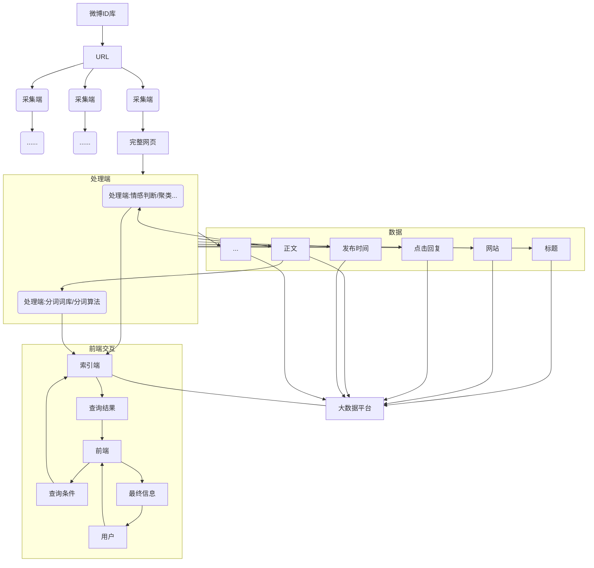
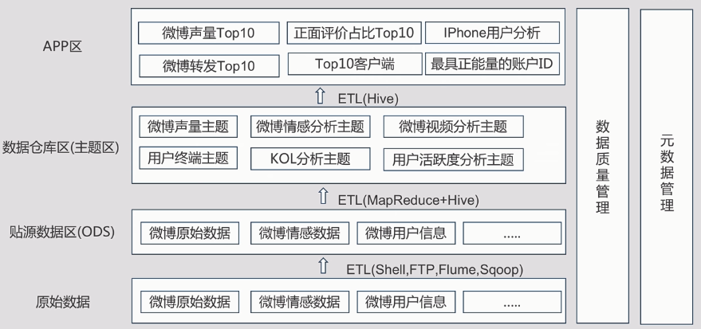
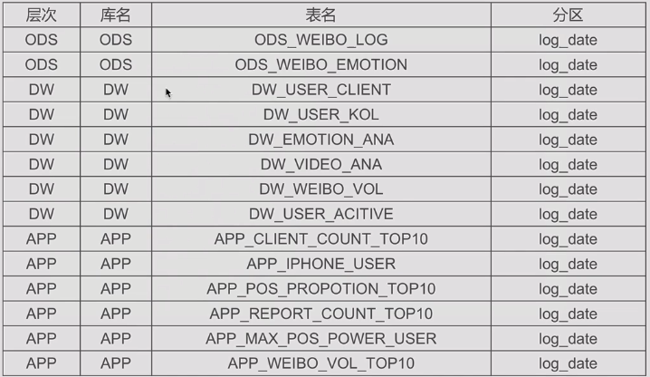

***
目录

- 整体架构
[微博数据分析平台架构解析](#1)
[微博数据分析平台数据存储模块设计与实现](#2)
- MapReduce
[微博情感分析与单元测试](#3)
[微博用户使用终端分析与单元测试](#4)
- Pig
[微博声量情况分析](#5)
- Hive
[Hive微博分析大数据平台数据仓库设计](#6)
[Hive实现KOL分析](#7)
[Hive实现声量分析](#8)
[Hive实现微博情感分析](#9)
[Hive实现用户微博热度分析](#10)
[Hive微博发帖终端分析](#11)

***

<h4 id='1'>微博数据分析平台架构解析</h4>

1. 了解课程案例微博数据分析平台的架构
2. 了解常见的大数据平台架构

微博大数据分析

产品背景需求
- 微博舆情：危机管理、竞争情报、品牌分析
    - 负面信息
        - 影响范围
    - 竞争对手
        - 行业政策、新技术、新商业模式
        - 竞争对手动态，新产品、营销活动
    - 品牌形象
        - 媒体认知、网友认知、用户认知、意见领袖的态度

对于客户的价值
- 提升客户体验
- 创新商业模式
- 技术高效、低成本
- 提升业务效率
- 增强管理水平

服务体系
- 检测系统
    - 网络口碑监测
    - 热点事件监测
    - 行业竞品监测
- 危机预警
    - 邮件预警
    - 微信预警
    - 电话、手机短信预警
    - IM预警
    - ...
- 分析报告
    - 日/周/季/年报专题事件报告
    - 市场效果评估

整体架构
- 云采集
    - 定向抓取的智能爬虫、云搜索等多种机制，实时全网监测，数据采集
- 云存储
    - 分布式存储
    - 结构化、非结构化数据存储
    - 快照存储
    - 安全性
    - 高扩展性
- 云分析
    - 文章权重计算
    - 情感分析
    - 自动分类
    - 自动聚类
    - 传播轨迹
    - 自动发现
- 云应用
    - 前端界面

产品架构
- 应用层
    - J2EE
- 能力层
    - 基础分析
    - 多维分析
    - 数据挖掘
    - 实时分析
    - 自主分析
    - 数据共享
    - 数据统一服务，开放SQL、FTP、WX、MDX、API、...
- 数据层（混合数据中心架构）
    - 主数据仓库（Oracle、TeraData...）
        - 提供数据分析报表，直接面对业务用户
        - 离线分析业务，实时性要求低
    - 分布式数据库（MPP、SQLServer、SybaseIQ、HANA、Greenplum...）
        - Ad-hoc query，在大数据量上完成实时分析
        - Hadoop实时查询较慢，因此需要分布式数据库
    - Hadoop平台
        - 存储所有的数据
        - 完成基本统计分析
        - 目前无法完成真正的维度建模
        - 很少直面业务用户
- 获取层
    - 数据采集
        - ETL（数据的extract + transform + load）
            - 工具：Kettle, Talend, Niffi...
            - 收费：Infomatic, Datastage...
            - 对数据清洗流程进行调度
            - 封装清洗流程（可视化）
        - 流数据处理
        - 爬虫
- 数据源
    - 公司内部数据
    - 互联网

功能结构
- 微博分析应用
    - 微博声量分析
    - 微博情感分析
    - 微博转发评论分析
- 微博粉丝应用
    - 微博发帖用户归属地分析
    - 微博用户活跃度分析
- 微博品牌分析
    - 品牌粉丝画像
    - 微博账号用户画像

平台流程
- 提供需要监控的微博ID
- 通过微博的正则工具采集内容，变成文件（FTP、Linux共享目录），通过采集工具发给大数据平台



平台设计步骤
1. 业务需求制定分析
    - 离线分析业务（小时级，T+1）
        - 定时报表
        - 定时任务
    - 在线分析业务（分钟级）
        - 输入条件查询结果
        - 统计分析
    - 展现方法
        - ECharts
        - J2EE Tomcat
    - 数据存储需求
2. 软件规划
    - 大数据平台组件（离线分析）
    - 数据库软件
    - Web应用
    - BI组件
    - MPP数据库（在线分析）
    - 缓存（在线分析）
    - NoSQL数据库（在线分析）
3. 硬件规划
    - 离线分析集群
    - 在线分析集群
    - Web端应用集群
    - MPP集群
    - 缓存集群
    - NoSQL集群
    - 注：集群之间最好互相独立，便于管理，并且每个集群业务作用不同，对硬件的要求不同

本项目使用软件
- CDH 5.14
    - HDFS
    - Yarn
    - MapReduce
    - Hive
    - HBase
    - Flume
    - Sqoop
- MySQL 5.6
- JDK 1.8
- CentOS 7.0
- Web应用：Tomcat
- 报表：ECharts

***

<h4 id='2'>微博数据分析平台数据存储模块设计与实现</h4>

1. 了解课程案例微博数据分析平台的架构
2. 了解常见的HDFS企业目录规划方法
3. 实现企业微博数据分析平台数据存储目录实现以及数据装载及检查

数据存储模块需求
- 按天在HDFS中分开存储数据
    - 微博原始数据：/weibo_log/20180202
    - 微博情感分析数据：/weibo_log/emotion/20180202
    - hdfs dfs -put
- 每晚12点完菜数据在HDFS的加载，需要实现脚本实现，输出当前文件夹内的文件数以及文件大小
    - shell脚本调用hdfs命令，完成文件的加载
    - hdfs dfs -count

数据存储部署架构
- 主备NameNode + 4DataNode
- 3台Zookeeper
- 部署角度
    - DataNode和NameManager部署在一起
    - NameNode和ResourceManager部署在一起，可能分开
    - Zookeeper（HA管理），可以与DataNode在一起，服务器数量超过20台可以单独部署
- HDFS有三个副本，要求DataNode至少有4个，可以将DataNode和NameNode部署在一起
- NameNode重启时间较长，需要等全部的DataNode汇报Block信息
- 高可用
    - HA：NFS
        - 通过Zookeeper完成主备监测与切换
        - 通过NFS完成元数据的共享
        - NFS本身也需要HA，无法实时同步
        - 无法保证数据100%不丢失
    - HA：Journal Node(JN)
        - 互为主备
        - 是一种服务，部署在服务器上
        - 共享数据，保证数据不丢失

数据存储服务器数量估算
- 总空间合计*3/冗余系数（考虑是否压缩）
- 此项目中冗余系数：0.5
- 原始微博内容：每天1TB，保存2年，存储空间总需求为：2\*365\*1\*3/0.5≈4380TB
- MapReduce及Hive结果数据存储：每天产生约50GB，保存2年，存储空间总需求为：2\*365\*50\*3/0.5≈219TB
- HBase数据存储：每天产生100GB，保存6个月，存储空间总需求为：180\*100\*3/0.5≈108TB
- 项目总计存储空间需求：4380+219+108=4707TB
- 单台服务器24TB存储，满足2年使用需求，最低存储服务器数量需求为：196台

Shell脚本完成文件装载的逻辑
- \$1表示第一个参数，\$2表示第二个...
- 记录时间
    - starttime='data+'%Y-%m-%d%H:%M:%S''
- 装载hdfs文件：hdfs dfs -put
    - hdfs dfs -put \$1 hdfs://hadoop001:9000/web_log/\$2
- 统计文件数量：hdfs dfs -count
    - hdfs dfs -count hdfs://hadoop001:9000/web_log/\$2
- 记录时间
    - endtime='data+'%Y-%m-%d%H:%M:%S''
- start_seconds=\$(date--date="\$starttime"+%s);
- end_seconds=\$(date--date="\$starttime"+%s);
- 总时间：end_seconds - start_seconds


``` hdfs_web_log.sh
#! /bin/bash
#HDFS Web Log数据装载Shell脚本
#创建人：root
#创建时间：2018-08-01
#版本：v1
#功能：完成hdfs数据文件的导入，并且输出hdfs装载的文件数量
#输入参数：1.本地文件的文件夹路径 2.日期
#输出参数：1.任务的执行时间 2.装载的文件数量

echo "load file from $1"

#数据装载程序开始时间
starttime=`date +'%Y-%m-%d %H:%M:%S'`

#判断目录是否存在
hdfs dfs -test -e /web_log
if [ $? -eq 1 ] ;then hdfs dfs -mkdir hdfs://hadoop001:9000/web_log ;  fi
#执行装载
#hdfs dfs -mkdir hdfs://hadoop001:9000/web_log
hdfs dfs -put $1 hdfs://hadoop001:9000/web_log/$2

#数据装载程序结束时间
endtime=`date +'%Y-%m-%d %H:%M:%S'`

#整体程序执行时间
start_seconds=$(date --date="$starttime" +%s);
end_seconds=$(date --date="$endtime" +%s);
echo "执行时间："$((end_seconds - start_seconds))"s"
#文件数量
hdfs dfs -count hdfs://hadoop001:9000/web_log/$2
```

使用ETL工具，对Shell脚本进行定时执行

***

<h4 id='3'>微博情感分析与单元测试</h4>

1. 掌握MapReduce编程思路
2. 掌握微博情感分析业务逻辑

MapReduce流程
1. Input：数据从HDFS上输入
2. Splitting：将数据转为Key, Value格式
3. Mapping
4. Shuffling：默认使用Key的Hash值传送给Reducer
5. Reducing
6. Final Result

需求分析——微博情感分析
1. 根据已经给定的微博评论数据（正面、负面、中立）统计（按日）某人的所有微博的正负中性汇总
2. 在查询时，用户可以按照时间范围展示某条微博整体的情感情况，包括24小时，3天，7天
3. 结果生成字段：用户ID、日期、正面评价数量、负面评价数量、中性评价数量、正面数量占比、负面数量占比、中性数量占比
4. 页面展示时，需要计算用户选定的时间范围的微博统计数据
5. 结果通过HDFS存储

什么是微博情感分析
- 使用自然语言处理技术，对微博内容情感进行分类：正面、负面、中性
    - 贝叶斯算法、深度学习算法等

微博情感分析数据结构
- catchTime     抓取时间
- createTime    创建时间
- commentCount  评论次数
- praiseCount   点赞人数
- reportCount   转发人数
- userId        用户id
- weiboId       微博id
- neg_num       负面评论数量
- pos_num       正面评论数量
- neutral_num   中立情感数量

业务整体逻辑设计
- HDFS文件存储路径：/weibo_log/emotion/<date>
- MapReduce JAR
    - MapReduce情感分析：数据量统计程序逻辑
        1. 按照用户ID与日期做分组Key
        2. Value(负面评论数量，正面评论数量，中立情感数量)
        3. Reduce端分别对Value中的三个部分进行相加
    - MapReduce情感分析：占比逻辑
        1. 按照用户ID与日期做分组Key
        2. Map端(每日)使用数量除以总数
        3. Reduce端将全部的占比相加，得到全量的一个占比
- Shell脚本定时运行，将结果保存到：/weibo_log/emotion_analysis/<date>

***

<h4 id='4'>微博用户使用终端分析与单元测试</h4>

1. 掌握MapReduce编程实践案例
2. 实现MapReduce微博用户使用终端分析

需求分析——微博用户使用终端分析
1. 根据已给定的微博数据，统计（按日）不同终端使用情况
2. 在查询时，用户可以按照时间范围展示微博终端整体的使用情况，包括24小时，3天，7天
3. 结果生成字段：终端类型，日期，微博数量
4. 页面展示时，需要计算用户选定的时间范围的微博统计数量
5. 结果通过HDFS存储

Map个数计算
- splitSize = Math.max(minSize, Math.min(maxSize, blockSize))
    - minSize默认是1，FileInputFormat.setMinInputSplitSize(job, size)
    - maxSize默认是MAX_VALUE=0x7fffffffffffffffL，FileInputFormat.setMaxInputSplitSize(job, size)
    - blckSize默认是128M
- Map个数 = 输入文件大小 / splitSize
- Map数量一般不需要设置，由输入文件大小决定即可

Reduce个数计算
- Reduce个数由partition个数决定
    - HashPartitioner.getPartition
        - (key.hashCode() & Integer.MAX_VALUE) % numReduceTasks
- Reduce个数 = min(max(totalInputFileSize / 单个reduce接受数据大小bytesPerReducer, 1), maxReducers)
    - totalInputFileSize输入文件大小，指Map端输出的文件
    - bytesPerReducer默认256M
    - maxReducers默认1094
- job.setNumReduceTasks(reduceNum)

微博数据结构
- beCommentWeiboId  是否评论
- beForwardWeiboId  是否是转发微博
- catchTime         抓取时间
- commentCount      评论次数
- content           内容
- createTime        创建时间
- info1             信息字段1
- info2             信息字段2
- info3             信息字段3
- mlevel no sure
- musicurl          音乐链接
- pic_list          照片列表（可以有多个）
- praiseCount       点赞人数
- reportCount       转发人数
- source            数据来源
- userId            用户id
- videourl          视频链接
- weiboId           微博id
- weiboUrl          微博网址

业务整体逻辑设计
- HDFS文件存储路径：/weibo_log/<date>
- MapReduce JAR
    1. 按照微博终端与日期分组Key，Value(1)
    2. Reduce端分别对Value进行相加
- Shell脚本定时运行，将结果保存到：/weibo_log/source_analysis/<date>

实战中解决参数硬编码
- new GenericOptionsParser(conf, args).getRemainingArgs()
    - 获取命令行写入的参数，传入程序并自动设置
    - files：上传指定文件到HDFS中MapReduce临时目录，并允许Map和Reduce任务读取到他
    - libjars：上传本地的jar包到HDFS中MapReduce临时目录并将其设置到Map和Reduce任务的classpath中
    - 通过DistributeCache实现
        - 每一个map的内存中，生成一个缓存区域来存放数据，该数据可能很小，从而达到提升性能的目的
- extends Configured implements Tool
    - run()
    - 自动调用GenericOptionsParser

***

<h4 id='5'>微博声量情况分析</h4>

1. 掌握Pig实例应用的完整开发流程
2. 掌握Pig开发技巧

微博声量情况分析
1. 按照年、月、日，统计某企业所发微博的评论量、转发量
2. 结果字段：日期，评论量，转发量
3. 页面展示时需要计算用户选定的时间范围的微博声量情况
4. 分别通过HDFS存储

```
/*
 function_detail = 企业微博声量分析
 author = shanxiao
 date = 2018-08-01
*/

/*
 定义schema
*/
weibo = LOAD 'file:///home/shanxiao/data/weibo_bigdata/pig_data/weibo.txt' USING PigStorage(',') as (created:chararray, id:int, mid:int, idsrt:chararray, text:chararray, source:chararray, favorited:boolean, truncated:boolean, reposts_count:int, comments_count:int, emotion:int, uidstr:chararray, screen_name:chararray, name:chararray, province:int, city:int, location:chararray);
/*
 按创建时间分组
*/
weibo_group = GROUP weibo by (created);
/*
 获取微博数据
*/
sum_weibo = FOREACH weibo_group GENERATE weibo.created,SUM(weibo.reposts_count),SUM(weibo.comments_count);

dump sum_weibo;
```

用Shell脚本运行Pig Script
- nohup ./test.sh >> test_log.log 2>&1 &
    - 0-STDIN_FILENO：标准输入（一般是键盘）
    - 1-STDOUT_FILENO：标准输出（一般是显示屏，准确的说是用户终端控制台）
    - 2-STDERR_FILENO：标准错误（出错信息输出）
    - 2>&1就是用来将标准错误2重定向到标准输出1中
    - 1前面的&就是为了让bash将1解释成标准输出而不是文件1
    - 最后一个&，则是让bash在后台执行
```
#!/usr/bin/env bash
source ~/.bash_profile
echo "Pig Script Start"
echo "Run "$2
hdfs dfs -rmr /output
pig -x local $1 $2 $3 $4 >> $5
echo "Pig Script End"
```

开发流程
1. Pig Shell中测试语句（小数据）
2. 编写Pig脚本
3. 使用Shell脚本，包装Pig脚本
4. 使用nohup输出日志

***

<h4 id='6'>Hive微博分析大数据平台数据仓库设计</h4>

1. 学习数据仓库基本原理
2. 实现微博分析大数据平台数据仓库设计

数据仓库介绍
- 数据仓库：分析型数据库
    - 分析：对数据进行报表分析（销售报表、运营报表等），发现问题
    - 事务型数据库（OLTP）：产生订单，完成订单业务等
- 存放海量的只读数据，为制定决策提供所需的信息
    - 数据仓库的数据是既成事实，比如某日产生的订单，如果订单发生变化，那么就会生成另一条数据（事务型数据库中的一条数据，在分析型数据库中可能是两条）
- 提供新的业务洞察力的数据中心存储库，代表了业务的全面一致的观点
- Data WareHouse(DW/DWH)

数据仓库特点
- 面向分析主题的：主题是指用户使用数据仓库进行决策时所关心的重点方面
- 集成的：数据有来自于分散的操作型数据，通过ETL流程进入
- 是不可更新的：涉及的操作主要是数据的查询
- 随时间而变化：数据随时间变化，所以需要保存快照，满足业务查询历史的需求
- 汇总的：映射成决策可用的格式
- 元数据
    - 描述数据的数据：表结构、字段大小、字段类型、字段取值范围
        - 数据仓库需要提供元数据管理工具
    - ETL数据清洗流程
    - 业务元数据：某个指标的计算公式

数据仓库基本概念
- 事实：数据仓库中的信息单元，存储在一张表中
    - 如：某企业今天微博发的数量是500条
- 维度：反映业务的一类属性，这类属性的集合构成一个维度
    - 如：某个地理维度可能包括国家、地区、省、城市级别
- 数据清洗：对无用或不符合数据格式规范的数据的清除
- 数据采集：从业务系统中收集与数据仓库各指标有关的数据
- 数据转换：解释业务数据并修改其内容，使之符合数据仓库数据格式规范
- 联机分析处理（OLAP）：一种多维分析技术，提供上钻、下钻、切片、旋转等在线分析机制
    - OLAP Cube：二维数据表 → 三维数据块

---

数据仓库维度建模技术

- ER建模/关系建模/维度建模
- 维度建模专门用于分析型数据库、数据仓库、数据集市
    - 维度表(dimension)：表示对分析主题所属类型的描述
        - 如：某企业7月微博舆情声量，包含两个维度：时间维度（7月）、企业信息维度（某企业）
    - 事实表(fact table)：表示对分析主题的度量
        - 通常是数值类型，且记录数会不断增加，表规模迅速增长
- 维度建模的三种模式
    - 星型模型
        - 维表只与事实表关联，维表之间没有关联
        - 维表的主码是单列，且该主码放置在事实表中，作为两边连接的外码
        - 以事实表为核心，维表围绕核心呈星型分布
    - 雪花模型
        - 相当于星型模型的大维表拆分成小维表，满足了规范化设计
    - 星座模型
        - 维度空间内的事实表不止一个，而一个维度表也可能被多个事实表关联

数据仓库&模型
- 运营型业务系统 → 数据仓库 → 数据集市OLAP → 报表分析型业务
    - 数据仓库模型 → 数据仓库
    - 业务分析模型 → 数据集市
    - 业务模板应用 → 报表分析

数据仓库分层
- 业务数据 & 流量日志
- ODS → DW → DM → APP
    - Operational Data Stroe(ODS)：操作数据存储 → 查询历史数据，保存3个月，超过3个月存入历史库
        - 最接近数据源的一层，经过ETL
        - 去噪、去重、提脏、业务提取、单位统一、砍字段、业务判别等
        - 存储方式：Hive外部表
        - 保存方式：长久存储
        - 表：按天创建分区，或按具体业务选择分区字段
        - 库名：ods
        - 表名：ods_日期_业务表名
        - 旧数据更新方式：直接覆盖
    - Data Warehouse(DW)：数据仓库
        - 从ODS取数据，为主题提供轻粒度汇总
        - 数据生成方式：按照一定的业务需求生成轻度汇总表
        - 存储方式：Hive内部表
        - 保存方式：长久存储
        - 表：按天创建分区，或按具体业务选择分区字段
        - 库名：dw
        - 表名：dw_日期_业务表名
        - 旧数据更新方式：直接覆盖
    - Data Market(DM)：数据集市/Data WareHouse Service(DWS)
        - OLAP或者分析主题，可能用同一份DW的数据
        - 数据生成方式：轻度汇总层和ODS数据
        - 存储方式：Hive内部表
        - 保存方式：长久存储
        - 表：按天创建分区，或按具体业务选择分区字段
        - 库名：dm
        - 表名：dm_日期_业务表名
        - 旧数据更新方式：直接覆盖
    - APP层：根据业务需要，由前面三层数据统计而出的结果，可以直接提供查询展现，或导入至MySQL
        - 一般不承载OLAP功能，直接提供报表（结果）
        - 数据生成方式：要求数据主要来源DM层
        - 存储方式：Hive内部表
        - 保存方式：长久存储
        - 表：按天创建分区，或按具体业务选择分区字段
        - 库名：app，可以根据业务分库
        - 旧数据更新方式：直接覆盖
- 数据应用：流量分析、指标提取...
- 数据门户

大数据平台的数据仓库Hive，可能要与传统的数据仓库（Oracle等）一起使用
数据量小了以后，可能传统的更快，更安全
因为传统数据库有索引等优势
数据质量：数据仓库的指标是否符合范围等

---

数据仓库工作流程
- 需求分析
    - 业务调研
    - 业务访谈
    - 业务需求编写
- 系统设计
    - 应用功能设计
    - 物理模型设计
    - 系统结构设计
- 系统开发
    - 应用开发
    - ETL开发
    - 数据质量开发
- 上线维护
    - 软硬件设备安装
    - 系统管理与维护
    - 系统测试与验收

微博大数据分析平台——数据仓库架构设计


微博大数据分析平台——数据仓库库表设计



***

<h4 id='7'>Hive实现KOL分析</h4>

***

<h4 id='8'>Hive实现声量分析</h4>

***

<h4 id='9'>Hive实现微博情感分析</h4>

***

<h4 id='10'>Hive实现用户微博热度分析</h4>

***

<h4 id='11'>Hive微博发帖终端分析</h4>