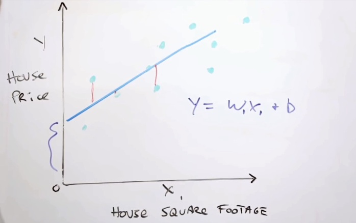
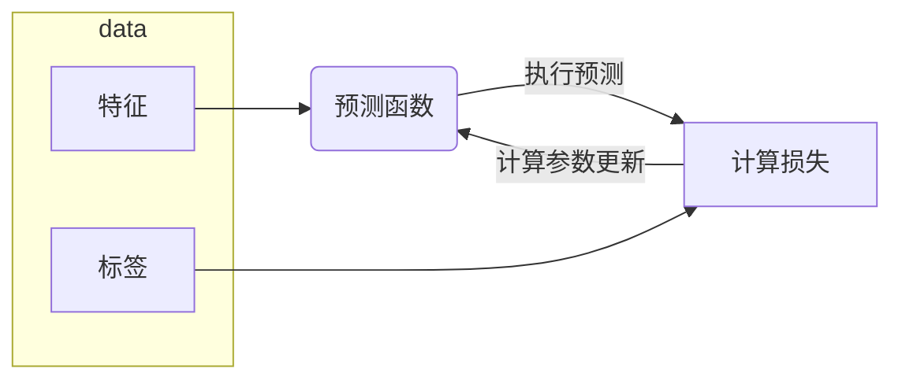

## 机器学习简介

学习目标
- 了解掌握机器学习技术的实际优势
- 理解机器学习技术背后的理念

机器学习的作用
- Reduce time programming
    - 缩短编程时间
- Customize and scale products
    - 可以自定义自己的产品
- Complete seemingly "unprogrammable" tasks
    - 解决人工方法无法解决的问题
    - 如：理解某人说的话

- 改变思考问题得方式
    - 数学科学 → 自然科学
    - 逻辑分析 → 统计信息
    
*********************************************

## 框架处理
- 如何将某个任务构建为机器学习问题
- 机器学习方法中通用的很多基本词汇术语

学习目标
- 复习机器学习基本术语
- 了解机器学习的各种用途

监督式机器学习
- 通过学习输入信息，对未见过的数据，做出有用的预测

标签和特征
- 标签：是指我们要预测的真实事物
    - y
    - 基本线性回归中的y变量
- 特征：是指用于描述数据的输入变量
    - xi
    - 基本线性回归中的{x1,x2,...,xn}变量

样本和模型
- 样本：是指数据的特定实例
    - x
- 有标签样本：具有{特征, 标签}
    - (x, y)
    - 用于训练模型
- 无标签样本：具有{特征, ?}
    - (x, ?)
    - 用于对新数据做出预测
- 模型：将样本映射到预测表情
    - y'
    - 由模型的内部参数定义
    - 这些内部参数值是通过学习得到的

*********************************************

## 深入了解机器学习
- **线性回归**是一种找到最适合一组点的直线或超平面的方法
- 直观介绍线性回归，为介绍线性回归的机器学习方法奠定基础

学习目标
- 复习直线拟合知识
- 将机器学习中的权重和偏差与直线拟合中的斜率和偏移关联起来
- 大致了解“损失”，详细了解平方损失

线性回归
- $y = mx + b$
    - y：预测值
    - x：特征值
    - m：斜率
    - b：截距
- $y'= b + w_1x_1$
    - y'：预测标签（理想输出值）
    - x1：特征值（已知输入项）
    - w1：特征1的权重
    - b：偏差
- 更复杂的模型：$y'=b+w_1x_1+w_2x_2+...$

训练
- 通过有标签样本来学习（确定）所有权重和偏差的理想值
- 检查多个样本并尝试找出可最大限度地减少损失的模型
- 这一过程称为**经验风险最小化**

损失
- 对糟糕预测的惩罚
- 是一个数值，表示对单个样本而言，模型预测的准确程度
- 训练模型的目的，是从所有样本中找到一组平均损失“较小”的权重和偏差

好用的回归损失函数——平方损失
- 给定样本的L2损失，也称为平方误差
    = 预测值和标签值之差的平方
    = $(y-y')^2$
- 训练模型时，并非专注于某一个样本的误差，而是着眼于最大限度地减少整个数据集的误差

定义数据集上的L2损失
- $$L_2Loss=\sum_{(x,y) \in D}(y-prediction(x))^2$$

均方误差(MSE)
- 每个样本的平均平方误差
- $$MSE=\frac{1}{N}\sum_{(x,y) \in D}(y-prediction(x))^2$$
    - (x,y)：样本
        - x：模型进行预测时使用的特征集
        - y：样本的标签
    - prediction(x)：权重和偏差与特征集x结合的函数
    - D：包含多个有标签样本的数据集
    - N：D中样本的数量

*********************************************

## 降低损失
- 为了训练模型，需要一种可降低模型损失的好方法
- 迭代方法是一种广泛用于降低损失的方法，使用起来简单有效

学习目标
- 了解如何试用迭代方法来训练模型
- 全面了解梯度下降法和一些变体
    - 小批量梯度下降法
    - 随机梯度下降法
- 尝试不同的学习速率

迭代方法

收敛
- 不断迭代，直到总体损失不再变化或至少变化极其缓慢为止

在训练机器学习模型时，首先对权重和偏差进行初始猜测，然后反复调整这些猜测，直到获得损失可能最低的权重和偏差为止。

梯度下降法

*********************************************

## 使用TF的基本步骤

*********************************************

## 泛化

*********************************************

## 训练集和测试集

*********************************************

## 验证

*********************************************

## 表示法

*********************************************

## 特征组合

*********************************************

## 正则化：简单性

*********************************************

## 逻辑回归

*********************************************

## 分类

*********************************************

## 正则化：稀疏性

*********************************************

## 神经网络简介

*********************************************

## 训练神经网络

*********************************************

## 多类别神经网络

*********************************************

## 嵌入
