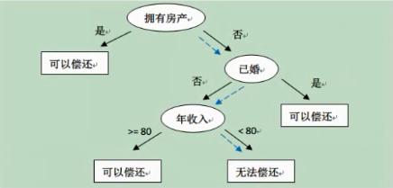

## 主要内容
[1. 熵与信息增益](#1)
[2. 特征选择策略](#2)
[3. 决策树的生成](#3)
[4. 决策树的剪枝策略](#4)
[5. 决策树算法实战](#5)

---

<h4 id='1'>熵与信息增益</h4>

决策树模型
- 本质上是一个IF-THEN规则的集合

熵与信息增益
- 决策树学习的第一步就是“特征选择”
    1. 选择对训练数据具有最大分类能力的特征进行树的叶子节点的分类
    2. 选择该特征最合适的分裂点进行分裂
        - 可以在所有的特征点上都分裂子树
- 熵
    - 表示随机变量不确定性的度量
    - 假设X是一个具有有限个值得离散型随机变量，服从如下的概率分布：
    $$P(X=x_i)=p_i,\ i=1,2,...,n$$
    - 那么随机变量X的熵定义为：
    $$H(X)=-\sum_{i=1}^n{p_i\log{p_i}}$$
    - 以随机变量只取0,1为例，假设X服从如下分布：
    $$P(X=1)=p,\ P(X=0)=1-p,\ 0 \leq p \leq 1$$
    - 它的熵为：
    $$H(p)=-p\log_2p-(1-p)\log_2(1-p)$$
    $$=\begin{cases} 
        0,\ \text{p=0或1,随机变量完全没有不确定性}\\
        1,\ \text{p=0.5,随机变量不确定性最高}
    \end{cases}$$
- 信息增益(Information gain)
    - 设随机变量(X,Y)的联合概率分布为：
    $$P(X=x_i,Y=y_i)=p_{ij},\ i=1,2,...,n;j=1,2,...,m$$
    - 条件熵H(Y|X)表示，在已知随机变量X的取值条件下，随机变量Y的不确定性
    - 数学定义为，X给定的条件下，Y的条件概率分布的熵对X的数学期望，表达式如下：
    $$H(Y|X)=\sum_{i=1}^n{p_iH(Y|X=x_i)}$$
        - 其中$p_i=P(X=x_i),\ i=1,2,...,n$
    - 信息增益表示，在特征X给定的条件下，使得类Y的信息不稳定性减少的程度
    - 数学定义为，特征A对训练数据集D的信息增益G(D,A)，定义为集合D的熵H(D)与特征A给定的条件下，D的条件熵H(D|A)之差，表达式如下：
    $$G(D,A)=H(D)-H(D|A)$$

---

<h4 id='2'>特征选择策略</h4>

特征选择
- 信息增益准则
    - 熵H(D)：对数据集D进行分类的不确定性
    - 条件熵H(D|A)：在特征A给定的条件下，对数据集D进行分类的不确定性
    - 他们的差，即信息增益，表示：由于特征A给定的情况下而使得对数据集D进行分类的不确定性减少的程度
    - 对于数据集D而言，信息增益依赖于特征，信息增益大的特征具有更强的分类能力
    - 选择信息增益最大的特征进行分裂构建

---

<h4 id='3'>决策树的生成</h4>

- 以ID3为例
    - C4.5（信息增益比）/ID3（信息增益）
- 设训练数据集D，|D|表示样本容量的大小，共有k类（Ck）
- 特征A有n个不同取值a1,a2,...,an
- 根据特征A的取值将数据集D划分为n个互不相交的子集{D1,D2,...,Dn}，|Di|表示第i个子集中样本的个数，显然有$\sum_{i=1}^n{|D_i|} = |D|$
- 递归的构建决策树，递归的在每个节点上应用信息增益选择特征，直至满足递归停止条件（所有特征的信息增益都很小或没有特征可以选择）

算法输入：
    - 训练数据集D
    - 特征集A
    - 最小信息增益阈值$\varepsilon$
算法输出：
    - 决策树T
执行过程：
    1. 如果D中所有实例属于同一类$C_k$，那么$T$就是单节点树，并且将$C_k$作为该节点所表示的类别，返回$T$
    2. 如果$A=\phi$，则$T$为单节点树，并且将D中实例数最大的类作为该节点的类标记，返回$T$
    3. 否则，计算A中各特征对数据集D的信息增益，选择信息增益最大的特征$A_G$
    4. 如果$A_G$的信息增益小于$\varepsilon$，此时T设置为单节点树，同时也选择将D中实例数最大的类作为该节点的类标记，返回$T$
    5. 否则，对特征$A_G$的每一个可能的取值$a_i$，根据$A_G=a_i$将数据D分割为不相交的子集$D_i$，此时依然将$D_i$中实例最大的类作为标记，构建子节点。由子节点和子节点构成树$T$，返回$T$
    6. 对第5步中，第i个子节点，以$D_i$为训练集，以$A-\{A_G\}$为新的特征集递归的调用1-5步得到子树$T_i$并返回

- C4.5算法
    - 信息增益会倾向于选择特征值较多的特征
    - 信息增益比表示，特征A的信息增益G(D,A)与训练数据集D关于特征A的熵$H_A(D)$的比值，即
    $$G_R(D,A)=\frac{G(D,A)}{H_A(D)}$$
    - 其中$H_A(D)=-\sum_{i=1}^n{\frac{|D_i|}{|D|}\log_2\frac{|D_i|}{D}}$，n是特征A所能取到的不同的值得总个数

---

<h4 id='4'>决策树的剪枝策略</h4>

- 递归构建决策树，直到不能继续构建为止
- 容易过分的学习训练样本（过拟合）
- 因此需要简化已生成的决策树：“剪枝”
- 将决策树中划分的过细的叶子节点剪去，退回到其父节点成为新的叶子节点，使得新的决策树变得简单

剪枝策略
- 预剪枝策略
    - 每一个节点包含一个最小样本数目，总样本数小到一定程度时，不再分
    - 指定树的深度
    - 指定节点的熵小于某个值，不再划分
- 预剪枝优点
    - 减少不必要的分裂操作，节省时间
- 预剪枝缺点
    - 可能最高的增益被剪去，可能得不到最优的树
- 后剪枝策略
    - 将决策树增长到最大深度，递归的进行剪枝，剪去那些使得增益值为负值的叶子节点
- 后剪枝优点
    - 能够获得最优的剪枝策略决策树
- 后剪枝缺点
    - 分裂过程浪费时间

---

<h4 id='5'>决策树算法实战</h4>