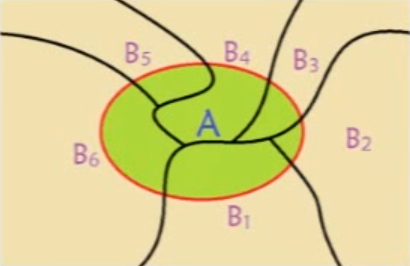

# 本章目标
1. 线性代数基础知识回顾
2. 概率与统计基础知识学习
3. 数学分析与凸优化知识讲解

## 本节目标
1. 了解机器学习中的数学相关知识
2. 熟练掌握基本的数学模型及相关应用

### 主要内容
[1. 泰勒展开式](#1)
[2. 基本概率公式](#2)
[3. 常见分布及其性质](#3)
[4. 统计量相关概念](#4)
[5. 大数定理与中心极限定理](#5)
[6. 最大似然估计](#6)
[7. 随机变量的分布与参数估计](#7)

----

<h4 id='1'>泰勒展开式</h4>

$$f(x) = f(x_0) + f'(x_0)(x-x_0) + \frac{f''(x_0)}{2!}(x-x_0)^2 + ... + \frac{f^{(n)}(x_0)}{n!}(x-x_0)^n + R_n(x)$$
- 在零点展开
$$f(x) = f(0) + f'(0)x + \frac{f''(0)}{2!}x^2 + ... + \frac{f^{(n)}(0)}{n!}x^n + o(x^n)$$

应用
- 数值计算
$\sin x = x - \frac{x^3}{3!} + \frac{x^5}{5!} - \frac{x^7}{7!} + \frac{x^9}{9!} + ... + (-1)^{m-1}\frac{x^{2m-1}}{(2m-1)!} + R_{2m}$
$e^x = 1 + x + \frac{x^2}{2!} + \frac{x^3}{3!} + ... + \frac{x^n}{n!} + R_n$

----

<h4 id='2'>基本概率公式</h4>

条件概率
    $$P(A|B) = \frac{P(AB)}{P(B)}$$
- B（起因）发生的情况下，A（结果）发生的概率
- A和B互相独立时$P(AB) = P(A)P(B)$
    - 即$P(A|B) = P(A)$
    - 即结果发生的概率与起因无关

全概率公式
    $$P(A) = \sum_i{P(A|B_i)P(B_i)}$$
- 把B所有的可能枚举，把乘积累加后，概率即$P(A)$
- 即，把所有可能的起因发生的概率枚举后累加，就是结果发生的概率

贝叶斯（Bayes）公式
    $$P(B_i|A) = \frac{P(A|B_i)P(B_i)}{\sum_j{P(A|B_j)P(B_j)}}$$
- 后因概率：A（结果）发生的情况下，$B_i$（起因）发生的概率
- 是：该起因发生导致该结果的概率 / 能让该结果发生的所有起因的概率之和

贝叶斯公式的应用(求解后因概率)
- 8个射击运动员，5个国家队，3个省队。国家队命中十环的概率是0.8，省队命中十环的概率是0.3。8个中随机选取一个选手打中了十环，该选手是国家队的概率是？
    - 解：
    选手来自国家队的概率：$P(B=1)=\frac{5}{8}$
    选手来自省队的概率：$P(B=0)=\frac{3}{8}$
    国家队打中十环的概率：$P(A=1|B=1) = 0.8$
    国家队打不中十环的概率：$P(A=0|B=1) = 0.2$
    省队打中十环的概率：$P(A=1|A=0) = 0.3$
    省队打不中十环的概率：$P(A=0|B=0) = 0.7$
    贝叶斯公式=>
    $$P(B=1|A=1) = \frac{P(A=1|B=1)P(B=1)}{\sum_{i\in A}{P(A=1|B=i)P(B=i)}} 
        = \frac{0.8 \times \frac{5}{8}}{0.8 \times \frac{5}{8} + 0.2 \times \frac{3}{8}} 
        = 0.8163$$

----

<h4 id='3'>常见分布及其性质</h4>

0-1分布
- 随机变量X的分布律，1-会发生/0-不会发生
- 期望：$E(X) = 1·p + 0·q = p$
- 方差：$D(X) = E[(X - E(X))^2] 
    = E(X^2) - E(X)^2 
    = 1^2·p + 0^2·(1-p) - p^2 
    = pq$

X(随机变量)|1|0
----------|-|-
P(概率):|P|Q=1-P

二项分布
- 随机变量X服从参数为$n,p$二项分布
- 是0-1分布的n次重复试验
- 设$X_i$是第$i$次试验中事件发生的次数，则$$X = \sum_{i=1}^{n}{X_i}$$
- $X_i$相互独立，且均服从参数$p$的0-1分布
- 期望：$E(X) = \sum_{i=1}^{n}{E(X_i)} = np$
- 方差：$D(X) = \sum_{i=1}^{n}{D(X_i)} = npq$

泊松分布
    $$e^x = 1 + x + \frac{x^2}{2!} + \frac{x^3}{3!} + ... + \frac{x^k}{k!} + R_k$$
- 两边除以$e^x$=>
    $$1 = e^{-x} + xe^{-x} + \frac{x^2}{2!}e^{-x} + ... + \frac{x^k}{k!}e^{-x} + R_ke^{-x}$$
- $x$换成$\lambda$：$\frac{x^k}{k!}e^{-x} \rightarrow \frac{\lambda^k}{k!}e^{-\lambda}$
- 设$X$ ~ $\pi(\lambda)$，且分布律为
    $$P\{X=k\} = \frac{\lambda^k}{k!}e^{-\lambda}, k=0,1,2,..., \lambda > 0$$
- 期望：
    $$E(X) = \sum_{k=0}^{\infty}{(k·\frac{\lambda^k}{k!}e^{-\lambda}}) 
        = \lambda e^{-\lambda} \sum_{k=0}^{\infty}{\frac{\lambda^{k-1}}{(k-1)!}} 
        = \lambda e^{-\lambda} e^{\lambda} 
        = \lambda$$
- 方差：
    $$E(X^2) = E[X(X-1) + X] 
        = E[X(X-1)] + E(X) 
        = \sum_{k=0}^{+\infty}{k(k-1)\frac{\lambda^k}{k!}e^{-\lambda}} + \lambda 
        = {\lambda}^2 e^{-\lambda}\sum_{k=0}^{+\infty}{\frac{\lambda^{k-2}}{(k-2)!}} + \lambda 
        = {\lambda}^2 e^{-\lambda} e^{\lambda} + \lambda 
        = {\lambda}^2 + \lambda$$
    $$D(X) = E(X^2) - E(X)^2 = {\lambda}^2 + \lambda - {\lambda}^2 = \lambda$$
- 泊松分布的期望和方差都等于参数$\lambda$

正态分布
- 设$X$ ~ $N(\mu, \sigma^2)$，其概率密度为
    $$f(x) = \frac{1}{\sqrt{2\pi}\sigma}e^{-\frac{(x-\mu)^2}{2\sigma^2}}, \sigma > 0, -\infty < x < +\infty$$
    - $\mu$：均值
    - $\sigma$：标准差
    - $\sigma^2$：方差
- 令$\frac{x-\mu}{\sigma} = t \rightarrow x = \mu + \sigma t$
    - 标准正态分布：$\mu = 0$，$\sigma = 1$
- 期望：
    $$E(X) = \int_{-\infty}^{+\infty}{xf(x)}dx 
        = \int_{-\infty}^{+\infty}{x\frac{1}{\sqrt{2\pi}\sigma}e^{-\frac{(x-\mu)^2}{2\sigma^2}}}dx
        = \frac{1}{\sqrt{2\pi}\sigma}\int_{-\infty}^{+\infty}{(\mu + \sigma t)e^{-\frac{t^2}{2}}}d{(\mu + \sigma t)} 
        = \mu \frac{1}{\sqrt{2\pi}}\int_{-\infty}^{+\infty}{e^{-\frac{t^2}{2}}}dt
            + \sigma \frac{1}{\sqrt{2\pi}}\int_{-\infty}^{+\infty}{t e^{-\frac{t^2}{2}}}dt
        = \mu$$
- 方差：
    $$D(X) = \int_{-\infty}^{+\infty}{(x-\mu)^2f(x)}dx
        = \int_{-\infty}^{+\infty}{(x-\mu)^2\frac{1}{\sqrt{2\pi}\sigma}e^{-\frac{(x-\mu)^2}{2\sigma^2}}}dx
        = \frac{\sigma^2}{\sqrt{2\pi}} \int_{-\infty}^{+\infty}{t^2 e^{-\frac{t^2}{2}}}dt
        = \frac{\sigma^2}{\sqrt{2\pi}} \left( \int_{-\infty}^{+\infty}{-te^{{\frac{t^2}{2}}}} + \int_{-\infty}^{+\infty}{e^{{\frac{t^2}{2}}}}dt\right)
        = 0 + \frac{\sigma^2}{\sqrt{2\pi}} {\sqrt{2\pi}} 
        = \sigma^2$$

----

<h4 id='4'>统计量相关概念</h4>

事件独立性
- 事件A和事件B，有$P(AB)=P(A)P(B)$，称事件A和B相互独立
- A和B独立，则$P(A|B)=P(A)$
- 实际含义：两个事件是否相互影响

期望
- 离散型：$E(X)=\sum_i{x_ip_i}$
- 连续型：$E(X)=\int_{-\infty}^{+\infty}{xf(x)}dx$
- 即：概率加权下的“平均值”

期望的性质
- 无条件成立
    - $E(kX)=kE(X)$
    - $E(X+Y)=E(X)+E(Y)$
- 若X和Y相互独立
    - $E(XY)=E(X)E(Y)$
    - 反之不成立
    - $E(XY)=E(X)E(Y)$只能说明X和Y不相关

方差
- 定义：$Var(X)=E\{[X-E(X)]^2\}=E(X^2)-E(X)^2$
    - $E\{[X-E(X)]^2\} \geq 0 \rightarrow E(X^2) \geq E(X)^2$，当X为定值时，取等号
- $Var(c)=0$
- $Var(X+c)=Var(X)$
- $Var(kX)=k^2Var(X)$
- 当X和Y独立时，$Var(X+Y)=Var(X)+Var(Y)$

标准差
- 方差的平方根

协方差
- 定义：$Cov(X,Y)=E\{[X-E(X)][Y-E(Y)]\}$
- $Cov(X,Y) = Cov(Y,X)$
- $Cov(aX+b,cY+d) = acCov(X,Y)$
- $Cov(X_1+X_1,Y) = Cov(X_1,Y)+Cov(X_2,Y)$
- $Cov(X,Y) = E(XY)-E(X)E(Y)$

协方差、独立、不相关的关系
- X和Y独立时，$E(XY)=E(X)E(Y)$，$Cov(X,Y)=0$，即协方差为零
- 协方差为零时，称X和Y不是线性相关
- 协方差是两个随机变量具有相同方向变化趋势的度量
    - 协方差>0，变化趋势相同
    - 协方差<0，变化趋势相反
    - 协方差=0，X和Y不相关

协方差矩阵
- 对于n个随机向量$(X_1,X_2,...,X_n)$，任意两个元素$X_i$和$X_j$都可以得到一个协方差，从而形成n*n的矩阵，称为协方差矩阵
- 协方差矩阵是对称阵$c_{ij} = Cov(X_i,X_j)$
    $$C = \left[ \begin{matrix}
    c_{11} & c_{12} & ... & c_{1n} \\
    c_{21} & c_{22} & ... & c_{2n} \\
    ... & ... & ... & ... \\
    c_{n1} & c_{n2} & ... & c_{nn} \\
    \end{matrix} \right]$$

----

<h4 id='5'>大数定理与中心极限定理</h4>

切比雪夫不等式
- 设随机变量X的期望为$\mu$，方差为$\sigma^2$，对于任意正整数$\varepsilon$，有：
$$P\{|X-\mu| \geq \varepsilon\} \leq \frac{\sigma^2}{\varepsilon^2}$$
- 含义：X的方差越小，事件$\{|X-\mu| \geq \varepsilon\}$发生的概率越大
- 即，X的取值基本集中在期望附近
- 进一步说明了方差的含义
- 可证明大数定理与中心极限定理

大数定理
- 设随机变量$X_1,X_2,...,X_n,...$互相独立，并且具有相同的期望$\mu$和方差$\sigma^2$。取前n个随机变量的平均$Y_n=\frac{1}{n}{\sum_{i=1}^{n}{X_i}}$
- 则对任意正数$\varepsilon$，有
$$\lim_{n \rightarrow \infty}{P\{|Y_n-\mu| < \varepsilon \}} = 1$$
- 含义：具有相同期望和方差的随机变量，取任意多的随机变量，当n很大时，他们的均值$Y_n$无限接近期望$\mu$
    - 当n无限大的时候，偏差的可能为零
- 重要推论
    - 一次试验中事件A发生的概率为p，重复n次独立试验，事件A发生了$n_A$次，则p、n、$n_A$的关系满足：
    - 对任意正数$\varepsilon$
$$\lim_{n \rightarrow \infty}{P\{|\frac{n_A}{n}-p| < \varepsilon \}} = 1$$
    - 该推论是最早的大数定理形式，称为伯努利定理
    - 含义：事件A发生的频率$\frac{n_A}{n}$以概率收敛于事件A的概率p，以严格的数学形式表达了频率的稳定性
    - 因此，我们可以在实际应用中，用频率来估计概率
        - 正态分布的参数估计
        - 朴素贝叶斯做垃圾邮件分类
        - 隐马尔科夫模型有监督参数学习

中心极限定理
- 设随机变量$X_1,X_2,...,X_n,...$互相独立，服从同一分布，并且具有相同的期望$\mu$和方差$\sigma^2$，则随机变量$Y_n=\frac{\sum_{i=1}^n{X_i} - n\mu}{\sqrt{n}\sigma}$的分布收敛到标准正态分布
- 得到：$\sum_{i=1}^n{X_i}$收敛到正态分布$N(n\mu, n\sigma^2)$

----

<h4 id='6'>最大似然估计(MLE)</h4>

----

<h4 id='7'>随机变量的分布与参数估计</h4>