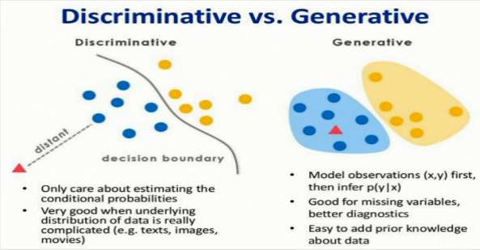

## 主要内容
[1. Navie Bayes的数学原理](#1)
[2. 条件概率的参数估计](#2)
[3. 贝叶斯估计](#3)
[4. Navie Bayes算法实战](#4)

---

<h4 id='1'>Navie Bayes的数学原理</h4>

朴素贝叶斯（Navie Bayes）算法
- 是机器学习中最常见的算法之一，主要被用来做分类任务
- 它的理论基础是基于贝叶斯定理和条件独立性假设
- 对于给定的训练数据集，首先基于特征条件独立性假设，学习联合概率分布P(X,Y)，然后基于此模型，对于任意的输入x，利用贝叶斯定理求出后验概率最大的P(Y|X=x)对应的y的取值

1. 该算法的理论核心是贝叶斯定理
2. 它是基于条件独立性假设这个强假设基础之上
3. 它是生成模型

生成模型（Generative model）与判别模型（Discriminative model）

特性|判别模型|生成模型
----|-------|-------
特点|寻找不同类别之间的最优分类面，反映的是异类数据之间的差异|对后验概率建模，从统计的角度表示数据的分布情况，能够反映同类数据本身的相似度
区别|估计的是条件概率分布(conditional distribution)：P(Y\|X)|估计的是联合概率分布(joint probability distriburtion)：P(X,Y)
联系|由生成模型可以得到判别模型|由判别模型得不到生成模型
常见模型|逻辑回归、SVM、MLP、KNN|Navie Bayes、GMM、HMM

数学原理
- 由全概率公式可以推出贝叶斯定理
    $$P(A|B)=\frac{P(B|A)P(A)}{P(B)}$$
- 根据贝叶斯定理，对一个分类问题，给定样本特征x，样本属于类别y的概率是：
    $$P(y|x) = \frac{P(x|y)P(y)}{P(x)}$$
- 公式中x是特征向量，假设它的维度是d，因此：
    $$P(y|x) = \frac{P(x^1,x^2,...,x^d|y)P(y)}{P(x)}$$
- 由于条件概率分布有指数及数量的参数，因此，求解该问题是一个NP难问题，实现中很难解决，所以直接求解不可行
- 朴素贝叶斯：条件独立性的假设，于是有：
    $$P(x^1,x^2,...,x^d|y=c_k) = \prod_{i=0}^d{P(x^i|y=c_k)}$$
    $$P(y=c_k|x) = \frac{P(y=c_k)\prod_{i=0}^d{P(x^i|y=c_k)}}{P(x)}$$    
- 以上就是朴素贝叶斯算法的基本数学原理
- 朴素贝叶斯分类器可数学化的表示为：
    $$y=f(x)=\mathop{argmax}_{c_k}\frac{P(y=c_k)\prod_{i=0}^d{P(x^i|y=c_k)}}{P(x)}$$
- 由于P(x)的分布是一样的，所以可简化为：
    $$y=f(x)=\mathop{argmax}_{c_k}{P(y=c_k)\prod_{i=0}^d{P(x^i|y=c_k)}}$$

---

<h4 id='2'>条件概率的参数估计</h4>

参数估计
- 朴素贝叶斯算法的学习过程主要是估计$P(y=c_k)$以及$P(x^j|y=c_k)$对于类别概率估计可以使用如下的公式进行估计：
    $$P(y=c_k) = \frac{\sum_{i=1}^N{I(y_i=c_k)}}{N}, k=1,2,...,K$$
- 但是对于$P(x^j|y=c_k)$的概率估计，我们需要根据每一维$x^j$分两种情况讨论
    - 离散型变量
        - 计算出每个特征值在相应的类中出现的概率即可
        $$P(X^{(j)}=x^{(j)}|y=c_k)
        = \frac{\sum_{i=1}^N{I(X^{(j)}=x^{(j)}|y_i=c_k)}}{\sum_{i=1}^N{I(y_i=c_k)}}, k=1,2,...,K$$
    - 连续型变量
        - 对条件概率分布$P(x^j|y=c_k)$进行估计时，无法直接求概率
        - 常用方式：假设$P(x^j|y=c_k)$服从某一分布，如高斯分布、多项式分布、伯努利分布等
            - 例：高斯分布
            $$P(X^{(j)}=x^{(j)}|y=c_k)
            = \frac{1}{\sqrt{2\pi{\delta_y}^2}}exp\left(-\frac{(x_i-u_y)^2}{2{\delta_y}^2} \right)$$

---

<h4 id='3'>贝叶斯估计</h4>

贝叶斯估计——拉布拉斯平滑
- 样本中算出概率值为0的解决办法
    $$P(y=c_k) = \frac{\sum_{i=1}^N{I(y_i=c_k)+\lambda}}{N+K\lambda}, k=1,2,...,K$$
    $$P(X^{(j)}=x^{(j)}|y=c_k)
    = \frac{\sum_{i=1}^N{I(X^{(j)}=x^{(j)}|y_i=c_k)}+\lambda}{\sum_{i=1}^N{I(y_i=c_k)}+L_j\lambda}, k=1,2,...,K$$
    - $L_j$是第j维特征的最大取值个数
- 特别的，当$\lambda=1$时，称为拉普拉斯平滑（Laplace smoothing）

---

<h4 id='4'>Navie Bayes算法实战</h4>