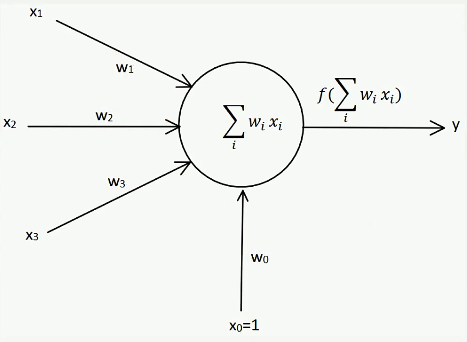
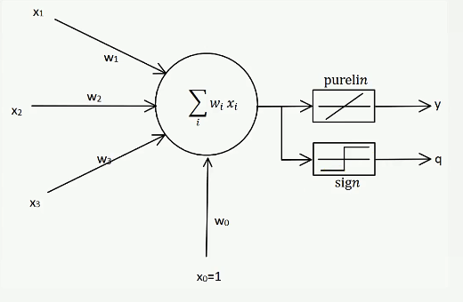
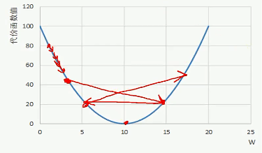
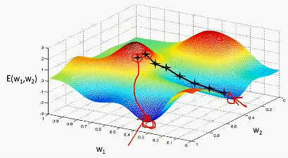
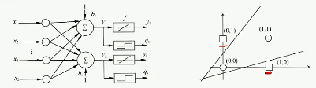
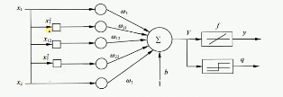

# 目录 #

- ## [神经网络概述](#L1)
- ## [神经网络发展史](#L2)
- ## [从0到1——单层感知器](#L3)
- ## [网络优化——线性神经网络，delta学习规则，梯度下降法](#L4)

********

<h2 id='L1'>神经网络概述</h2>

神经网络
- 大脑，神经元
- 应用：图像识别、自动驾驶、人工智能

神经网络种类
- 神经网络基础
    - 单层感知器，线性神经网络，BP神经网络，Hopfield神经网络等
- 神经网络进阶
    - 玻尔兹曼机，受限玻尔兹曼机，递归神经网络等
- 深度学习网络
    - 深度置信网络，卷积神经网络，深度残差网络，LSTM网络等
- 深度网络应用
    - 传统的数据挖掘与机器学习问题，手写体识别，图像识别，自然语言处理，人工智能等
- 编程语言
    - python，R，matlab，java等
- 深度学习实现框架
    - Tensorflow，Caffe，Torch等
- 发展过程
    - 单层感知器
        - BP神经网络
            - 递归神经网络(RNN)
                -LSTM
            - 卷积神经网络
                - 残差神经网络
        - Hopfield神经网络
            - 玻尔兹曼机
                - 受限玻尔兹曼机
    - BP神经网络 + 受限玻尔兹曼机 ==> 深度置信网络

********

<h2 id='L2'>神经网络发展史</h2>

- 启蒙时期（1890-1969）
    - 1890年，心理学家William James，《心理学原理》，神经细胞受到刺激激活后把刺激传播到另一个神经细胞，神经细胞激活是所有输入叠加的结果
    - 1943年，神经元的数学描述和结构，M-P模型，人工神经网络（ANN）的起点
    - 1949年，《行为组织学》，神经元权值
    - 1958年，三层网络特性的神经网络结构，“感知器”
    - 1969年，《感知器》，简单神经网络智能运用于线性问题的求解，需要隐层，多层网络
- 低潮时期（1969-1982）
- 复兴时期（1982-1986）
    - 1982年，Hopfield提出Hopfield神经网络，引用了物理学的分析方法
    - 1985年，借助统计物理学的概念和方法，提出了一种随机网络模型——玻尔兹曼机。一年后改进为受限玻尔兹曼机
    - 1986年，BP算法（多层感知器的误差反向传播算法）
- 新时期（1986-）
    - 1987年6月，首届国际神经网络学术会议

********

<h2 id='L3'>单层感知器</h2>

单层感知器
- 输入节点：x1,x2,x3
- 输出节点：y
- 权向量：w1,w2,w3
- 偏置因子：b
- 激活函数：sign(X)
    - $X = \sum_i{w_i x_i + b}$
    - $x_i,w_1... \rightarrow f(X) \rightarrow y$
- 把偏置当做特殊权值
    - $x_1,w_1...,x_0=1,b \rightarrow f(\sum_i{w_i x_i}) \rightarrow y$

感知器学习规则
- 1958年，美国学者Frank Rosenblatt首次定义了一个具有单层计算单元的神经网络结构，称为Perceptron（感知器）
- 感知器的学习规则规定，学习信号等于神经元期望输出（教师信号）与实际输出之差
    - $r = d_j - o_j$
        - $d_j$为期望输出
        - $o_j = f({W_j}^T X)$
            - W权值矩阵，w权值，T转置，${W_j}^T X = \sum_i{w_i x_i}$
- 感知器采用了符号函数作为转移函数
    - $
    f({W_j}^T X) = sign({W_j}^T X) 
    = \begin{cases}
        1, {W_j}^T X \geq 0 \\
        -1, {W_j}^T X < 0 \\
    \end{cases}
    $
    - 权值调整公式为：
        - $\Delta W_j = \eta \left[d_j - sgn({W_j}^T X)\right] X$
        - $\Delta w_{ij} = \eta \left[d_j - sgn({W_j}^T X)\right] x_i, i=0,1,...,n$
        - $\eta$： 学习信号，学习率
            - $0 < \eta < 1$
            - 学习率太大，容易造成权值不稳定
            - 学习率太小，权值调整太慢，迭代次数太多
        - 当实际输出与期望值相同时，权值不需要调整
        - 在有误差存在的情况下，由于$d_j$和$sgn({W_j}^T X)$ $\in \{-1,1\}$,权值调整公式可简化为：$\Delta W_j = \pm 2\eta X$

- 感知器学习规则只适用于二进制神经元，初始权值可以取任意值
- 是一种有导师学习
- 是研究其他神经网络的基础
- 收敛条件
    - 误差小于某个预先设定的较小的值
    - 两次迭代之间的权值变化已经很小
    - 设定最大迭代次数，当迭代超过最大次数就停止

********

<h2 id='L4'>网络优化——线性神经网络，delta学习规则，梯度下降法</h2>

线性神经网络
- 感知器的激活函数只能输出两种可能的值
- 线性神经网络的输出可以是任意值，其激活函数是线性函数
- 采用Widrow-Hoff学习规则，即LMS（Least Mean Square）算法来调整网络的权值和偏置
- 感知器：sign函数；线性神经网络：purelin函数（y=x）

LMS学习规则
- 1962年，Bernard Widrow和Marcian Hoff提出了Widrow-Hoff学习规则
- 它能使神经元实际输出与期望输出之间的平方差最小，所以又称为*最小均方规则*（LMS）
- 学习规则
    - 学习信号为：$r = d_j - {W_j}^T$
    - 权向量调整量：$\Delta W_j = \eta (d_j - {W_j}^T X) X$
    - $\Delta W_j$的各分量：$\Delta w_{ij} = \eta (d_j - {W_j}^T X) x_i, i=0,1,...,n$

    - 用purelin函数训练，用sign函数输出

Delta学习规则
- 1986年，认知心理学家Mcclelland和Rumelhart在神经网络训练中引入了$\delta$规则，该规则也可以称为*连续感知器学习规则*
- $\delta$学习规则是一种利用梯度下降法的一般性的学习规则
- 代价函数Cost Function（损失函数Lost Function）
    - $E = \frac{1}{2}(d_j - o_j)^2 = \frac{1}{2}[d_j-f({W_j}^T X)]^2$
        - $E$是权向量$W_j$的函数，为了让误差E最小，$W_j$应与误差的负梯度（导数的负数）成正比，即：
        - $\Delta W_j = -\eta \nabla E$
            - $\eta$：正常数
        - 可推得，误差梯度$\nabla E$
            - $E = \frac{1}{2}[d_j-f({W_j}^T X)]^2$
                - 注：“$\frac{1}{2}$”的目的是在求梯度（求导）的时候，变为1
            - $\nabla E = [d_j - f({W_j}^T X)] \times[-f'({W_j}^T X)] \times X$
            - $\nabla E = -(d_j - o_j)f'({W_j}^T X) X$
        - 带入得到，权值调整计算公式
    - $\Delta W_j = \eta (d_j - o_j) f'(net_j) X$
    - 学习信号：$\delta = (d_j - o_j) f'(net_j)$
    - $\Delta W_j$的各分量：$\Delta w_{ij} = \eta (d_j - o_j) f'(net_j) x_i, i=0,1,...,n$
- LMS学习规则是Delta学习规则的特殊情况，即$f({W_j}^T X) = {W_j}^T X$
- $\delta$学习规则可推广到多层前馈网络中，权值可初始化为任意值
- 梯度下降法的问题
    - 学习率难以选取，太大会产生震荡，太小收敛缓慢
        
    - 容易陷入局部最优解
        
    
解决线性不可分的问题
- 用多个线性函数对区域进行划分
    
- 对神经元添加非线性输入，引入非线性成分，使等效的输入维度变大
    

----------

学习规则|学习信号|权向量调整|$\Delta W_j$的各分量($i=0,1,...,n$)
-------|-------|---------|--------------------
感知器|$r = d_j - o_j$|$\Delta W_j = \eta \left[d_j - sgn({W_j}^T X)\right] X$|$\Delta w_{ij} = \eta (\left[)d_j - sgn({W_j}^T X)\right] x_i$
LMS|$r = d_j - {W_j}^T$|$\Delta W_j = \eta (d_j - {W_j}^T X) X$|$\Delta w_{ij} = \eta (d_j - {W_j}^T X) x_i$
Delta|$\delta = (d_j - o_j) f'(net_j)$|$\Delta W_j = \eta (d_j - o_j) f'(net_j) X$|$\Delta w_{ij} = \eta (d_j - o_j) f'(net_j) x_i$

